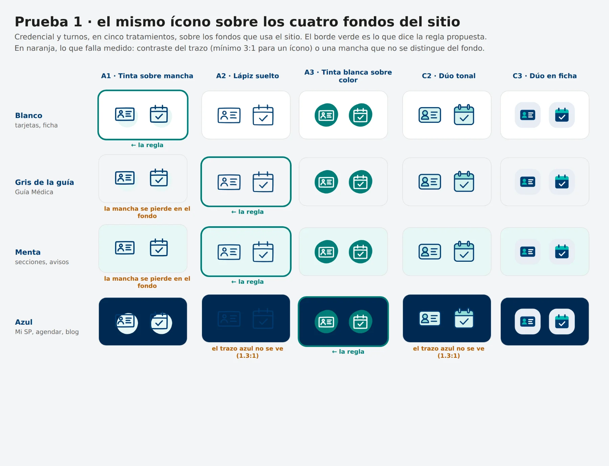
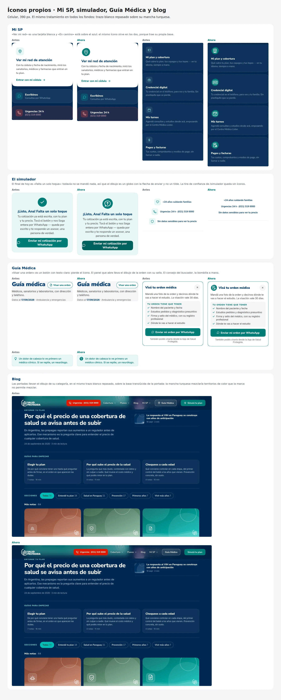
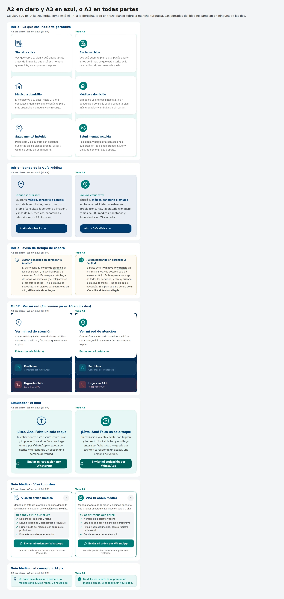
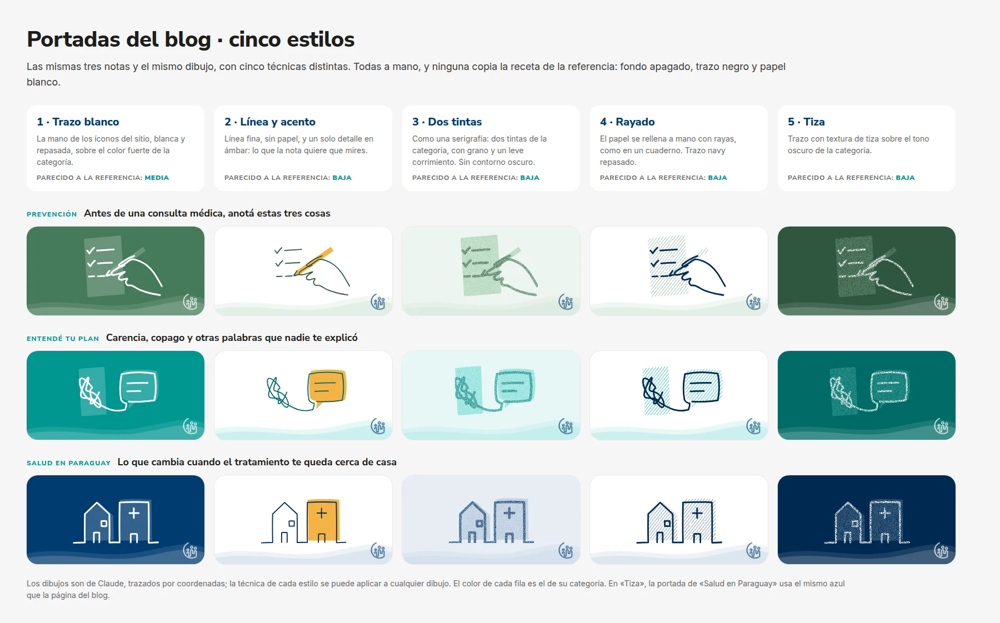
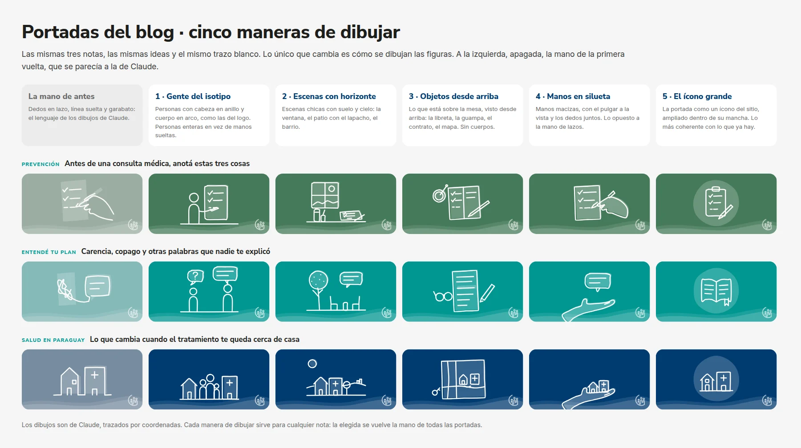

# BITÁCORA — el libro que escribimos mientras construimos

Esto no es un changelog ni documentación técnica. Es el diario de a bordo
del ecosistema digital de Salud Protegida: qué intentamos, qué pasó de
verdad, qué vueltas dimos y por qué, y qué aprendimos en cada una. Se
escribe mientras construimos — y va a seguir escribiéndose después de que
la página exista — porque las lecciones valen para nosotros y para
cualquiera que construya algo parecido.

**Reglas del libro:**
- Cada entrada cuenta tres cosas: *qué intentamos, qué pasó, qué
  aprendimos*. Si no hay aprendizaje, no es una entrada.
- Los errores se escriben con nombre y apellido. Los capítulos de lo que
  no funcionó son los que más valen.
- Se escribe en el momento (o lo más cerca posible): la memoria edita, el
  diario no.
- La bitácora solo crece; nunca se reescribe una entrada vieja. Si hoy
  pensamos distinto que en un capítulo anterior, eso es un capítulo nuevo.
- Todavía no sabemos de qué trata este libro. Está bien: el tema va a
  aparecer solo cuando lo releamos.

Complementa al `HANDOFF.md` (que dice *dónde estamos*) — la bitácora dice
*cómo llegamos y qué aprendimos en el camino*.

---

## Capítulo 1 — El encargo era una web; la respuesta fue cuatro preguntas

Todo empezó como un pedido conocido: "necesitamos una página para vender
planes". Pudimos haber hecho eso — un folleto digital lindo — y quizás
nadie lo habría objetado. En cambio, la pregunta que ordenó todo fue otra:
*¿qué necesita resolver una familia paraguaya, en minutos y desde el
celular, sin llamar a nadie?* La respuesta cupo en cuatro preguntas: ¿qué
plan me conviene? ¿cuánto me cuesta? ¿qué me cubre? ¿dónde me atiendo?

**Lo aprendido:** una lista corta de preguntas del cliente es mejor brief
que cualquier documento de requisitos. Desde entonces, cada propuesta
nueva se filtra con "¿a cuál de las cuatro preguntas sirve?" — y esa
regla mató más ideas mediocres que cualquier comité.

## Capítulo 2 — La guía se rediseñó en el formato "viejo" a propósito

Para rediseñar la Guía Médica teníamos la tentación obvia: hacerla en el
stack moderno del prototipo (Next.js). La descartamos y la construimos en
el mismo formato que usa el proveedor actual de SP: archivos HTML sueltos
con Tailwind. ¿Por qué? Porque el rediseño más elegante del mundo vale
cero si la empresa que lo tiene que adoptar no puede integrarlo sin
fricción.

**Lo aprendido:** la adopción le gana a la elegancia técnica. Diseñá para
el que tiene que integrar tu trabajo, no para tu portafolio.

## Capítulo 3 — Datos falsos a propósito (porque los reales estaban sucios)

Los datos reales de prestadores existían, pero venían con teléfonos
concatenados que rompían el botón "Llamar", dos direcciones en un campo,
un "fax: 30" y un typo memorable: "SERVICIO DE AMBULACIA". En vez de
importarlos, cargamos datos **ilustrativos** con el formato correcto:
sedes separadas, un teléfono por acción, horarios por día.

**Lo aprendido:** cuando el dato real está sucio, el prototipo con datos
inventados *bien estructurados* vale más — se convierte en el molde que
le dice al dueño del dato cómo tiene que limpiarlo. El prototipo es la
especificación.

## Capítulo 4 — Cero resultados nunca es un callejón

Decisión temprana que se volvió filosofía: cuando alguien busca algo que
no existe en la guía, jamás recibe una página vacía. Recibe un "¿quisiste
decir…?" y un botón de WhatsApp con su búsqueda ya escrita. Cada búsqueda
fallida es dos cosas: un cliente rescatado y un dato para Convenios sobre
qué le falta a la red.

**Lo aprendido:** las fallas del producto son la mejor fuente de
inteligencia de negocio, si las diseñás para capturarlas. El error no se
esconde: se cosecha.

## Capítulo 5 — Nunca "No cubierto", nunca rojo

Regla de tono que costó internalizar: la ausencia de cobertura no se
comunica como negación ("No cubierto", en rojo) sino como oportunidad
(etiqueta dorada, "Desde SP Premium", hoja de upsell hacia el simulador).
El rojo quedó reservado para una sola cosa: urgencias.

**Lo aprendido:** en un producto comercial, cada pixel comunica. Un
"no" mal dicho cierra la venta; el mismo dato dicho como "todavía no,
pero mirá lo que te falta" la abre. Y reservar un color para una sola
emoción (rojo = emergencia) es de las decisiones de diseño más baratas y
más potentes que tomamos.

## Capítulo 6 — El día que rompimos el lockfile

Instalamos una dependencia de prueba dentro del repo y el archivo de
dependencias quedó desincronizado; el deploy automático (que usa
`npm ci`, estricto) se rompió. Barato de arreglar, valioso de aprender.

**Lo aprendido:** las herramientas de verificación viven *fuera* del
proyecto. Y el CI estricto no es una molestia: es el guardián que
convierte un error silencioso en un error ruidoso — los ruidosos se
arreglan, los silenciosos se acumulan.

## Capítulo 7 — La integración que faltaba estaba en el menú

Teníamos una web de planes y una guía médica rediseñada — dos piezas
buenas que no se conocían entre sí. La guía ni aparecía en el menú del
homepage, y sus links de "volver" apuntaban al sitio viejo de producción:
el visitante que entraba a la guía quedaba atrapado en ella. La
integración fue menos glamorosa que construir las piezas: menú, footer,
un buscador que lleva la búsqueda puesta, links de vuelta.

**Lo aprendido:** un ecosistema no es un conjunto de piezas buenas; es un
conjunto de piezas *conectadas*. El pegamento (menús, links, contexto que
viaja con el usuario) es trabajo de primera clase, no un detalle. Y los
callejones sin salida se esconden justo en los bordes entre una pieza y
otra — ahí hay que ir a buscarlos.

## Capítulo 8 — El blur que nunca existió (o: verificá lo computado)

Pusimos un efecto de vidrio esmerilado en el header. El código estaba
"bien". El efecto no existía: el minificador de CSS del build encadenaba
las funciones sin espacio (inválido — el navegador lo descartaba en
silencio) y, cuando declarábamos la variante con prefijo a mano, el
minificador se quedaba *solo* con la prefijada, que nuestro navegador de
prueba no honraba. Dos bugs invisibles, apilados, sin un solo error en
pantalla. Lo encontramos porque la verificación no lee el código fuente:
le pregunta al navegador qué estilos *computó* de verdad.

**Lo aprendido:** entre tu código y el usuario hay una cadena de
herramientas que puede traicionarte en silencio. No verifiques lo que
escribiste; verificá lo que el navegador entendió. (Bonus del mismo día:
en el navegador de pruebas, el click en un link de teléfono congela la
navegación posterior — perdimos una hora hasta descubrir que el bug era
del entorno de prueba, no del producto. Anotado: cuando un test falla
raro, sospechá también del test.)

## Capítulo 9 — La auditoría de algo que no existe es una especificación

Planificamos auditar el registro de búsquedas del sistema actual:
comparar qué campos guarda contra los que necesitamos. Resultó que el
panel de estadísticas del proveedor *también* es un prototipo — no hay
datos reales; todos estamos dibujando el futuro al mismo tiempo. En vez
de frustrarnos, giramos: la auditoría se convirtió en especificación.
Escribimos en el contrato técnico exactamente qué debe tener ese panel
(conversión por prestador, demanda vs. oferta por ciudad, embudo por
sesión anónima) y de paso instrumentamos nuestra propia web con los
mismos eventos.

**Lo aprendido:** en proyectos tempranos, muchas veces vas a auditar
cosas que aún no existen. No es una pared: es la oportunidad de definir
la vara antes de que exista lo que va a ser medido. El que escribe la
especificación primero, define la conversación.

## Capítulo 10 — El manifiesto hermoso que era un peaje

El capítulo más incómodo hasta ahora. Construimos un manifiesto
scrollytelling del que estábamos orgullosos: siete pantallas
cinematográficas, frases que emocionan, fotos con parallax. Y un día,
mirando la home con ojos de usuario, hicimos la pregunta que dolía: *¿y
si esto arruina la experiencia?* Medimos: 720vh de marca **entre** el
hero y las herramientas. El visitante que scrollea — lo más natural del
mundo — paga siete pantallas de peaje antes de poder resolver nada. Y
peor: la home entera le habla solo al que todavía no es cliente; el
afiliado que vuelve cada mes no tiene nada.

Convocamos una mesa de advisors imaginaria (Miller, Ogilvy, Sutherland,
Bezos, Munger, Christensen, Galperin) y el veredicto fue 7-0: la home
debe resolver primero y emocionar después. El manifiesto no muere — se
comprime a una pantalla y su versión completa se muda a su propia página.
El plan quedó escrito en `PLAN-home-v2.md`.

**Lo aprendido — tres lecciones en una:**
1. Lo más difícil de criticar es lo que te quedó lindo. La belleza de una
   pieza no dice nada sobre si está en el lugar correcto.
2. "¿Estamos vendiendo demasiado?" es una pregunta que hay que hacerse
   *en voz alta* y con frecuencia. Vender y servir no son enemigos, pero
   el orden importa: primero resolvé, después emocioná.
3. El truco de la mesa de advisors imaginaria funciona: obligarse a mirar
   la misma decisión con siete pares de ojos distintos (narrativa, oficio
   de venta, psicología, modelo de negocio, sabiduría, producto, cancha
   local) produce mejores decisiones que discutir con uno mismo.

## Capítulo 11 — La medición como espec ejecutable

Cuando instrumentamos la web (cada click importante emite un evento
anónimo), no lo hicimos conectando una herramienta de analytics: lo
hicimos escribiendo los eventos en el código como *demostración
ejecutable* de lo que el backend deberá registrar. El que integre después
no tiene que interpretar un documento: abre la consola y ve los eventos
salir, con sus campos exactos.

**Lo aprendido:** la mejor especificación es la que corre. Un documento
dice "debería"; un prototipo instrumentado dice "así". Y una regla de
privacidad que nos ordenó todo: los eventos nunca llevan nombre, teléfono
ni email — el dato personal va al CRM, la analítica es anónima. Decidirlo
temprano evitó diez discusiones futuras.

## Capítulo 12 — El proceso también se diseñó (y esta bitácora es parte)

Sin darnos cuenta, construimos un método: ramas de trabajo → PR en
borrador → verificación con un navegador real (no "a ojo") → el usuario
dice "fusionalo" → deploy automático → el HANDOFF se actualiza en el
mismo PR que el cambio. Cada pieza del método nació de un dolor real (el
lockfile roto parió el CI; el blur fantasma parió la verificación
computada; el miedo a perder contexto entre sesiones parió el HANDOFF).

**Lo aprendido:** el proceso no se elige al principio, se destila de los
golpes. Y hay que escribirlo — el HANDOFF para el estado, y esta bitácora
para la historia — porque el conocimiento que no se escribe se paga dos
veces.

## Capítulo 13 — La confianza se delega por etapas (y el libro aprende a escribirse solo)

Durante ocho PRs el ritual fue idéntico: yo proponía, verificaba y dejaba
el PR en borrador; el usuario decía "fusionalo". Ese checkpoint no era
burocracia — era el período de prueba. Hoy el usuario lo cerró con dos
pedidos en una frase: *fusioná automáticamente, y date cuenta vos solo de
cuándo hay que escribir en la bitácora*.

Lo interesante es lo que hizo posible ese momento: ocho fusiones seguidas
donde lo prometido y lo entregado coincidieron, cada una con verificación
que el usuario podía ver (capturas, checks, CI). La confianza no se pidió
— se acumuló, y cuando alcanzó cierto nivel, la delegación llegó sola.
Quedaron excepciones explícitas (los cambios de visión o alcance siguen
esperando confirmación), porque delegar la ejecución no es delegar el
rumbo.

**Lo aprendido:** la autonomía no se negocia al principio de una relación
de trabajo: se gana con un historial de resultados verificables, y se
otorga por capas — primero la ejecución rutinaria, el rumbo nunca. Y una
segunda lección, sobre este libro: un diario que depende de que alguien
se acuerde de pedirlo, muere; un diario con criterios escritos de *cuándo
hay capítulo* (errores, vueltas, decisiones revertidas, intuiciones que
cambian el rumbo) puede mantenerse solo. Las reglas quedaron en
`CLAUDE.md`, donde cualquier sesión futura las hereda.

## Capítulo 14 — El rediseño se ejecutó (y congelamos el "antes")

Ejecutamos el plan de la mesa de advisors: la home ahora abre con dos
puertas ("Quiero un plan" / "Ya soy de SP · Ver mi red"), las
herramientas suben, el manifiesto quedó en una pantalla — reescrito con
el cliente como protagonista — y su versión cinematográfica completa
vive en `/historia/`, donde la emoción persuade sin cobrar peaje. Los
testimonios inventados salieron (volverán cuando existan de verdad).

Dos detalles del proceso que valen registro. Primero: antes de tocar
nada, **congelamos el home anterior en `/v1/`**, navegable para siempre.
No es nostalgia — es honestidad metodológica: dentro de unos meses, la
memoria va a editar cómo era "el antes"; el snapshot no. Comparar contra
lo real le gana a comparar contra el recuerdo. Segundo: el presupuesto
de peso móvil dejó de ser una intención y se volvió un número medido en
el pipeline — 173 KB comprimidos de contenido crítico, bien abajo del
techo de 300 — y ahora cualquier regresión futura tiene una vara contra
la cual fallar.

**Lo aprendido:** un rediseño no está completo sin tres cosas que no son
diseño — el snapshot del antes (para comparar sin autoengaño), la
medición del después (para que "más liviano" sea un número y no una
sensación), y los eventos nuevos (`puerta_home`, `manifesto_scroll`)
que van a decirnos si la teoría de la mesa de advisors sobrevive al
contacto con usuarios reales. Diseñar es opinar; instrumentar es
permitir que la realidad conteste.

## Capítulo 15 — El idioma del cliente (o: nadie dice "cartilla" en su casa)

Observación del usuario, con su voz: *"la palabra 'cartilla' o 'cartilla
viva' no es una palabra que se usa mucho. Tenemos que insertar algo que
ya se conoce y ya se dice usualmente y la gente entiende fácilmente."*

Tenía razón, y el hallazgo fue más profundo que una palabra: al barrer el
sitio encontramos toda una familia de jerga de seguros que se nos había
colado sin darnos cuenta — "cartilla" (ya renombrada antes), "práctica"
("Escribí una práctica…" — ¿quién le dice 'práctica' a una ecografía?) y
"prestación" (cabecera de la tabla comparativa). Las tres se fueron:
"escribí lo que necesitás", "cobertura", "servicio".

**Lo aprendido:** la jerga es invisible para el que la escribe — nosotros
veníamos leyendo "práctica" hace semanas sin verla, porque en el mundo de
los seguros es normal. El test que quedó como regla permanente: ante cada
palabra visible, preguntarse *¿la dice una familia en su casa?* Si no la
dice, hay otra palabra mejor. Y un corolario: este tipo de hallazgo lo
hace mejor el que mira de afuera (el usuario) que el que construye — otra
razón para mostrar el trabajo seguido y temprano.

## Capítulo 16 — Llegaron los primeros datos reales (y me corrigieron)

El usuario trajo el Google Analytics de la web activa de SP: dos meses de
datos reales, los primeros del proyecto. Confirmaron tres decisiones
tomadas por intuición y teoría: **el 77% del tráfico entra por celular**
(la ponderación móvil no era perfeccionismo), **"Guía para el asegurado"
es la tercera página más visitada** (la puerta 2 del hero atiende una
demanda que ya existía), y la atención media es de **50 segundos**
("resolver en un minuto" es la vara correcta, y cualquier peaje de siete
pantallas estaba condenado por los datos antes que por la mesa de
advisors).

Pero el capítulo se gana su lugar por dos cosas más incómodas. Primera:
la captura inicial (un embudo con "100% de finalización" en cada paso) me
llevó a concluir que "un tercio de los clientes ya usa el canal digital".
Con el informe completo quedó claro que ese embudo se auto-calificaba —
el Login real tuvo 132 usuarios, no 2.900. **Los datos merecen la misma
desconfianza metódica que el código**: un embudo perfecto es tan
sospechoso como un test que nunca falla. Corregido en el mismo día,
gracias a que el usuario trajo más capturas en vez de conformarse.

Segunda: el dato más valioso no confirmaba nada — revelaba. **El 91% de
los usuarios son nuevos: casi nadie vuelve.** El sitio actual no le da a
nadie un motivo de regreso, mientras SP paga tráfico social que aterriza
ahí. Esa cifra (recurrencia ~9%) quedó registrada en el HANDOFF como *la
métrica a vencer* — el día que la guía nueva y el portal existan, este
número es el juez.

**Lo aprendido:** los datos reales hacen tres trabajos — confirman (barato),
corrigen (incómodo pero sano) y revelan lo que nadie preguntó (lo más
valioso). Y una regla de higiene: ante un dashboard, preguntar siempre
cómo se midió antes de creer qué dice.

## Capítulo 17 — El QA integral (o: el instrumento también se audita)

Recorrimos todo el ecosistema como un usuario con mala suerte: 76 links,
el simulador de punta a punta, la guía con búsquedas absurdas, tres
anchos de celular, contraste computado de cada texto, pesos de página y
caza de placeholders. Resultado: cero "roto" — y una docena de arreglos
que nadie había visto porque no dolían: textos grises y verdes que no
cumplían el contraste mínimo para un adulto mayor (el público de SP
Senior, nada menos), botones más chicos que un pulgar, 27 imágenes
cargándose antes de tiempo.

Dos lecciones. La primera repite el capítulo 8 con otro disfraz: **el
primer reporte de la suite traía 34 hallazgos, y un tercio eran mentiras
del instrumento** — el medidor de contraste no sabía componer fondos
translúcidos ni sabía que detrás de un header fijo no está el fondo
blanco del documento. Un QA que no audita sus propias herramientas
fabrica trabajo falso. Depuramos el medidor antes de tocar el producto,
y los 34 quedaron en 7 reales.

La segunda es sobre qué se arregla y qué se decide: los tonos de texto se
oscurecieron un pelo (nadie lo nota, WCAG sí) — eso es un arreglo. Pero
el blanco sobre el teal de marca de los botones falla la norma *y es la
identidad comercial del sitio* — eso no se "arregla" en silencio un
martes: se documenta con opciones y lo decide el dueño de la marca. La
línea entre bug y decisión no la marca la severidad técnica sino quién
tiene que vivir con el cambio.

**Lo aprendido:** el QA no es buscar errores; es separar tres pilas — lo
que se arregla ya, lo que decide otro, y lo que el instrumento inventó.
Y la accesibilidad no era un lujo: era literalmente legibilidad para el
cliente de SP Senior.

## Capítulo 18 — La densidad también es diseño (y el menú aprendió de Apple)

Feedback del usuario, con su voz: *"la experiencia tiene que ser un poco
menos de scroll… siento que es un poco más largo de lo que debería ser…
usar bien los espacios que tenemos"* y, sobre el menú móvil: *"podría ser
algo como la página de Apple o la página de Tesla… si en el header ya
aparece urgencias, quizás al desplegar no hace falta poner urgencias"*.

Tres cambios salieron de ahí. El menú móvil dejó de ser una tarjetita
flotante con filas de colores y pasó a ser un overlay a pantalla completa
de vidrio esmerilado: solo texto grande, entrada escalonada, y **sin
urgencias adentro** — el usuario tenía razón en algo sutil: repetir un
elemento que ya está siempre visible no es refuerzo, es ruido. "Cómo
funciona la contratación" pasó de cuatro tarjetones a un paso-a-paso
compacto (1.068 → 538 px en móvil). Y toda la página hizo dieta de
espacios: **de 14,2 a 11,6 pantallas en móvil (-18%), de 8,9 a 8,1 en
desktop** — medido antes y después, no estimado.

**Lo aprendido:** el aire entre secciones parece elegancia en el monitor
del que diseña y es peaje en el pulgar del que usa (y acá el 77% usa el
pulgar). Segundo: la mejor referencia de diseño no es una tendencia sino
un patrón que el usuario ya ama y sabe nombrar — "como Apple, como
Tesla" es un brief más claro que cualquier documento. Y tercero: medir
la altura de la página por sección convirtió una sensación ("es largo")
en una lista de culpables con números.

## Capítulo 19 — El mejor SEO del prototipo es esconderlo

Los datos reales habían dicho algo claro: Organic Search ya es el canal
número uno de la web activa. La reacción obvia era "hagamos SEO al
prototipo, ya". Y ahí apareció la trampa: **si Google indexa el
prototipo, un cliente real que busque "salud protegida" puede aterrizar
en una demo con precios de referencia** — creería que ese es el precio,
que esa es la web, que eso es lo que firma. Riesgo reputacional puro, y
encima canibalizando al sitio activo que sí vende.

Lo que hicimos fue lo contrario de lo obvio, en las dos direcciones a la
vez: construimos **toda** la infraestructura SEO (robots.txt, sitemap con
las 7 URLs del ecosistema, canonicals por página, Open Graph, JSON-LD de
la organización con teléfono y sedes reales) — y la dejamos **apagada
bajo llave**. Todas las páginas, web y guía, dicen hoy `noindex`; el
robots.txt dice `Disallow: /`. Un solo interruptor
(`NEXT_PUBLIC_INDEXABLE=true` más el dominio) enciende todo el día que se
decida dónde vive esto — sin retrabajo, sin "ahora hay que hacer el SEO".

Hubo un detalle técnico con moraleja: en GitHub Pages, este prototipo
vive en una subcarpeta del dominio (`/sp-prototipo/`), y los buscadores
solo leen el robots.txt de la **raíz** del dominio — donde no podemos
escribir. O sea que nuestro robots.txt, hoy, es decorativo; la defensa
real es la etiqueta `noindex` dentro de cada página. Saber cuál de tus
dos cerraduras funciona de verdad importa más que tener dos cerraduras.

**Lo aprendido:** a veces el trabajo correcto es construir algo y no
encenderlo. La madurez no era "tener SEO" sino separar la
infraestructura (que se construye cuando se entiende el problema) de la
activación (que se decide cuando el negocio está listo). Y la variante
del capítulo 8: no alcanza con poner la protección — hay que saber cuál
de las protecciones está haciendo el trabajo.

## Capítulo 20 — El simulador aprende a escuchar (y el ecosistema deja de prometer)

La brújula la puso el usuario, con su voz: *"lo importante siempre es que
la experiencia se sienta humana, especialmente cuando la persona vaya a
través del simulador, que el simulador también sea como una persona que
le responde, que le ayude a entender lo que está escogiendo, como que le
está acompañando en ese proceso"*. Y una salvedad sabia: *"tenemos que
saber tener un balance con lo funcional"*.

Fuimos a mirar cómo lo hacen los mejores. Lemonade —la aseguradora que
nació conversacional— construyó su cotizador como una charla: una
pregunta por vez, lenguaje llano, y el precio en menos de dos minutos.
La sorpresa fue grata: nuestro simulador ya tenía casi todo eso (una
pregunta por vez, el "por qué te preguntamos esto", el precio antes de
pedir datos). Lo que le faltaba era más fino: **escuchar**. Los mensajes
de aliento eran fijos por paso — decían lo mismo elijas lo que elijas.
Una persona que acompaña no hace eso: responde a *tu* elección. Ahora,
si elegís cuidar a tus padres, el simulador dice "cuidar a los que nos
cuidaron — estamos con vos"; si elegís a toda la familia, "de eso se
trata". Y al final, el cierre promete lo que la marca es: te va a
escribir *una persona, no un robot*.

El mismo día nacieron dos espacios que faltaban. El blog dejó de ser un
cartel de "muy pronto": tres notas reales, escritas en el idioma que
esta bitácora ya defendió a capa y espada (carencia, copago y compañía,
traducidos a idioma de familia). Y "Mi SP" — el espacio del cliente que
el usuario venía pidiendo — ya es una página: lo que funciona hoy
funciona de verdad (ver mi red, WhatsApp, urgencias), y lo que no
existe todavía se muestra como "en camino", con borde punteado y sin
botón. **El portal no finge.**

**Lo aprendido:** humanizar no era rehacer — era afinar. La
infraestructura conversacional ya estaba; lo humano estaba en el detalle
de reaccionar a la elección de la persona. Segundo: contra la tentación
de fingir funcionalidades para que el prototipo "se vea completo", la
honestidad visual (tarjetas punteadas, "en camino") vende mejor: nadie
toca un botón que no anda. Y tercero: cuando el usuario dice "que se
sienta humano", la respuesta técnica correcta casi nunca es un chatbot —
es copy que escucha.

---

## Capítulo 21 — El blog aprende a alimentarse solo (y un repo estaba publicando al vacío)

**Qué intentamos.** El usuario pidió automatizar la recolección diaria de
noticias (salud en Paraguay, seguros, datos) y convertirla en contenido de
blog. La primera versión se construyó entera en el repo privado
`sp-interno`: línea editorial, plantillas, dos Routines programadas (digest
diario a las 02:00, borradores semanales los lunes) y hasta una sección
`/blog` propia en su copia del sitio.

**Qué pasó.** Al traer `sp-prototipo` a la misma sesión apareció el
problema: `sp-interno` tenía un `deploy.yml` copiado literal de acá —
mismo basePath `/sp-prototipo` — pero siendo otro repo, publicaba (si
acaso) a otra URL con todos los links rotos. Publicar un post ahí jamás
habría tocado el sitio real. Además, los dos repos tenían *dos blogs
distintos*: este con 3 notas JSX escritas a mano, aquel con un motor
markdown automatizable. Dos forks del mismo sitio, cada uno con la mitad
buena.

La fusión tomó lo mejor de ambos: el motor markdown vino acá (donde vive
la URL real) y adoptó el diseño de lectura existente — `Articulo.jsx`
quedó como layout, las 3 notas JSX se convirtieron a markdown conservando
sus URLs, y el índice y el sitemap se generan solos desde
`contenido/blog/publicados/`. La cocina editorial (línea editorial,
digests, borradores crudos) se quedó en el repo privado, que deja de ser
fork del sitio. Publicar = copiar un markdown aprobado, vía PR. De paso,
dos notas nuevas del pipeline estrenaron el sistema — con "cartilla"
corregida antes de publicar, porque la regla de lenguaje también aplica a
los robots.

**Qué aprendimos.** Primero: un workflow copiado entre repos es una
promesa rota en silencio — publicaba al vacío y nadie lo veía; cuando un
repo se bifurca, lo primero que hay que auditar es adónde apunta su
deploy. Segundo: la arquitectura sana no fue elegir un repo ganador sino
darle a cada uno un rol nítido — el público es el producto, el privado es
la cocina; la conexión entre ambos no es técnica, es el gesto humano de
publicar. Tercero: el contenido en markdown es el único activo que
sobrevive a cualquier decisión de plataforma futura (WordPress, HubSpot o
lo que BuenaVista decida) — el código del blog es reemplazable; la
biblioteca de notas, no.

---

## Capítulo 22 — Gilroy es para mirar, no para leer

**Qué intentamos.** El blog fusionado salió al aire con todo el texto en
Gilroy, como el resto del sitio.

**Qué pasó.** El usuario lo leyó y lo dijo sin vueltas: *"el diseño del
cuerpo debería estar en vez de Gilroy, algo más leíble, por favor, porque
Gilroy me cuesta muchísimo leer para un blog"*. Y tenía razón dos veces:
primero porque una geométrica display cansa en lectura larga, y segundo
porque la propia identidad SP (decisión #2 de este mismo HANDOFF) siempre
dijo "Gilroy para títulos, **Inter para cuerpo**" — el prototipo había
derivado a Gilroy-para-todo sin que nadie lo decidiera. Se auto-hospedó
Inter variable (OFL, mismo mecanismo next/font que Gilroy) y el cuerpo de
las notas — párrafos, listas, copete, callouts y nota final — pasó a Inter
17px/1.8; los títulos siguen en Gilroy, que es donde brilla.

**Qué aprendimos.** Una tipografía display vende el titular pero cobra
peaje en el párrafo: si un texto de 800 palabras "cuesta leer", el
problema no es el lector. Y otra vez la lección del minificador al revés:
la deriva silenciosa también pasa en diseño — la espec decía Inter y nadie
lo notó hasta que dolió. Cuando el usuario dice "me cuesta", eso es un
dato de QA, no una opinión.

## Capítulo 23 — La sesión que leyó una foto vieja

El proyecto llegó a un punto que nadie planeó explícitamente: **varias
sesiones de Claude trabajando en paralelo**, cada una en lo suyo — una en
la web, otra en el blog, otra en la tipografía. El mismo día en que
celebrábamos esa velocidad, apareció el costo. El usuario abrió una
sesión nueva, le pidió "leé el HANDOFF", y la sesión respondió con
seguridad total que el master orquestador y el motor de contenido "no
están registrados en ninguna parte" — cuando habían quedado escritos en
el HANDOFF *esa misma mañana*, con guarda y todo.

¿Mintió el documento? No. Mintió la foto. Cada sesión clona el repo en el
momento en que arranca su contenedor; esa sesión había nacido antes de
los últimos merges y leyó, con total honestidad, un HANDOFF de horas
atrás. En un proyecto de una sola sesión eso jamás duele. Con cinco PRs
fusionados en un día por manos distintas, la foto vieja se vuelve una
máquina de contradicciones: sesiones que reportan pendientes ya
resueltos, o peor, que construyen algo que otra ya construyó distinto —
también pasó hoy: dos versiones del blog nacieron en paralelo y hubo que
reconciliarlas sobre la marcha.

La solución es de una línea y ahora es la **regla cero** del proyecto:
antes de leer cualquier documento o empezar cualquier trabajo,
actualizarse (`git pull`). La memoria compartida solo funciona si todos
leen la última página, no la que quedó abierta cuando entraron.

**Lo aprendido:** cuando un equipo pasa de uno a varios — sean personas
o sesiones de IA — el primer bug no es de código: es de sincronización.
Y la confianza de una respuesta no dice nada sobre la frescura de sus
datos: la sesión que negó el orquestador no estaba rota, estaba
desactualizada. Preguntarse "¿estoy leyendo la última versión?" antes que
"¿qué dice el documento?" — en ese orden.

---

## Capítulo 24 — El feedback que nos encontró violando nuestra propia regla

El usuario trajo un feedback externo sobre la web — el mejor que recibió
el prototipo hasta ahora. La señal más valiosa no fue ningún hallazgo
puntual sino la lectura estratégica final: "la guía consigue recurrencia,
el simulador conversión, la portada conduce". Es exactamente la tesis del
HANDOFF, reconstruida por alguien que nunca leyó nuestros documentos.
Cuando un lector externo llega solo a tu tesis, la arquitectura comunica.

Pero el hallazgo que dolió (y enseñó) fue otro: la etiqueta **"No
incluida"** en el comparador de la home. La decisión #7 del proyecto dice
desde hace meses "nunca 'No cubierto', la ausencia se comunica como
oportunidad (dorado)" — y la guía la cumple religiosamente con su "Desde
SP X". El comparador de la home, escrito antes de que la regla madurara,
quedó violándola a la vista de todos. Nadie de adentro lo vio; el de
afuera lo vio en una pasada. Se corrigió con la solución que la guía ya
tenía: "Desde SP Integral", en dorado.

Del mismo feedback salió la disciplina de cifras: solo sobreviven los
números confirmados por el usuario. Vidas (~19.000) es real y se queda;
contratos (~9.100) no estaba confirmado y salió; prestadores espera la
confirmación del +800 antes de tocar el "más de 50" actual (que es
verdadero pero se queda corto); y los años dejaron de ser un número
escrito a mano — se calculan desde la fundación (agosto de 2002) en cada
build, así no pueden envejecer. Y el bloque de cédula de la guía ganó su
etiqueta visible de "Demostración": el mismo principio de Mi SP — el
prototipo no finge integraciones que no existen.

Lo que el feedback propuso y quedó en pausa, a propósito: acortar la
portada, decir la categoría más rápido en el hero, una sola acción
dominante y fusionar la intro del simulador. Todo eso lo decide el test
de 5 segundos con 5 personas que el usuario va a correr — evidencia antes
que opinión, y los datos de GA ya defendieron una vez la puerta 2.

**Lo aprendido:** las reglas propias también necesitan auditoría — una
regla que nace después del código deja huérfanos atrás, y quien mejor los
encuentra es un ojo externo que no sabe cuáles son las reglas. Segundo:
toda cifra pública es una promesa; la que no está confirmada se marca o
se va, y la que puede calcularse sola (los años) nunca debería escribirse
a mano. Tercero: el elogio más útil no es "está lindo" — es que un
extraño reconstruya tu estrategia sin haberla leído.

---

## Capítulo 25 — La web deja de inventar precios

Llegó el día que el proyecto esperaba desde el principio: el usuario
pasó los cuadernillos y tarifarios **reales** de los cuatro planes
vigentes — Vital (senior 65+), Bronce, Silver y Gold — y decidió que
van a la web como contenido temporal, hasta que la mesa técnica defina
los planes nuevos. Con dos reglas suyas: fuera la palabra "Privilege"
(queda "Plan Bronce"), y nada de logos ni colores de los cuadernillos —
Gilroy y colores de sentido común por metal.

Lo primero que hicimos con el tarifario no fue diseñar: fue **escribir
un test**. Cada PDF de precios trae una tabla "GRUPOS" con siete
combinaciones resueltas (titular solo, pareja, familia con 1/2/3
hijos…). Reconstruimos las reglas del tarifario — tarifa de titular
solo, tarifa titular/cónyuge en cuanto hay más de una persona,
adherentes por edad, prima de grupo familiar, hijo adicional desde el
3º — y recién nos dimos por satisfechos cuando el motor reprodujo
**los 21 ejemplos exactos, guaraní por guaraní**. Los ejemplos del
tarifario resultaron ser la mejor suite de tests que este proyecto
tuvo jamás: escritos por la propia empresa, sin ambigüedad.

Los datos reales, además, **simplificaron el producto**. El simulador
tenía un paso de "zona" que cambiaba el precio y un paso de
"coberturas adicionales" — los dos eran ficción de prototipo: el
tarifario real es nacional y los planes vigentes no tienen extras. Al
tocar datos verdaderos, dos pasos inventados se convirtieron en uno
informativo ("tu precio es el mismo en todo el país" — que además es
un buen argumento comercial) y uno eliminado. El simulador quedó de
4 pasos: la honestidad acortó el embudo.

Y una simetría que nadie planeó: la regla de tono #7 ("la ausencia se
comunica como oportunidad, en dorado") era hasta ayer una convención
estética. Hoy es un hecho: la resonancia **de verdad** no está cubierta
en Bronce y **de verdad** se suma al 100% desde Silver. La etiqueta
dorada "Desde Plan Silver" dejó de ser una promesa de diseño y pasó a
ser una cláusula del cuadernillo.

**Lo aprendido:** cuando el dato real llega, lo primero es buscarle los
ejemplos resueltos y convertirlos en tests — el modelo se valida contra
la fuente, no contra la intuición. Segundo: los datos reales no solo
corrigen números, corrigen *estructura* — pasos enteros del producto
eran artefactos de no tener datos. Y tercero: guardar la fuente
estructurada (`datos/planes-vigentes/*.json`) separada de la
presentación pagó en horas — el mismo JSON alimentó motor, comparador
y guía sin releer los PDFs.

---

## Capítulo 26 — El simulador entra en la pantalla (y el tilde vuelve al centro)

El usuario abrió el simulador en su iPhone y vio lo que ninguna
verificación nuestra había visto: *"en varias fases todavía no encaja
bien con la versión móvil, se requiere de scroll para ver todo"*. Y una
segunda observación al pasar: *"el ícono de check no figura bien"*.

Antes de proponer nada, medimos. Los números fueron elocuentes: en un
iPhone de 844px de alto, la primera opción del paso 1 aparecía en
y=783 — el usuario aterrizaba viendo todo *menos* las respuestas — y en
el paso 2 directamente en y=890, bajo el pliegue. Peor: al elegir una
opción, el scroll quedaba donde estaba (medimos scrollY=528 arrastrado
entre pasos); que el paso siguiente se viera bien era suerte de
geometría, no diseño. Y en los in-app browsers de Instagram/Facebook —
justo donde aterriza el Paid Social — hay 150-200px menos.

La cura fue en tres movimientos: **auto-scroll** al inicio de la
tarjeta en cada cambio de paso (la corrección más importante: pocas
líneas, garantiza que cada pregunta arranque desde arriba), **dieta del
preámbulo** ("¿por qué te preguntamos esto?" plegado en un `
`
nativo, paddings comprimidos en móvil), y el **resultado en dos actos**:
precio y formulario juntos en el primer pantallazo, y "¿cómo calculamos
esto?", descargar y compartir en el segundo. Después del cambio, el
paso 1 completo — pregunta, cuatro opciones y respiro — entra en una
sola pantalla.

El tilde tenía otra historia. El ícono del "match" se centraba con
`transform: translate(-50%,-50%)`… y su animación de entrada animaba
`transform: scale()`. Una animación CSS con fill-mode **pisa la
propiedad transform completa**, translate incluido: el tilde terminaba
descentrado, montado sobre el aro, pareciendo un círculo roto. La
solución no fue meter el translate en los keyframes (más funciones
encadenadas, la familia de trucos que el minificador ya nos rompió una
vez): fue quitarle al transform la responsabilidad de centrar — ahora
centra un flexbox y la animación solo escala.

Y para que nada de esto regrese, el QA integral ganó dos guardianes
nuevos: un **presupuesto de geometría** (en 390×670, la primera opción
de cada paso debe verse sin scroll) y la verificación **computada** de
que el tilde queda centrado en su aro (±2px).

**Lo aprendido:** el dispositivo real del usuario ve lo que el headless
no mira — nuestras verificaciones comprobaban *que* los elementos
existían, no *dónde* caían; ahora el "dónde" también tiene presupuesto.
Segundo: animar `transform` pisa todo el transform — si un elemento se
centra con translate, su animación no puede tocar esa propiedad; mejor
aún, que el centrado no dependa de transform. Y tercero: la regla de la
casa se confirma una vez más — verificá lo computado, no el código que
creés haber escrito.

---

## Capítulo 27 — Las reglas para no pisarse (la otra mitad de la regla cero)

El capítulo 23 resolvió la mitad del problema de trabajar con varias
sesiones a la vez: la **lectura** (actualizarse antes de leer, o
terminás reportando un proyecto que ya no existe). Hoy el usuario trajo
la otra mitad. Con dos sesiones corriendo desde ayer — una sobre el
cerebro del motor de contenido, otra sobre el sistema del blog —
preguntó: *"¿Hay algo que se pueda dejar claro en el repo para evitar
cualquier problema, no solo para este caso, sino para otros en el
futuro?"*.

Qué intentamos: destilar en `CLAUDE.md` un protocolo de **escritura** en
paralelo, para que valga para cualquier combinación de sesiones y no
solo para las dos de hoy. Qué pasó: al revisar los golpes ya anotados,
el protocolo casi se escribió solo — cada regla ya tenía su cicatriz.
"Una rama por sesión" (el push pisado), "integrar, nunca descartar, en
conflictos de HANDOFF/BITACORA" (los dos blogs que nacieron en paralelo
y hubo que reconciliar, cap. 21 y 23), "respetar las guardas ⚠" (el
motor de contenido que ninguna sesión debe construir mientras el usuario
lo diseña en otra conversación).

Qué aprendimos: dos cosas. Primera, que git ya resolvió este problema
hace veinte años para equipos de personas, y las sesiones de IA no
necesitan reglas nuevas — necesitan las mismas: rama propia, territorio
declarado, integrar antes de fusionar. Segunda, la ironía fundacional
del protocolo: **las reglas escritas en el repo solo protegen a las
sesiones que se actualizan para leerlas**. Las dos sesiones que ya
están corriendo nacieron antes de este capítulo; a ellas hay que
avisarles a mano ("traé main y releé CLAUDE.md"). La memoria compartida
funciona — pero solo para quien lee la última página, y eso incluye a
las reglas mismas.

---

## Capítulo 28 — El cerebro se diseñó antes que la casa (y la mudanza fue con las ollas hirviendo)

**Qué intentamos.** Construir el motor de contenido universal — la
guarda ⚠ que este propio libro defendió durante cuatro días. Pero al
revés de como se construye casi todo: primero el usuario diseñó el
cerebro en un pimpón de 9 temas (alcance, audiencias, voz, entradas,
circuito humano, documentos, orquestador, medición, terreno vedado) —
cada tema con recomendación, porqué, y cierre explícito antes de pasar
al siguiente — y recién con el `CEREBRO-motor-de-contenido.md` aprobado
y el "construí" dicho con todas las letras, se creó la casa: el repo
privado `sp-contenido`.

**Qué pasó.** Dos cosas que valen capítulo. La primera: mientras la
sesión constructora armaba el repo nuevo, la Routine de borradores
semanales — que nadie detuvo, a propósito, por la regla de corte
("ninguna obrera se desactiva hasta verificar su reemplazo") — dejó sus
3 borradores del lunes en la cocina vieja. Uno de ellos, "Vivimos 14
años más" (educación con fuentes INE/Banco Mundial), resultó el estreno
perfecto del flujo completo hasta el PR de publicación; otro, "Cómo
funciona la cobertura de medicamentos", era 🔴 de cobertura y estrenó
la regla de parking **el mismo día en que la regla se escribió**: quedó
terminado y estacionado, esperando un validador de Producto que todavía
no tiene nombre. La cola de rojos — el caso de negocio para pedirle
validadores a Gerencia — se escribió sola antes de que terminara la
construcción. La segunda: la guarda ⚠ funcionó exactamente como se
diseñó — cuatro días protegiendo a todas las sesiones paralelas de
construir antes de tiempo, y se levantó en el mismo PR que anuncia lo
construido.

**Qué aprendimos.** Diseñar el cerebro antes que las carpetas no fue
burocracia: fue lo que permitió que la construcción entera cupiera en
una sesión sin una sola decisión improvisada — cada archivo del repo
nuevo es una frase del pimpón. Y la mudanza con la fábrica encendida
(las Routines viejas siguen corriendo hasta que las nuevas prueben que
funcionan) confirmó la lección del capítulo 13: la confianza se delega
por etapas — también entre robots.

---

## Capítulo 29 — La tipografía que no podíamos pagar

**Qué intentamos.** Nada — esta vez el cambio vino de afuera. El usuario
avisó: "cambiamos la tipografía a Nunito Sans, porque Gilroy no podemos
pagar la licencia anual". Gilroy era la display de la identidad desde el
primer día (decisión #2), pero era una fuente comercial; Nunito Sans es
libre (SIL OFL), con un dibujo redondeado que hasta le queda bien a una
marca que se define "cercana".

**Qué pasó.** El reemplazo fue 1:1 a propósito: mismos pesos, mismas
reglas, cero reforma de diseño. La variable CSS pasó de `--font-gilroy` a
`--font-display` — un nombre semántico, así el próximo cambio de fuente
(si lo hay) no obliga a renombrar nada. Los TTF de Gilroy se borraron del
repo (eran, además, el riesgo legal), la guía recibió sus propios TTF de
Nunito Sans en el mismo formato que consume la empresa desarrolladora, y
la web usa el subset latin del variable woff2 (50 KB, alfabeto español
completo). Pero al correr el QA integral apareció una regresión que nadie
tocó: **scroll horizontal de 7px en el simulador a 360px**. El culpable:
"Prefiero escribir por WhatsApp", un botón con `white-space:nowrap` que
entraba justo con Gilroy — y Nunito Sans dibuja las mismas letras unos
píxeles más anchas.

**Qué aprendimos.** Un cambio de fuente es un cambio de layout: la
métrica tipográfica participa de todos los anchos, y cada `nowrap` que
"entraba justo" es una promesa hecha con la fuente vieja. La regla quedó
en `CLAUDE.md`: después de cambiar una tipografía, el QA responsive se
corre entero, aunque "solo se cambió la fuente". Y la de siempre, otra
vez: lo agarró el QA computado, no el ojo.

---

## Capítulo 30 — La conversión no era rediseñar: era la última milla

**Qué intentamos.** El usuario pidió auditar la página con ojos de
conversión: "las personas no leen, escanean" — y que la web tenga una
dirección definida, no solo información. La auditoría (build local,
recorrida completa en 390px y 1440px con capturas por pantalla) llegó a
la misma tesis que el feedback externo de julio: la arquitectura ya
convierte; lo que faltaba era fricción de última milla.

**Qué pasó.** Se ejecutó la primera ola, aprobada por el usuario, sin
tocar lo que espera el test de 5 segundos: (a) el mismo botón tenía
**cinco nombres** ("Calcular mi plan", "Simulá tu plan", "Simular mi
plan", "Cotizá tu plan", "Empecemos") — quedó un solo verbo, "Simulá tu
plan", y el BRANDSCRIPT se actualizó para que el guion mande; (b) el
botón "Consultar este plan" del comparador abría WhatsApp con un mensaje
**genérico** — ahora prellena el plan elegido, y la FAQ prellena su tema
(la salvaguarda de Galperin era letra escrita que el código no cumplía);
(c) la FAQ respondía y no ofrecía el paso siguiente — quien abre
"¿cubren preexistencias?" es un lead caliente y ahora tiene su link; (d)
los **dos botones flotantes** de móvil tapaban texto en la banda Senior,
el manifiesto, los diferenciadores y el footer — los reemplazó una barra
fija en el borde inferior (zona del pulgar) con guardián computado en el
QA; y (e) el precio ancla entró a la pantalla 1 ("planes desde
₲ 238.000", calculado de `plans()`, nunca escrito a mano). El punto de
los logos de aliados en gris se propuso y el usuario lo descartó — queda
como está. De paso, el simulador desktop dejó de flotar chico en un
océano navy: fondo continuo, tarjeta de 920px y una intro que llena su
vacío con datos útiles.

**Qué aprendimos.** Primero: los elementos flotantes se auditan contra el
contenido que tapan, no mirándolos a ellos — un FAB "chico" es una columna
permanente que se come el 15% de cada pantalla de lectura. Segundo: la
consistencia del CTA es escaneo puro — cada verbo nuevo para la misma
acción es una decisión más que le pedimos a alguien que no lee. Tercero:
cuando dos auditorías independientes (la externa de julio y esta) llegan
a los mismos cuatro puntos pausados, el test de 5 segundos dejó de ser
opcional: es la llave que ya tiene dos cerraduras esperándola. Y una
técnica: con `scroll-behavior:smooth`, medir después de un
`window.scrollTo()` es medir a mitad de viaje — los guardianes scrollean
con `behavior:'instant'`.

---

## Capítulo 31 — Filadelfia, o el paso que preguntaba mal

**Qué intentamos.** El usuario trajo una intuición: "en vez de hacer que
la persona escoja interior, central o todo el país, quizás tenemos que
preguntarle **dónde** quiere la cobertura". Propusimos tres opciones
(tarjetas por departamento, buscador de ciudades, mapa tocable) y él
sumó la pieza que faltaba: la transcripción de la reunión semanal de
MKT y Ventas en tl;dv.

**Qué pasó.** La reunión cambió el problema. No era UX: era inteligencia
de mercado. Una venta real se perdió en Filadelfia — familia interesada,
sin red en su ciudad, "yo vivo acá y necesito acá" — y la pérdida se
registró como "fuera de zona de cobertura" **sin la ciudad**. Del
interior "hay muchísimos" leads así, y la estrategia a 3 años del
usuario pone la zona como dimensión del precio ("si quiere Ciudad del
Este, Ciudad del Este tiene su precio"). Con eso, el buscador de
ciudades dejó de ser la opción recomendada para ser la única que
resolvía el problema: la gente sabe decir su ciudad, el negocio necesita
demanda por ciudad, y la web ya dominaba el patrón (el buscador único de
la guía). Se construyó en una sesión: `app/geo.js` (18 departamentos,
~97 ciudades, aliases y acentos tolerados), eventos `sim_zona` y
`sim_zona_sin_lista`, motor price-ready con ajuste por departamento
neutro, y la regla de honestidad: sin cobertura **nunca bloquea** — la
persona de Filadelfia ve su precio, una nota honesta ("la red está
creciendo — tu pedido nos ayuda a priorizarla") y su pedido queda
contado para el caso al directorio.

**Qué aprendimos.** Primero: cuando una pregunta del formulario no le
sirve a nadie — ni al que responde (no cambiaba su precio) ni al que
pregunta (no registraba nada útil) — no se optimiza: se reemplaza por la
pregunta que ambos necesitan. Segundo: la fuente del rediseño no fue un
benchmark sino una venta perdida con nombre de ciudad — las
transcripciones de reuniones son material de diseño, no solo actas.
Tercero: el mismo dato vale doble si se recolecta igual en los dos
embudos (web por `sim_zona`, ventas por HubSpot): dos fuentes, una sola
bolsa de demanda por ciudad para Convenios y el directorio.

---

## Capítulo 32 — El link que destapó un desborde viejo

**Qué intentamos.** La segunda ola de auditoría (estratégica, 22 jul
2026) pidió darle al afiliado una puerta persistente en desktop: "Mi SP"
solo vivía en el hero y el menú móvil, así que apenas se scrolleaba, el
cliente actual —la prioridad de retención— se quedaba sin camino. El
arreglo parecía de una línea: sumar "Mi SP" como link del nav.

**Qué pasó.** Al medir la geometría (no el código), el nav desbordaba a
960px: "Mi SP" envolvía a dos líneas y el CTA "Simulá tu plan" quedaba
cortado fuera de pantalla. Pero el cálculo mostró algo peor: el nav
completo necesita ~1171px, y el corte al hamburguesa estaba en 860px. O
sea, **el nav ya venía cortando el "Simulá tu plan" en cualquier pantalla
de 861 a 1145px — un bug que estaba en producción y nadie había visto.**
El link nuevo no rompió nada: destapó lo que ya estaba roto. Se subió el
corte al hamburguesa a 1200px (el hamburguesa ya tiene todo, Mi SP
incluida) y se verificó sin desborde ≥1200 en 1200/1280/1440/1680.

**Qué aprendimos.** Dos cosas. Primero, la de siempre pero que siempre
vuelve: **el bug no estaba en el diff, estaba en lo computado.** Agregar
un ítem a un contenedor que se ve "holgado" a pantalla completa puede
revelar que ya desbordaba en la franja de anchos que uno nunca abre.
Cada vez que se suma algo a una barra de ancho fijo, se mide la
geometría en la franja incómoda (861–1199), no solo en el monitor
grande. Segundo, más de fondo: un nav que necesita 1200px para entrar es
un nav sobrecargado — el corte no fue una decisión de diseño sino la
factura de haber apilado cinco links + dos CTA + urgencias. La próxima
poda del header ya tiene su primer argumento.

---

## Capítulo 33 — El resumen no es la fuente

**Qué intentamos.** La auditoría había dejado una pregunta abierta con
etiqueta "requiere validación": ¿la web sobrepromete al decir
"telemedicina garantizada por contrato" y "laboratorio a domicilio"? El
resumen curado que teníamos en el repo (`bronce.json`) no las mencionaba,
pero un resumen que no menciona algo no prueba que no exista — podía estar
incompleto. El usuario pasó la grilla oficial completa (`.xlsx`, 8 hojas,
~950 ítems de los tres planes) y pidió incorporarla al git.

**Qué pasó.** Con la fuente completa en la mano, la búsqueda fue
concluyente: en las 8 hojas **no aparece "telemedicina" en ningún lado**
(los únicos "video" son *Videolaparoscopía*, una técnica quirúrgica) ni
"laboratorio a domicilio". Sí existe "consulta médica a domicilio" (2/3/4
eventos por año). O sea, el Crítico de la auditoría quedó **confirmado con
la fuente**, no con el resumen. Y de yapa, al cotejar celda por celda,
salió que los resúmenes del comparador (`cart()`) podrían no coincidir con
la grilla en categorías multi-fila (resonancia y TAC tienen decenas de
filas con CT/COP/AD distintos) — quedó anotado para revisar antes de tocar
el sitio.

**Qué aprendimos.** Para un chequeo de sobrepromesa, **verificá contra la
fuente completa, no contra el resumen** — el resumen es una vista con
pérdida, y lo que no dice puede ser omisión, no ausencia. La grilla cruda
(el `.xlsx` y su transcripción JSON diffeable) es ahora la fuente de
verdad de coberturas; los `*.json` curados por plan son una vista cómoda,
pero cuando el detalle importa (una cláusula, un copago, una carencia) se
va a la grilla. Corolario del método: cuando entra material nuevo del
negocio, primero se incorpora fiel y verificado (precios cotejados 3/3
contra el motor), y recién después se decide qué mostrar — ingerir y
mostrar son dos pasos, no uno.

---

## Capítulo 34 — "Arancel diferenciado" es decir "sin cobertura" con saco y corbata

**Qué pasó.** Con la grilla ya en el repo, el usuario puso el dedo en una
palabra: *«"Arancel diferenciado" es una forma elegante de decir sin
cobertura. No hay que eliminar esas determinaciones, pero en pos de la
claridad tenemos que ayudar siempre a dar claridad con esa clase de cosas.
Y tengo que entender cuál es la razón de ese arancel diferencial.»*

**Qué encontramos al mirar el dato.** Tres cosas cambiaron el mapa. Una:
la exclusión *total* (AD en los tres planes) es corta — 13 ítems, casi
todos técnicas de contraste en desuso + "Depilación"; lo que pesa de
verdad son categorías enteras (odontología, bariátrica, oncología-
tratamiento). Dos: la sorpresa más grande **no es el AD sino el copago** —
300 ítems en Bronce donde pagás la mitad y creés que está cubierto. Tres:
hay una pista de que AD = *precio de convenio* (no precio de mercado), que
de confirmarse convierte "sin cobertura" en "no cubierto, pero a precio SP".

**Qué aprendimos.** Dos ideas. Primera, del usuario: **la claridad no es
mostrar todo ni esconder todo — es traducir la jerga que suena a beneficio
y significa bolsillo propio** (AD, COP), y explicar el *por qué*, que es el
nivel más alto de transparencia. Segunda, de método: una etiqueta única
("AD") tapaba dos cosas distintas —exclusión real vs. cobertura-desde-un-
plan-superior— y sin abrir el dato no se veía; el gris de la "letra chica"
casi nunca es un solo color. El análisis quedó en
`datos/planes-vigentes/ANALISIS-arancel-diferenciado.md` — insumo de
estrategia, todavía no copy de web.

---

## Capítulo 35 — La consulta era la cereza, no el arranque

**Qué pasó.** Mirando el comparador, el usuario notó algo que la auditoría
había rozado sin afilar: el botón "Consultar este plan" saltaba a un
WhatsApp frío. Su reencuadre, textual: *"cuando uno quiere consultar el
plan, prácticamente que sea la cereza sobre la torta. Que no sea toda otra
vez el proceso doloroso de entender si ese plan le conviene. O que la
persona también sea sold on the idea of getting insurance."*

**Qué aprendimos.** Dos ideas que van a volver. Primera: **un handoff no es
un cierre.** Mandar a la persona a WhatsApp desde una tabla la deja MÁS
lejos, no más cerca — el asesor tiene que redescubrir todo, y ella siente
que vuelve a empezar. El cierre bueno llega cuando la persona ya vio su
precio y ya decidió; ahí el asesor confirma, no descubre. Por eso el
comparador ahora entra al simulador con el plan puesto (`?plan=`), saltea
la pregunta "¿qué plan?" y muestra el precio para su familia antes de
hablar con nadie. Segunda, del guion de marca: **la solución no era sacar
WhatsApp** —en salud se vende la cita, no el carrito— sino que la persona
**llegue caliente**. El WhatsApp quedó, pero de cierre, con el plan puesto,
y detrás del "dejá tu dato y un asesor te escribe".

**Un detalle de método (dos golpes de test que no eran bugs).** Verificando
el flujo nuevo, cuatro checks "fallaron" y ninguno era real: el contador
"Paso X de 3" es solo móvil (en desktop lo reemplaza el checklist del
costado), y el rótulo "Tu plan elegido" lleva `text-transform:uppercase`,
así que el `innerText` de Chrome lo devuelve en MAYÚSCULAS y un match
sensible a mayúsculas no lo encuentra. Moraleja que ya conocíamos y volvió:
**cuando el test falla, sospechá del test tanto como del código** —
verificá el viewport correcto y que la comparación no se rompa por una
transformación de CSS.

---

## Capítulo 36 — La tarjeta que prometía lo que el contrato no decía

**Qué intentamos.** Retomar el Crítico #1 de la Parte 2: el bloque del home
"Lo que casi nadie te garantiza" —el mismo que jura "quedan escritas en tu
plan"— encabezaba con "Telemedicina **garantizada por contrato**" y "Médico
y **laboratorio a domicilio**". El resumen del repo (la grilla de 8 hojas)
ya avisaba que ninguna de las dos aparecía. En vez de reetiquetar por
inferencia, fuimos a la fuente: leímos los cuatro cuadernillos SP
(Bronce/Silver/Gold + Vital) en el Drive.

**Qué pasó.** El contrato confirmó lo peor y sumó una sorpresa. Telemedicina:
**cero menciones** en los cuatro planes (el único "video" es
*videolaparoscopía*, una técnica quirúrgica — un falso amigo perfecto).
Laboratorio a domicilio: **no existe**; los labs son siempre en laboratorio
habilitado, y de yapa **la enfermería a domicilio está EXCLUIDA** (cláusula
2.9.2, "a cargo del beneficiario"). Lo que sí está, con número y todo:
**consulta médica a domicilio** (2/3/4 eventos al año según plan, secc.
2.9.1.5, vigencia inmediata) y **salud mental** en Privilege (3/5/6 sesiones)
— pero **Vital no la incluye** (arancel preferencial). O sea: la enfermedad
que la web venía a curar —prometer de más— vivía justo en el bloque que decía
"esto lo ponemos por escrito".

**Qué aprendimos.** Tres cosas. Primera, la más incómoda: **el bloque que más
promete es el que más hay que auditar.** Un kicker que dice "Lo que ponemos
por escrito" es un cheque que alguien puede querer cobrar; si no está en el
contrato, no se firma. Segunda: **cuando el dato no alcanza, andá a la fuente,
no al resumen.** La grilla decía "no aparece"; el cuadernillo lo confirmó Y
agregó la exclusión de enfermería que la grilla no mostraba — el resumen es un
mapa, no el territorio (eco del cap. 33). Tercera, la salida no fue tapar el
agujero sino darlo vuelta: la tarjeta de telemedicina se volvió **"Sin letra
chica"** — "ves qué cubre y qué pagás aparte antes de firmar". Donde había una
promesa que el contrato desmentía, ahora está la única promesa que el contrato
**sí** puede sostener: la de mostrar la verdad. El diferenciador más honesto
era la honestidad.

**Un detalle de método.** La verificación la hizo una sub-sesión leyendo los
PDF completos y devolviendo citas textuales por plan; el hilo principal no se
llenó con cientos de páginas de cuadernillo. Cuando la fuente es enorme y solo
querés el veredicto, delegá la lectura y quedate con la cita.

---

## Capítulo 37 — Explicar lo que no se cubre (sin pintar de rojo la verdad)

**Qué intentamos.** Después de sacar las promesas falsas (cap. 36), el paso
natural: que el sitio diga, de frente, lo que el plan NO cubre y lo que ponés
de tu bolsillo. Lo pedían dos frentes a la vez: el pendiente #2 del HANDOFF y
—el mismo día— la reunión con los departamentos, donde Arturo lo puso en una
frase: *"no somos transparentes hoy como empresa… si quiere Bronce, que sepa en
qué se está metiendo"*. Y Visaciones desnudó el truco del lenguaje: *"hacer
'preferencial' o 'diferencial' es la misma cosa que no te cubrimos, se lo lleva
a cargo el asegurado"*.

**Qué pasó.** El desafío no era el dato —ya estaba en la grilla— sino el TONO.
La regla del proyecto dice "nunca rojo, nunca 'No cubierto' a secas". ¿Cómo
mostrás la ausencia sin asustar? La respuesta la dio el propio contrato: AD no
es "andá a pagar lo que sea", es "no cubierto, pero al precio de convenio de SP"
(cláusula 2.10). Eso convierte una mala noticia desnuda en una verdad completa.
Entonces el bloque entero se pintó de gris, no de rojo: tres modos en criollo
(Cubierto / Copago / Al precio de convenio), la cobertura real por plan
(45→66→93, donde el gradiente mismo es el argumento de subir de plan), y las
exclusiones de verdad dichas planas ("mejor saberlo hoy que en la sala de
espera").

**Qué aprendimos.** Dos cosas. Primera: **la transparencia no es mostrar lo
malo, es mostrar lo completo.** "Sin cobertura" asusta; "no cubierto, y esto sí
podés hacer" da tranquilidad — es la misma información con el final puesto. La
honestidad bien hecha vende. Segunda, un recordatorio de oficio: el número más
honesto puede fallar el contraste. El footnote gris claro (#8a8a8a) sobre el
panel casi-blanco daba 3,2:1 — lo cazó el QA. Bajarlo a #666 lo arregló. De
nada sirve la claridad del mensaje si la claridad del pixel no acompaña.

---

## Capítulo 38 — Menos planes en la web que en la realidad (a propósito)

**Qué pasó.** Preguntando por los "nuevos planes" que la reunión había
mencionado, Arturo aclaró algo que cambia el alcance: SP no tiene cuatro
planes, tiene muchos —"miles de otros planes", formas traslapadas de los
mismos—. Y su decisión fue tajante: en la web, solo Bronce, Silver y Gold.
Textual: *"la idea es simplificarlo… si pongo los otros planes son más
confusos otra vez, porque son como formas traslapadas de los planes que ya
tenemos… no tiene sentido trabajar todos los planes que realmente existen"*.
Los nuevos —Esencial, Integral, Premium— son las versiones mejoradas de esos
tres y llegan en dos o tres meses.

**Qué aprendimos.** La web no es un espejo del backend, es un filtro. El
instinto de ingeniería es modelar toda la realidad —los mil productos, cada
excepción—; el de producto es al revés: mostrar lo mínimo que le sirve a la
persona para decidir y esconder la complejidad que solo confunde. Es la misma
tesis de claridad de los caps. 36 y 37, aplicada al catálogo: menos opciones,
mejor decisión. Y una consecuencia práctica para las sesiones que vienen: se
escribe siempre sobre Bronce/Silver/Gold, "Privilege" es nombre de trastienda,
y el set queda armado para que cuando lleguen los nuevos planes sea cambiar los
datos, no rehacer la web.

---

## Capítulo 39 — El prototipo dejó de ser prototipo

**Qué pasó.** La pregunta que estuvo abierta desde el principio —¿la web
pública se hace en WordPress (como proponía la agencia) o en el prototipo
Next.js?— se cerró en una frase del usuario: *"el prototipo va a ser la web.
A muchísimos les está gustando cómo está quedando"*. El pendiente #8, el que
"condicionaba todo el trabajo siguiente", quedó resuelto a favor de lo que ya
estábamos construyendo.

**Qué aprendimos.** El prototipo ganó por acumulación, no por decreto: cada PR
que sumó honestidad, claridad y contenido lo fue volviendo indefendible de
descartar. La lección de método: cuando la decisión de plataforma está trabada,
la mejor forma de destrabarla no es un documento comparativo — es hacer el
producto tan bueno que la comparación se vuelva obvia. "Prohibido lorem ipsum,
el copy dicta el diseño" (criterio que ya estaba en el HANDOFF) resultó ser
también la estrategia para ganar la discusión de plataforma. Consecuencia
práctica: BuenaVista, si entra, es implementador/hosting, no dueño del diseño;
y el SEO —que dependía de esta decisión— quedó a un flip de distancia (falta
solo el dominio y la fecha de salida a público).

---

## Capítulo 40 — Las imágenes no se consiguen, se generan

**Qué pasó.** Arturo señaló un hueco real: *"cada vez que hago el diseño de la
web, me sale sin imágenes… no me tiran las imágenes automáticamente, percibiendo
la necesidad"*. Tenía que ir a ChatGPT, Gemini o Envato a mano. Y las fotos
reales —las buenas, de Lister y del equipo— toman tiempo: hay que agendar,
sacar, elegir. Mientras tanto, el blog salía sin una sola imagen.

**Qué aprendimos.** La causa raíz: un asistente de código genera código, no
píxeles. Entonces la salida sostenible no es que aprenda a generar imágenes —
es **hacer que el código genere lo visual.** Se dio vuelta el problema: en vez
de conseguir una imagen para cada nota, cada nota genera su propia portada de
marca (SVG por código: degradé + formas + ícono de categoría, variado de forma
determinística por el slug). Costo cero, sin conector, sin trabajo humano. Y con
**degradación elegante**: si algún día hay una foto real (`cover` en el
frontmatter), esa manda; si no, la portada generada — el sitio nunca queda sin
imagen. La foto real deja de ser un requisito y pasa a ser una mejora opcional.
Regla que queda para las imágenes (HANDOFF, capa 1/2/3): para lo abstracto y
editorial, generamos por código; el banco de stock (Pexels/Envato) o la IA por
API se reservan para cuando hace falta una cara humana concreta, y las fotos
reales son el destino, no el bloqueo.

---

## Capítulo 41 — Agendar no puede vivir detrás de una contraseña

**Qué pasó.** Encarando el header, el usuario frenó con una observación fina:
el agendamiento estaba pensado como algo "en camino" dentro de Mi SP —o sea,
detrás del login—. Y lo dijo claro: *"capaz tiene que haber un espacio directo
de agendamiento para no dar muchas vueltas"*. Pedir un turno es de las cosas de
más alta intención que hace una persona; enterrarlo detrás de usuario y
contraseña es ponerle un peaje a la puerta.

**Qué aprendimos.** Salió una regla de arquitectura de información que vale para
todo el sitio: **separar la intención de la identidad.** Las acciones de alta
intención y baja fricción —agendar, simular, urgencias— van directas, sin
login; el login (Mi SP) es solo para lo personal —mis turnos, mi red, mi
credencial, mis pagos—. "Quiero un turno" es directo; "ver MIS turnos" es con
login. Con eso nació `/agendar`: sin login, empieza por Lister (el centro
propio) y hace hoy lo único que se puede sin backend — un handoff caliente a la
recepción por WhatsApp, con todo cargado. El sistema real de turnos, cuando
exista, se enchufa detrás sin mover la experiencia. La lección general: **no le
pongas login a lo que la persona quiere hacer ya.** El login protege lo suyo,
no le cobra entrada a la intención.

---

## Capítulo 42 — El header es el mapa (y el mapa cambiaba en cada módulo)

**Qué pasó.** El usuario miró la web y nombró algo que ya se sentía: el header
no era UNA experiencia, eran varios. La home tenía un nav rico; el blog, el
artículo, Mi SP, el simulador traían cada uno un "logo + volver" reinventado.
Alguien que iba de la home al blog sentía que cambiaba de sitio. Su referencia:
el header de Anthropic — cómo cada título se desglosa en un panel, con una
animación fluida "pero no demasiado".

**Qué aprendimos.** El header no es decoración, es el mapa del sitio; si el mapa
cambia en cada módulo, el sitio se siente roto aunque cada página esté linda. El
primer paso fue enseñarle a los títulos a desglosarse —"Qué cubre" y "Planes"
abren un panel de vidrio con fade+slide— para aprobar el *feel* antes de la
migración grande: extraer el header a un componente compartido y rodarlo a todos
los módulos, incluida la guía (que corre en otra tecnología). La lección de
método: cuando algo tiene que vivir en "todos los módulos", primero se prueba el
feel en uno, y recién con el sí se paga el costo de unificar. (Y de paso, el
vidrio del panel volvió a recordar el cap. 24: el `backdrop-filter` hay que
verificarlo computado, no en el código — esta vez sobrevivió al minificador.)

---

## Capítulo 43 — Un header compartido no es un header con un solo color

**Qué intentamos.** Con el *feel* aprobado (cap. 42), arrancó la migración: sacar
el header a `app/Header.jsx` y llevarlo al primer módulo, el blog. La idea
ingenua era "un componente, un look": copio el nav de la home tal cual y lo
reuso. El índice del blog es navy, así que el vidrio oscuro con links blancos —el
mismo de la home sobre el hero— cayó perfecto de una.

**Qué pasó.** La nota del blog reventó esa idea. La página del artículo es de
fondo **blanco** (es lectura larga, tiene que descansar la vista). El mismo
header de vidrio oscuro con texto blanco, sobre blanco, es texto invisible: al
scrollear, el contenido pasa por debajo del nav fijo y no se lee nada. Un solo
look no servía para los dos fondos.

**Qué aprendimos.** Un header verdaderamente compartido no lleva UN color: lleva
una **variante por fondo**. Quedaron tres — `hero` (home: transparente sobre el
hero → sólido al scrollear), `dark` (páginas navy: vidrio oscuro fijo, links
blancos) y `solid` (páginas de lectura claras: sólido/claro fijo, links
oscuros). La estructura del nav es idéntica en todos —los mismos mega-menús, el
mismo overlay móvil, el mismo mapa—; lo único que cambia es cómo se pinta para
que se lea sobre lo que tiene detrás. La generalización: cuando unificás un
componente que vive sobre fondos distintos, el eje de variación no es el estilo
entero, es *el contraste con el fondo*. Y se decidió arrancar por el blog y
**dejar la home para el final**: su nav inline se acababa de aprobar (#51), y no
se arriesga una regresión de lo recién bendecido para ahorrarse una ola.

---

## Capítulo 44 — Una herramienta que te patea afuera no es una herramienta

**Qué pasó.** El usuario miró el home y puso el dedo en algo incómodo: *"el
comparador de planes no es un comparador, es un slider… y tampoco muestra muchas
diferencias"*, y *"la guía médica del home es medio raro: ponés algo que no está
en el buscador y te lleva directo a la página de la guía médica — no me cumple
esa utilidad"*. Y remató: *"lo único que ahora me funcionó fue el simulador"*.
Fuimos al código y tenía toda la razón, con nombre y apellido: el "comparador"
era un `input range` que mostraba **un plan a la vez** y escondía la tabla que sí
compara detrás de un toggle; el "buscador" buscaba sobre **11 coberturas** y, ante
cualquier término fuera de esa lista, hacía `window.location.href` a la guía. Dos
herramientas que prometían y, al primer roce, o plegaban el premio o te expulsaban.

**Qué aprendimos.** El simulador funcionó por una razón que sirve de vara para
todo lo demás: **da una respuesta personal y completa ahí mismo**, no te manda a
otro lado. De ahí el principio que queda: *una herramienta se gana su lugar en el
home solo si responde en el lugar. Si redirige o esconde el resultado, no es una
herramienta: es una puerta disfrazada de herramienta — y el usuario lo siente
como "raro" antes de poder explicar por qué.* El arreglo de la primera ola no fue
mejorar el buscador, fue **dejar de fingir que era uno**: con 11 datos reales, la
honestidad es un explorador curado (chips → tarjeta, sin caja que promete saber
todo), y la búsqueda de verdad (médicos, sanatorios) se la queda la Guía Médica,
que ahí sí devuelve resultados; el home solo abre esa puerta, honesta y separada.
La generalización de método: cuando algo "se siente raro" y no sabés por qué,
buscá el **hueco entre lo que la interfaz promete y lo que entrega** — casi
siempre está ahí. Y la data manda el diseño: un buscador con 11 ítems no es un
buscador, es una lista; forzarlo a parecer buscador es el origen del engaño.

---

## Capítulo 45 — La interacción que aclara vs. la que tapa (y la señal del toque)

**Qué pasó.** Dos observaciones del usuario el mismo día, chicas en apariencia,
grandes en fondo. La primera: *"que se sienta que estás tocando algo — un
subrayado, lo que sea. Necesitamos poner más eso en toda la web."* La segunda,
volviendo sobre el slider y el explorador de "qué cubre": *"un comparador que se
ve de entrada es mucho mejor… parece divertido al principio, pero al mismo tiempo
tiene que dar mejor claridad… no parece completo, le falta más para interactuar."*
Y una confesión de método que vale oro: *"al principio me encantan, pero después
de verlas varias veces me doy cuenta si realmente ayudan o hay una forma mejor."*

**Qué aprendimos.** Dos capas del mismo objetivo — que la web se sienta viva y
cuidada — que se resuelven al revés una de la otra:

- *Micro (el hover):* faltaba **señal de que estás tocando algo**. Los botones y
  tarjetas ya avisaban; los links de texto solo cambiaban de color, señal débil.
  Se sumó un subrayado que crece (nav) y que aparece (inline/footer/menú),
  currentColor para servir sobre cualquier fondo, en el CSS compartido → cae en
  todo. Barato, y cambia cuánto "responde" la página.
- *Macro (el slider y el explorador):* la lección más profunda. Ambos **revelaban
  una porción a la vez** —un plan, una cobertura— y por eso "no parecían
  completos". El usuario nombró la cura sin querer: *ver de entrada*. De ahí el
  principio: **la interacción tiene que AGREGAR claridad, no ser la reja que la
  tapa.** El test: *si sacás la interacción, ¿el núcleo sigue claro?* Un slider
  que esconde los otros planes falla; una comparación entera a la vista, donde
  tocar solo enfoca o profundiza, pasa. Corolario que explica su propia
  confesión: **novedad ≠ utilidad.** Lo divertido deslumbra la primera vez y
  cansa a la quinta si cada uso sigue mostrando una sola tajada; lo que aguanta
  es claro de un vistazo Y premia explorar. Por eso "después de verlo varias
  veces" se cae: el test de las repeticiones es el juez honesto, no el flechazo.
- *Método:* como el usuario decide **mirando** ("me doy cuenta después de ver"),
  la forma de proponerle rediseños no es describirlos, es **prototiparlos para
  que los vea** — y dejar que las repeticiones, no la primera impresión, decidan.

---

## Capítulo 46 — El deslizador que revelaba de a uno → el comparador de entrada

**Qué intentamos.** El comparador del home era un `slider`: arrastrabas y veías
**un plan a la vez**, con la tabla que sí compara escondida detrás de un toggle.
Divertido el primer minuto; poco práctico siempre, porque comparar es, por
definición, ver varios a la vez. La cura la nombró el usuario (cap. 45): *ver de
entrada*.

**Qué aprendimos (construyendo la cura).** Reemplazamos el slider por **tres
columnas Bronce/Silver/Gold a la vista**, cada una mostrando el **delta** — lo
que suma sobre el anterior ("La base" → "Todo lo de Bronce, y suma" → "Todo lo de
Silver, y suma"). Ahí la interacción cambió de rol: ya no es la reja que te deja
ver un plan, es un **bonus de foco** — pasás el mouse por una columna y esa se
eleva mientras las otras se atenúan apenas; nada se esconde. Es el principio del
cap. 45 hecho pixeles: *la interacción agrega claridad, no la tapa.*

Y la pregunta home-vs-página se resolvió **partiendo por profundidad**: el home
se queda con el **resumen completo de un vistazo** (las tres columnas + precio);
el **detalle exhaustivo** —11 servicios × 3 planes, con el estado y la letra
chica real de cada uno— se mudó a una **página propia `/planes`**, a un click.
Dos lecciones de ingeniería que dejó el traslado: (1) cuando un dato va a vivir
en dos lugares (home + /planes), se **extrae a una fuente única** (`coverage.js`)
antes de duplicar — o en tres semanas hay dos verdades; (2) una página de detalle
puede permitirse lo que la portada no: la tabla con toda la letra chica estorba
en el home y es exactamente lo que alguien busca en `/planes`. **El mismo dato,
dos profundidades, dos formas.** Queda pendiente aplicarle la misma cura al
explorador de "qué cubre", que todavía revela de a una cobertura.

---

## Capítulo 47 — Una diferencia solo se ve alineada (y restando lo igual)

**Qué intentamos.** El "comparador de entrada" (cap. 46) mostró los tres planes a
la vez, pero como **tres tarjetas de precios**. Lo mostramos al usuario.

**Qué pasó.** *"Se ve muy genérico, y poco claro. No siento que puedo ver la
diferencia entre planes."* Dos golpes en una frase, y con razón. Genérico: tres
pricing cards es el molde de *toda* web de planes. Y no se veía la diferencia por
algo más profundo: **las tres columnas eran tres listas separadas, con texto
distinto cada una** — para comparar había que leerlas y diferenciarlas de memoria.

**Qué aprendimos.** Dos leyes de las comparaciones, que valen para cualquier tabla
que hagamos:

1. **Una diferencia solo se ve cuando lo mismo está alineado al lado.** Las
   tarjetas son *column-first*: cada una monologa lo suyo. La comparación es
   *row-first*: el mismo servicio, tres valores en columnas alineadas, y el ojo
   compara cruzando la fila. Cards → tres monólogos; tabla → un careo.
2. **Para ver la diferencia hay que restar lo igual.** Si repetís en cada columna
   lo que es idéntico, la diferencia se ahoga en el ruido. La cura: mostrar solo
   las filas que difieren, **resaltar (en teal) únicamente la celda donde cada
   nivel mejora sobre el anterior** —aparece una *escalera* visible de lo que
   ganás subiendo— y mandar "lo igual en los tres" a una línea apagada abajo. De
   yapa, **barras** para la magnitud: "5 vs 3" entra más rápido por una barra que
   por un número. Anti-genérico no fue decorar: fue cambiar de *checklist* a
   *mapa de diferencias*.

Método (otra vez cap. 45): esto se entendió recién en la **tercera** forma
—slider → tarjetas → tabla-diff—, cada una prototipada y mirada. El flechazo
miente; las repeticiones y el ojo del usuario mandan. (Pendiente: la tabla-diff
en móvil scrollea horizontal con la columna de servicios pegada; si hace falta,
una vista móvil nativa de "saltos" — Bronze→Silver→Gold — es el próximo paso.)

---

## Capítulo 48 — La claridad ingeniosa no es claridad: "no me hagas pensar"

**Qué intentamos.** La tabla-diff (cap. 47) resaltaba en teal **solo** la celda
donde cada plan mejoraba sobre el anterior. Analíticamente impecable.

**Qué pasó.** El usuario, con ojo de CX, la desarmó en dos golpes: *"prioriza ser
ingeniosa por encima de ser clara… me obliga a leer instrucciones ('en teal, lo
que ganás') antes de entender los precios. La regla de oro es: no me hagas
pensar."* Y el peor efecto secundario: **castigaba al plan más rentable.** Como
Resonancia y Tomografía ya estaban al 100% en Silver, en Gold aparecían **en
gris** — así Silver, con más celdas teñidas, se veía *más completo que Gold*. La
transparencia terminó vendiendo peor el plan premium.

**Qué aprendimos.** Varias reglas de CX que valen para cualquier pantalla:

- **El color semántico consistente le gana al color condicional ingenioso.**
  "Al 100%" va en teal en **todos** los planes que lo tienen — el premium se ve
  premium. Un mapa que apaga lo que un plan superior *sí* incluye miente
  emocionalmente.
- **Si el usuario tiene que leer una regla para entender la tabla, la tabla
  falló.** La claridad que exige decodificar es fricción disfrazada.
- **Guiá, no solo informes.** Una línea humana bajo cada plan ("la más elegida",
  "tranquilidad total") saca a la persona de la parálisis de "no sé cuántas
  sesiones de fisio necesito". Y **anclá**: destacar UN plan (el intermedio)
  orienta más que resaltar deltas.
- **Menos burocracia visual = más claridad.** Las barritas bajo los números no
  aportaban nada: fuera. Que el número respire.
- **Lo común no es letra chica, es la base de integridad.** "Todos los planes te
  garantizan…", con peso y en positivo — no gris al pie como una cláusula.

La meta de fondo, que el usuario nombró: **la tabla no muestra la diferencia
matemática, lleva de la mano hacia la mejor decisión sin estresar.** El objetivo
no es el dato; es el cliente eligiendo tranquilo.

---

## Capítulo 49 — El asesor que nunca iba a escribir

**Qué intentamos.** Auditar el "clic crítico" del sitio: qué pasa exactamente
cuando alguien termina el simulador y toca "Enviarme mi cotización".

**Qué pasó.** Nada. Literalmente nada: `simSubmit()` validaba los campos,
marcaba `sent: true` y mostraba "Tu cotización va en camino. Te va a escribir
un asesor — una persona, no un robot". Ningún dato salía del navegador. Hasta
había un comentario en el código que decía "el lead viaja al CRM" — era
aspiracional, no descriptivo. El sitio publicado violaba el principio
inmutable #7 (no prometer lo que no se cumple) en su momento de mayor
confianza: justo cuando la persona acababa de entregar su nombre y su número.

**Qué aprendimos.**

- **La promesa más cara de romper es la del final del embudo.** Toda la web
  puede ser honesta y un solo botón falso al final la vuelve mentirosa. La
  auditoría de honestidad tiene que incluir *qué hace* cada botón, no solo
  *qué dice*.
- **Un comentario que describe el futuro como presente es una trampa.** "El
  lead viaja al CRM" sonaba a hecho; era un deseo. Los comentarios describen
  lo que el código HACE; los deseos van al HANDOFF como pendientes.
- **El puente honesto se diseña con la falla adentro.** La solución quedó en
  capas: CRM cuando exista el formulario de HubSpot (el portal real ya quedó
  cableado), WhatsApp prellenado con la cotización entera mientras tanto —
  **y** como respaldo si el POST al CRM falla. La misma doctrina del
  cero-resultados de la guía: cada falla es un lead y un dato, nunca un
  callejón.
- **Estrategia antes de código** (el usuario lo pidió explícito en esta
  sesión): el arreglo se dimensionó contra los tres horizontes de la web —
  hoy máquina honesta de leads, mediano plazo ecosistema conectado
  (HubSpot + analítica real), largo plazo el círculo que se alimenta solo.
  Por eso no fue un parche: es la primera cañería del círculo.

---

## Capítulo 50 — El resalte que desbalancea, y el segundo CTA que no suma

**Qué intentamos.** Dos detalles de la home, heredados de iteraciones previas: (1)
en el comparador, Silver se destacaba como "la más elegida" con un badge encima
del nombre y una columna teñida; (2) al scrollear aparecía un FAB flotante "Simulá
tu plan" abajo a la derecha, además del CTA del header.

**Qué pasó.** El usuario miró la sección y nombró dos cosas distintas con la misma
raíz —*ruido que no se gana su lugar*:

- *"Cuando dice acerca del plan Silver, el más usado, como que desbalancea la
  estética de esa parte."* El badge vivía **dentro** del flujo de la columna del
  medio, así que empujaba el nombre "Silver" hacia abajo: Bronze y Gold quedaban
  en una línea base, Silver en otra. El resalte, que buscaba anclar, terminaba
  descuadrando las tres columnas.
- *"Ya tenemos un iconito de 'Simulá tu plan' abajo y también en el header, que se
  desplaza al hacer scroll. No creo que sea necesario ese de abajo… ¿cuál es la
  utilidad?"* Dos botones con **el mismo verbo** compitiendo por la misma acción.

**Qué aprendimos.**

- **Énfasis sin alineación se lee como desbalance.** Para destacar una columna
  entre pares, la *ranura* del badge tiene que existir en **todas** las columnas
  (vacía en las demás), no solo en la destacada. Si el marcador vive en el flujo de
  una sola, mueve solo a esa y rompe la línea base. La regla general: **un elemento
  que aparece en un ítem de una grilla comparativa reserva su alto en todos.** Así
  el resalte de Silver quedó como una tenue franja teñida —emphasis sereno— en vez
  de un bulto que descuadra.
- **Dos CTAs con el mismo verbo no se refuerzan: se estorban.** El header ya es
  `position:fixed` y su "Simulá tu plan" viaja con el scroll en desktop; el FAB
  flotante repetía exactamente esa función a 300px de distancia. Redundancia, no
  seguro. (Se aplica la regla de etiquetas a los CTAs: **un botón se gana su lugar
  solo si ofrece un destino o un momento que otro no cubre.**) El WhatsApp flotante
  se queda —*ese* sí es otra acción— y en móvil la barra inferior sigue igual: un
  Simulá + un WhatsApp, sin flotantes que tapen texto.

El hilo con el cap. 48 y con el "valle de la súper saturación": **la claridad no es
agregar señales, es podar las que no aportan.** Menos, pero cada cosa en su lugar.

---

## Capítulo 51 — El teléfono no es la web angosta, y darle peso a lo que ya funcionaba

**Qué intentamos.** El comparador de la home era una tabla con scroll horizontal
(`min-width:640px`). En desktop se ve entero; confiamos en que en móvil "también
se entiende deslizando". Y debajo de la tabla vivían tres piezas que al usuario le
encantan —la banda "Todos los planes te garantizan", el "Ver todos los planes" y el
"un seguro no es un gasto"— pero chicas, casi al pie.

**Qué pasó.** Dos observaciones del usuario, el mismo día:

- *"Este espacio es genial… pero se ve muy pequeño. Siento que debería tener más
  protagonismo."* Las tres piezas buenas estaban subdimensionadas: contenido
  magnífico que la jerarquía mandaba a segundo plano.
- *"La versión móvil de esta comparativa no se ve tan bien todavía… algo que
  encaje y no se vea medio raro."* En 390px la columna de servicios (≈222px) se
  comía la pantalla y dejaba ver **un solo plan**, cortado, sin señal de que había
  más. Se leía como algo roto, no como algo que se desliza.

**Qué aprendimos.**

- **Un buen elemento subdimensionado se saltea.** Calidad no compensa falta de
  peso visual: si algo importa, tiene que *pesar* — cuerpo, aire, y en el caso del
  "Ver todos los planes", forma de CTA (borde + relleno en hover) en vez de link
  al pie. Darle protagonismo fue agrandar lo que ya era bueno, no inventar nada.
- **El teléfono no es "la web pero angosta".** Una tabla comparativa en 360–430px
  necesita: columna de etiquetas **angosta y pegajosa** (labels siempre visibles),
  **dos planes completos** a la vez (no uno), **asomo del tercero** como affordance
  de scroll, y un **rótulo explícito** ("Deslizá para comparar los tres planes →")
  para que el corte se lea como intención, no como bug. La grilla se movió a una
  clase (`.cmp-row`) para reencuadrarla por CSS sin tocar el markup fila por fila.
- **Nota de método — el contenedor es efímero, el remoto es la memoria.** A mitad
  de sesión el clon local "volvió" a un `main` viejo (reflog: *Reset to
  origin/main* sobre un commit anterior; el commit ya pusheado no estaba en el
  object-db local). El susto dura hasta recordar la regla: **lo pusheado es la
  verdad.** `git fetch` + `git reset` a `origin/<rama>` recuperó el trabajo intacto
  (el PR y su CI nunca se habían movido). Nunca reconstruir a mano lo que el remoto
  ya tiene guardado.

---

## Capítulo 52 — El hallazgo chico que era la marca entera

**Qué intentamos.** Cerrar un pendiente menor: el QA venía marcando, hacía días,
dos contrastes flojos en la banda de cierre de `/simulador/`. Un parche de diez
minutos, en principio.

**Qué pasó.** Antes de tocar nada escribimos un auditor que recorre el DOM y
calcula el contraste sobre **estilos computados** —componiendo el alfa y subiendo
por los padres hasta encontrar fondo opaco— y lo corrimos sobre las seis páginas.
El parche de diez minutos se convirtió en otra cosa: **17 fallas**, y en el centro
no estaba la banda sino **el CTA "Simulá tu plan": blanco sobre `#00BCB4`, 2.37:1,
en el header de todas las páginas.** El botón más importante del sitio —el que
sostiene la conversión entera— apoyado en un color que se lava con sol o en una
pantalla mala. Nadie lo había visto porque *se ve lindo en el monitor del que lo
diseña*.

Peor: el peor número no era ese. El botón deshabilitado de `/agendar/` daba
**1.51:1** — blanco sobre gris claro. No se leía "todavía no", se leía roto.

**Qué aprendimos.**

- **Un hallazgo de QA es una punta, no un tamaño.** El reporte decía "dos
  contrastes en /simulador/" y el problema real era la paleta de acción de la
  marca. Antes de parchear lo que el QA nombra, conviene preguntarse *de qué es
  síntoma* y medir alrededor. Si hubiéramos arreglado solo la banda, habríamos
  cerrado el ticket dejando el bug grande intacto — y con la sensación de haberlo
  resuelto, que es lo peligroso.
- **La regla que ordena mejor no inventa: elige entre lo que ya hay.** La solución
  no fue un color nuevo sino repartir los dos teals que ya vivían en la paleta:
  **`#00BCB4` decora, `#007d77` carga texto blanco.** Una frase que se puede
  aplicar sin volver a medir, y que además unificó los botones con los del
  comparador.
- **Los arreglos de contraste se propagan.** Oscurecer la tarjeta rompió el acento
  navy que vivía encima (de 4.75:1 a 2.25:1): sobre fondo oscuro el acento tiene
  que **aclararse**, no mantenerse. Y el secundario "fantasma" con relleno blanco
  translúcido resultó el peor de la banda (2.1:1) porque el relleno *aclaraba el
  fondo debajo del texto* — quitarle el relleno lo arregló. Nada de esto se ve
  leyendo el código: aparece midiendo.
- **La bitácora otra vez, en carne propia (cap. 8):** calculé a mano 3.2:1 donde el
  navegador medía 2.1:1. **Verificá lo computado**, incluso cuando "la cuenta es
  fácil".
- **Y el falso positivo también enseña.** El auditor marcó los links del nav en
  2.26:1 porque no ve imágenes y asume fondo blanco; en la realidad están sobre el
  hero oscuro y se leen perfecto. Una herramienta automática propone, el ojo
  dispone: cerrar hallazgos sin mirar habría oscurecido un nav que estaba bien.

---

## Capítulo 53 — Medir la home antes de opinar sobre la home

**Qué intentamos.** Encarar el pendiente más viejo y más difuso del proyecto: el
"valle de la súper saturación" que el usuario había nombrado semanas antes —
*"estás yendo mucho por el tema de la súper claridad… demasiados botones… quiero
que vayas un poquito más atrás, mires el panorama completo y lo que realmente se
necesita poner en la home page"*. Un diagnóstico sin números es una opinión, y
sobre opiniones no se rediseña una home.

**Qué pasó.** En vez de proponer, medimos: un script que recorre la home y devuelve
**el alto y la posición de cada sección en pantallas**, desktop y móvil. El valle
dejó de ser una sensación y pasó a tener coordenadas:

- El **teaser del simulador arrancaba en la pantalla 7.2 de 14.9** en móvil. La
  única herramienta que el usuario había dicho que funcionaba estaba enterrada
  bajo **6.2 pantallas seguidas de tablas**.
- Esas tablas eran tres: "qué cubre" (1.88), comparador (2.2) y "bolsillo" (2.12).
  Dos de las tres en registro negativo — lo que *no* tenés, lo que pagás vos —
  encadenadas y en la primera mitad.
- "Qué cubre" concentraba **11 botones**: la mayor densidad de la página, el
  "demasiados botones" del usuario con nombre y apellido.

Con el mapa sobre la mesa, las dos decisiones se tomaron solas: **subir el
simulador al puesto 2** y **fusionar "qué cubre" con "bolsillo"**.

**Qué aprendimos.**

- **La home no se rediseña con criterio, se rediseña con un mapa.** El mismo
  problema que veníamos nombrando de forma vaga se volvió accionable cuando tuvo
  unidades. "Pantallas de scroll" resultó la unidad correcta: es lo que la persona
  realmente gasta.
- **El orden es un argumento.** Poner el estudio antes que la acción dice
  "demostrame que entendiste antes de dejarte probar". Poner la acción antes dice
  "probá; acá abajo está todo lo que respalda lo que viste". Es la misma
  información y la promesa cambia entera.
- **La mejor fusión no recorta: descubre que dos cosas eran una.** "Qué cubre" y
  "bolsillo" respondían la misma pregunta. Y al juntarlas apareció lo que no se
  veía por separado: los tres modos (cubierto / copago / precio de convenio) **no
  eran una sección, eran la leyenda del explorador** — el vocabulario que sus
  propios badges ya usaban. Puestos como leyenda ocupan un cuarto y explican más.
- **Los principios viejos siguen pagando.** El gradiente 45/66/93 estaba en tres
  tarjetas altas que en móvil se apilaban: imposible comparar. Pasarlo a tres
  filas con las barras alineadas es el cap. 47 otra vez —*una diferencia solo se
  ve alineada*— aplicado en otra parte de la página.
- **Nota de método, segunda vez en dos días:** el contenedor volvió a reiniciarse
  y otra vez se llevó ediciones no commiteadas. La regla del cap. 51 ya no es un
  aprendizaje sino un hábito: **commitear y pushear apenas una tanda funciona**,
  no al final. Lo pusheado es lo único que existe.
- **Coda: la regla nueva cazó a su propio autor.** Al rearmar el gradiente le puse
  un mini-encabezado ("PLAN · CÓMO SE REPARTE · CUBIERTO") en gris claro. El QA
  lo marcó en **2.78:1** — una hora después de haber publicado la regla de
  contraste del cap. 52, y en el mismo bloque que estaba reordenando. La moraleja
  no es "qué distraído": es que **una regla escrita en el HANDOFF no alcanza si no
  hay una verificación que la haga cumplir**. La disciplina no está en acordarse,
  está en que el QA corra siempre y en no cerrar sin mirarlo.

---

## Capítulo 54 — Honestidad sin pelos en la lengua (o: la transparencia también se diseña)

**Qué intentamos.** Habíamos construido, con orgullo, el bloque *"Cuánto cubre de
verdad cada plan"*: 45% / 66% / 93%, con barras que mostraban cómo se reparte lo
que usás. Era el punto más alto de nuestra transparencia — decir en números lo que
nadie dice.

**Qué pasó.** El usuario lo miró y lo desarmó con una analogía que vale más que el
bloque entero:

> *"La transparencia tiene que cumplir un propósito. No puede ser transparencia por
> ser transparencia nada más. Es lo mismo que yo sea honesto, pero sin pelos en la
> lengua: puede salir de mi boca honestidad, pero no va a caer bien."*

Y tenía razón en lo concreto: **"45% cubierto" se lee como "55% NO cubierto".** El
bloque no ayudaba a elegir nada —eso ya lo hace el comparador— y encima le pegaba
al plan de entrada. Era una confesión, no una herramienta. Es el mismo error del
cap. 48 con otra cara: allá la claridad ingeniosa castigaba a Gold, acá la
transparencia numérica castigaba a Bronze.

Su segunda observación fue más fina todavía: mostrábamos *lo que no cubre SP* como
si fuera un defecto nuestro, cuando la mayoría de esas categorías son **el límite
del producto**, no una carencia de la empresa.

**Qué aprendimos.**

- **La transparencia es una herramienta, no una virtud que se exhibe.** Si un dato
  honesto no ayuda a decidir, a prepararse o a estar tranquilo, no está informando:
  está descargando culpa. El test que queda: *¿esto para qué le sirve a quien lo
  lee?* Si la respuesta es "para que vea que somos honestos", va afuera.
- **Un bloque honesto tiene que terminar en una acción o en un alivio.** Las
  exclusiones eran un callejón: "esto no lo cubre nadie, chau". Ahora terminan en
  *"si alguna te preocupa, decíselo a tu asesor antes de firmar"*. Misma verdad,
  con destinatario. (Es la misma doctrina del cero-resultados de la guía, cap. 44,
  aplicada al copy: una mala noticia nunca es un callejón.)
- **Encuadrar no es maquillar.** Decir "hasta acá llega la medicina prepaga" en vez
  de "esto no lo cubrimos" no oculta nada — la lista es idéntica— pero ubica al
  lector en la verdad correcta: no está viendo un defecto de SP, está viendo el
  borde de una categoría de producto.
- **Y un límite honesto sobre la honestidad misma:** el usuario pidió decir lo que
  no cubre *la prepaga del país*. No tenemos ningún relevamiento de la competencia
  —nuestro propio análisis deja la pregunta abierta— así que el copy dice "en
  general" y no "ningún seguro del país". Ser honesto hacia afuera incluye ser
  honesto sobre lo que **no sabemos**: una afirmación comparativa sin dato habría
  sido, justamente, la clase de promesa que este proyecto se prohibió.

---

## Capítulo 55 — La espera que nadie contaba, y dos trampas del que la fue a buscar

**Qué intentamos.** Mostrar las carencias en la web. La observación del
usuario fue simple: *"algo que no se comunica mucho es el tema de
carencias… no solamente decir qué cubre, sino cuánto tiempo tomaría"*. Y
tenía razón con creces: la web mencionaba la palabra **una sola vez**, en
una FAQ, y terminaba en *"tu asesor te muestra el detalle exacto"* —
derivando a una persona un dato que ya estaba estructurado en las 935
filas de la grilla, dentro del propio repo.

**Qué pasó.**

*Lo que encontramos.* Parto: **300 días de carencia en los tres planes**.
Cesárea: 300 / 300 / **150 en Gold**. Diez meses de espera, en el servicio
donde llegar tarde no se puede arreglar, y el sitio no lo decía en ningún
lado. Es, literalmente, la sorpresa más cara que el producto podía
guardar — en una marca cuya promesa es "Cero Sorpresas".

*La primera trampa: el dato limpio que no lo era.* La grilla trae
`carencia: "INMEDIATA"` en filas con `cob: "AD"`. Pero **AD significa
Arancel Diferenciado = SIN COBERTURA**: el propio README lo aclara, y ahí
carencia y cantidad deberían figurar como N/A. Publicado sin filtrar, el
sitio habría dicho **"Resonancia: cubierta, sin espera"** en un plan que
no cubre resonancia. Prometer una cobertura inexistente, en salud, por
confiar en un campo que estaba lleno. El dato también venía sucio de
formato: `INMENDIATA` con typo 61 veces, `DÍAS`/`DIAS`, `.120 DIAS`.

*La segunda trampa: el test que acusaba al código.* El QA reportó que el
tooltip no abría ni con hover ni con tap. Tres diagnósticos después —
handlers atados, React hidratado, cero errores de consola— el fallo era
**del test**: `.hover()` de Playwright hace su propio scroll y, con
`scroll-behavior:smooth`, calcula la caja **a mitad de viaje**; el puntero
aterriza en cualquier lado. Es la trampa que ya teníamos anotada para
`window.scrollTo`, entrando por otra puerta.

*Pero el test corregido encontró un bug de verdad.* En móvil, un tap
dispara **primero un `mouseenter` sintético (abre) y enseguida el `click`
(cierra)**: la burbuja nunca llegaba a verse con el dedo — justo el caso
que el usuario había pedido. Se arregló recordando el `pointerType`: con
mouse manda el hover, con dedo manda el click, y solo el foco de **teclado**
(`:focus-visible`) abre — porque en mouse y touch el click también enfoca,
y ahí volvía a pelearse consigo mismo.

**Qué aprendimos.**

1. **Un campo lleno no es un campo válido.** Antes de publicar una columna
   entera, preguntar qué significa cuando la fila de al lado dice que no
   hay cobertura. El valor más peligroso no es el vacío: es el que parece
   una buena noticia.
2. **Cuando el test acusa al código, sospechar del test primero si el
   síntoma es "no pasa nada".** Un handler que no dispara suele ser un
   puntero que no llegó, no una lógica rota. Pero **corregir el test hasta
   que sea fiel** — porque recién ahí encontró el bug real.
3. **`.hover()`, `.click()` y `.tap()` heredan el problema del scroll
   suave.** Regla nueva: centrar con `behavior:'instant'`, esperar, leer la
   caja y mover el mouse crudo.
4. **Hover y tap no son el mismo gesto**, aunque el navegador finja que sí.
   Todo lo que se abra con hover necesita probarse con dedo, o funciona
   solo para quien usa mouse.
5. **La misma información honesta cambia de signo según cuándo se dice.**
   "10 meses de espera para el parto" descubierto al firmar es una trampa;
   dicho antes es *"afiliándote ahora llegás"*. No se suavizó el número: se
   le dio un destino. Por eso el aviso va en dorado —oportunidad— y no en
   rojo, que este proyecto reserva para urgencias.

---

## Capítulo 56 — Tres arreglos para un tooltip de 12 píxeles

**Qué intentamos.** Llevar las carencias y el glosario a `/planes`, que es
donde la gente compara y decide. La parte de datos salió derecho: las 14
celdas con espera, la nota de la cesárea (un `waitNote` que estaba en la
grilla y nunca se había mostrado) y Resonancia sin espera en Bronce, que no
la cubre.

**Qué pasó.** El QA encontró que a **360 px la burbuja del glosario se salía
12 px** de la pantalla. Tres intentos hasta acertar, y cada uno falló por una
razón distinta:

1. **Clamp al viewport.** Se mide la burbuja al abrir y se corrige con
   `translateX`. Mejoró de 12 px a 5 px. Insuficiente, pero el enfoque era el
   correcto.
2. **El signo del `calc`.** Con un corrimiento negativo se generaba
   `calc(-50% + -20px)`, que es **CSS inválido**: el navegador descarta la
   declaración entera **en silencio**. El signo va en el operador, no pegado
   al número. Arreglado… y el resultado no se movió ni un píxel.
3. **`window.innerWidth` mentía.** Instrumentando en vez de adivinar apareció
   el número: en un viewport de 360, `innerWidth` devolvía **373** en el
   momento de medir. En emulación móvil el viewport de layout **se ensancha
   cuando algo ya desbordó**, así que la corrección se calculaba contra un
   ancho inflado y salía corta. Con `document.documentElement.clientWidth`
   dio exacto.

**Qué aprendimos.**

1. **Un `calc` inválido no avisa.** Es primo del blur fantasma del minificador
   (cap. 12): CSS que se descarta sin ruido. Si una declaración con `calc`
   generada por código "no hace nada", sospechar de la sintaxis antes que de
   la lógica — y armar el string con el signo en el operador.
2. **Medir el viewport con `innerWidth` es medir después del desastre.** Para
   decidir si algo entra en pantalla, `clientWidth`; `innerWidth` incluye
   barra de scroll y, en móvil, se ensancha con el propio desborde que estás
   tratando de corregir. Es la versión espacial de la lección del scroll
   suave: **medir a mitad de viaje**.
3. **Dos arreglos correctos seguidos pueden dar cero.** El del `calc` era
   necesario y no cambió el resultado porque lo tapaba el tercero. Que un
   arreglo bueno no mueva la aguja no significa que estuviera mal: puede
   significar que hay otro problema encima.
4. **El corolario de método:** después de dos intentos fallidos, dejar de
   probar hipótesis y **instrumentar**. El tercer diagnóstico —imprimir el
   `transform` real, el rect y el ancho— resolvió en un intento lo que dos
   suposiciones no habían podido.

---

## Capítulo 57 — Fuimos a endurecer una frase y descubrimos que era falsa

**Qué intentamos.** Cerrar el ⚠ pendiente 12c. Desde el capítulo 54 el bloque
*"Dónde termina la medicina prepaga"* decía que odontología, bariátrica,
oncológico y alta complejidad *"en general"* no las cubre la medicina prepaga,
y cerraba con una frase de la que estábamos bastante orgullosos:

> *"No es letra chica nuestra: es hasta dónde llega este tipo de producto."*

El "en general" era una hedge deliberada: no teníamos relevamiento, así que no
afirmábamos "ningún seguro del país". El plan era **relevar para poder
endurecerla**. Ese era literalmente el pendiente escrito.

**Qué pasó.** El relevamiento salió y no endureció nada: **tumbó la frase**.

- **SPS** (Superior Plus) cubre, con cita textual de su propio folleto,
  tratamiento oncológico —quimioterapia en pensión y honorarios, radioterapia,
  cirugías oncológicas— y **alta complejidad**: *"Cirugía de alta complejidad:
  Neurológicas, torácicas, cardiacas y vascular periférica"*.
- **SPS y MediLife** cubren odontología general básica.
- **Bariátrica** no se puede afirmar en ninguna dirección: nadie confirma
  cubrirla, nadie la excluye.

El "en general" tapaba la primera oración. Pero **la última era categórica**:
*"es hasta dónde llega este tipo de producto"* afirma que la categoría no
puede. Y el folleto de un competidor decía que sí.

Y de paso cayó la hipótesis que habíamos anotado con confianza: creíamos que
los competidores **con sanatorio propio** cubrirían más en alta complejidad,
por costo marginal. **Santa Clara**, con la cabecera de mayor nivel del
relevamiento (Británico, Nivel III), declara textual *"Alta Complejidad:
Opcional"* — no viene en el plan base. **Promed**, con sanatorio propio, no la
menciona en ningún plan publicado. Y **SPS, sin sanatorio, la cubre.**

**Qué aprendimos.**

1. **Una hedge no salva una frase categórica que está al lado.** "En general"
   protegía la oración uno; la oración tres afirmaba sobre toda la categoría
   sin ninguna protección. Al revisar copy sensible hay que leer **cada
   oración por separado**, no el párrafo como bloque — la prudencia no se
   contagia entre frases.
2. **El daño habría caído justo donde más importa.** Este bloque existe para
   demostrar honestidad. Una familia que compare y encuentre que SPS cubre
   oncología no lee "SP se equivocó": lee "SP me presentó sus propios límites
   como límites del rubro". **La pieza construida para generar confianza era la
   que más confianza podía destruir.**
3. **Verificar puede empeorar tu posición, y hay que ir igual.** Salimos a
   buscar munición para afirmar más fuerte y volvimos con la obligación de
   afirmar menos. Ese es el precio real de verificar: si solo aceptás el
   resultado cuando te conviene, no estás verificando.
4. **Una hipótesis cómoda es la que más hay que testear.** La del sanatorio era
   elegante, tenía una lógica económica linda y la creíamos. Ninguna de esas
   tres cosas es evidencia. La refutó una tabla de coberturas de dos líneas.
5. **Lo que sobrevive es lo que siempre valía.** La fuerza del bloque nunca fue
   "los demás tampoco" — fue **"te lo decimos antes de que firmes"**. Sacando
   la generalización, eso queda intacto. Lo que se cayó era un adorno
   argumental que además no era cierto.

**Qué quedó.** El bloque se llama ahora *"Dónde termina nuestra cobertura"* y
habla solo de SP: *"Hay cuatro cosas que nuestros planes no cubren… Preferimos
que lo sepas ahora y no cuando lo necesites."* Ninguna afirmación sobre el
rubro. Y una guarda en el código: no volver a escribir afirmaciones sobre lo
que cubre "la medicina prepaga" sin relevamiento con fuente y fecha.

---

## Capítulo 58 — Cuatro papelitos amarillos contra un año de intuición

**Qué intentamos.** Arturo le pidió a los cuatro asesores del equipo digital de
ventas que escribieran, cada uno por su lado y en papel, **las 5 preguntas más
frecuentes de los clientes**. Cuatro post-its amarillos, firmados a mano.

**Qué pasó.** Coincidieron más de lo que cualquiera esperaba:

| Pregunta | Frecuencia |
|---|---|
| Precio / costo | **4/4** (primera en tres de las cuatro listas) |
| Diferencia entre planes | **4/4** |
| **Carencia** | **4/4** |
| Qué cubre / nivel de cobertura | 3/4 |
| Descuentos · ¿cubre en todo el país? · profesionales específicos | 2/4 cada una |

Dos golpes de una sola vez.

**El primero: la carencia es unánime.** Los cuatro, sin verse entre ellos. Y
hasta esa misma mañana la web la mencionaba **una sola vez**, en una FAQ, y
cerraba con *"tu asesor te muestra el detalle exacto"*. **La pregunta más
frecuente del negocio estaba derivada a humanos por diseño**, teniendo el dato
estructurado en 935 filas dentro del propio repo. La habíamos publicado horas
antes por otra intuición del usuario, sin saber nada de esto.

**El segundo, peor: la FAQ respondía 2 de las 7 preguntas.** Tenía seis
entradas, y gastaba slots en cosas que **ninguna asesora reportó** — incluida
*"¿cómo doy de baja mi plan?"*, que en una home para prospectos planta la
salida antes que la entrada. Faltaba la diferencia entre planes (4/4), el
descuento (2/4, vivía en letra chica gris), la cobertura geográfica (2/4) y
"¿está mi médico?" (2/4).

**Qué aprendimos.**

1. **Cuatro personas y quince minutos valen más que un año de intuición.** No
   hizo falta analítica, ni encuestas, ni un panel. La gente que atiende
   clientes todos los días ya tenía la respuesta escrita en la cabeza; nadie se
   la había pedido.
2. **Una FAQ se llena sola de las preguntas que nos hacemos nosotros.** Baja,
   cambio de plan, qué es Lister: preguntas de dueño de producto, no de
   prospecto. Sin dato externo, una FAQ deriva hacia el índice del negocio en
   vez del de la duda.
3. **Coincidir de a cuatro es un dato distinto a coincidir de a uno.** Una
   pregunta en una lista es anécdota; la misma en las cuatro, sin
   coordinación, es estructura. Vale la pena diseñar la consulta para que las
   respuestas sean independientes — si se hubieran juntado a hacerla, la
   convergencia no significaría nada.
4. **Confirmación cruzada del método:** el relevamiento competitivo, ese mismo
   día, había terminado en una lista de preguntas para el equipo comercial. Y
   el equipo comercial, sin saberlo, ya estaba respondiendo la más importante.
   **El dato que falta suele estar adentro de la empresa, no afuera.**

**Qué quedó.** Cuatro preguntas nuevas en la FAQ, ordenadas por frecuencia real
y no por intuición; el descuento del 10% sale de la letra chica y tiene entrada
propia; y los CTA de la FAQ ahora pueden mandar a `/planes` o a la Guía, no solo
a WhatsApp — porque varias de estas preguntas se responden mejor mostrando que
conversando.

---

## Capítulo 59 — El argumento que sostenía todo estaba en letra chica

**Qué intentamos.** Nada, al principio: Arturo miró la home ya publicada y
señaló tres cosas de una sola vez.

**Qué pasó.**

*Uno.* La frase *"Un seguro no es un gasto: cambia una cuenta impredecible por
una cuota que conocés"* era **una línea centrada debajo del comparador**. Su
observación:

> *"Creo que tiene que tener mucho más protagonismo… hoy en Paraguay hay una
> gran necesidad de que la gente entienda la necesidad de un seguro médico."*

Tenía razón y el desbalance era grande: **el argumento que sostiene la
categoría entera pesaba menos que una nota al pie de precios.** Toda la home
discute *cuál plan*; nadie discutía *por qué un plan*. Y en un país donde
**7 de cada 10 personas no tienen ningún seguro médico** (INE), la segunda
pregunta le gana a la primera por mucho.

*Dos.* El glosario explicaba *carencia* al pasar el mouse, pero no
*tratamiento oncológico* ni *cirugía bariátrica* — las palabras más pesadas
del bloque estaban sin explicar. Al escribir esas definiciones apareció algo
que no sabíamos: **la consulta con el oncólogo SÍ está cubierta** (con copago),
y las de cardiocirugía y neurocirugía están **sin tope en los tres planes**. Lo
que no se cubre es el tratamiento y la cirugía, no al especialista.

*Tres.* El título que yo mismo había puesto esa mañana —*"Dónde termina nuestra
cobertura"*— seguía sin convencerlo:

> *"Todavía es un poquito negativo y va a una transparencia que no beneficia a
> nadie."*

**Qué aprendimos.**

1. **Corregir un error puede dejarte a mitad de camino.** Ese título era mi
   arreglo de la mañana: pasé de una afirmación falsa sobre el rubro a una
   verdadera sobre nosotros, y me detuve ahí, satisfecho de haber sacado la
   mentira. Pero *"dónde termina"* sigue mirando el límite. **Dejó de ser
   incorrecto sin llegar a ser bueno.** Ahora se llama *"Para que no haya
   sorpresas"*: el propósito en el título, que es lo que el cap. 54 ya había
   enseñado y no habíamos aplicado acá.
2. **Explicar una exclusión obliga a mirarla de cerca, y ahí aparece lo que sí
   está.** Escribir *"¿qué es tratamiento oncológico?"* nos hizo abrir la
   grilla y descubrir que el oncólogo está cubierto. Cada definición ahora dice
   las dos mitades — *"la consulta sí; el tratamiento no"*— y el bloque quedó
   **más preciso y menos sombrío al mismo tiempo**. La transparencia que
   beneficia no es la que muestra menos: es la que muestra **completo**.
3. **El peso visual es un argumento.** No cambiamos una palabra de la frase del
   seguro: cambiamos su tamaño, le pusimos las dos cifras con fuente y la
   sacamos del gris. La idea siempre había estado bien escrita; estaba mal
   **jerarquizada**, que es otra forma de no estar dicha.
4. **Educar la categoría no es lo mismo que vender el producto**, y en un
   mercado con 70% sin cobertura puede importar más. Este bloque no empuja a
   cotizar: explica por qué existe la cotización.

---

## Capítulo 60 — La migración que se detuvo a mitad, y el test que acusó al lugar equivocado

**Qué intentamos.** Arturo pidió revisar que el header fuera el mismo en todos
los módulos: *"a veces veo que en algunos lugares el header se simplifica y no
es la misma cosa, tanto en móvil como en escritorio."*

**Qué pasó.** No era una impresión: medido, había **cinco tratamientos
distintos**. Home, planes, blog y nota llevaban el mapa completo (7-8 ítems); el
simulador, tres; **Mi SP, historia y agendar, dos** —logo y "volver al inicio"—;
y la guía, un header propio ni siquiera fijo. En **5 de 9 páginas no se podía
llegar al resto del sitio**.

Lo incómodo: **este problema ya estaba diagnosticado y resuelto en el papel.**
El capítulo 42 lo nombró con las mismas palabras y el 43 documentó la solución
—`Header.jsx` con tres variantes—. El HANDOFF incluso listaba los módulos que
faltaban. **La migración llegó al blog y se detuvo.** Cuatro módulos quedaron
esperando once días con la solución ya construida al lado.

Y al migrar el simulador apareció un choque real: su CSS está calibrado al
píxel para el **modo app** (*"la ideal es no escrollear, tener todo en una
pantalla, casi como una app"*), con `.sim-card{height:calc(100dvh - 180px)}`
donde 180 = header 76 + hero 74 + aire 28. El header compartido mide 88. Hubo
que recalibrar a 192 y abrirle paso al hero con padding, porque `fixed` no
ocupa lugar en el flujo y `sticky` sí.

**El test, otra vez, acusó al lugar equivocado.** Escribí una verificación de
"modo app" que exigía **cero scroll de página** y falló con 993px de exceso en
los cuatro tamaños. Antes de tocar nada medí `origin/main`: **exactamente los
mismos 993px**. No lo había roto yo — y peor, no estaba roto: abajo de la
tarjeta hay tres secciones intencionales (confianza, mini-FAQ, contacto) más el
footer. **"Modo app" nunca significó cero scroll: significa que la tarjeta entra
en la primera pantalla.** Con esa métrica corregida, entra en los cuatro
tamaños, antes y después.

**Qué aprendimos.**

1. **Una migración a medio camino es peor que no haberla empezado.** Antes, todo
   era inconsistente por igual. Después, la mitad del sitio tiene el mapa
   completo y la otra mitad no — y esa asimetría es más desconcertante, porque
   el usuario aprende a esperar algo que a veces está.
2. **"Pendiente" en un HANDOFF no se ejecuta solo.** La lista exacta de módulos
   faltantes estaba escrita hacía once días. Documentar el pendiente evita
   perderlo, pero no lo cierra: alguien tiene que volver a mirar la lista.
3. **Antes de acusar a tu cambio, medí la línea de base.** Dos veces en dos
   días un test falló y el reflejo fue "lo rompí yo". Las dos veces la medición
   contra `main` dijo otra cosa. **Medir el antes cuesta un build; suponer
   cuesta un arreglo innecesario** — o peor, romper algo bueno para "arreglar"
   lo que no estaba mal.
4. **Un test puede codificar mal la promesa que verifica.** El mío tradujo
   "modo app" a "cero scroll", que nadie había prometido. Cuando un test falla
   de forma total y uniforme —993px idénticos en todos los tamaños—, sospechar
   del criterio antes que del código.

---

## Capítulo 61 — Auditar dónde está algo no es auditar qué dice

**Qué intentamos.** Dejar escrita la auditoría estratégica de la home antes de
cerrar la sesión, para que la próxima no tuviera que volver a medir. Se midió
todo con Playwright: alto de cada sección, profundidad en pantallas, y dónde
caía cada una de las siete preguntas más frecuentes de los clientes.

**Qué pasó.** La revisión automática del PR desarmó **dos de los tres
hallazgos**, y tenía razón en los dos.

*El primero.* Yo afirmé que descuentos, cobertura geográfica y "¿está mi
médico?" **"viven en la FAQ, al 79% de profundidad"**. Falso: los tres aparecen
antes. El descuento está en `page.jsx:628`, la búsqueda de médico en `:697`
—con puerta a la Guía y todo— y la cobertura nacional en `:697` y `:778`.
**"¿Está mi médico?" ni siquiera era un problema: está bien resuelto.**

*El segundo.* Recomendé consolidar las secciones 9 y 10 "porque las dos hablan
de la red". La repetición real es entre la **4 y la 9** (las dos dicen *"Lister
+ más de 50 prestadores en todo el país"*); la sección 10 es el carrusel de
aliados comerciales, con sus prestadores médicos marcados como *"próximamente"*.
Consolidar 9 con 10 habría mezclado lo que existe con lo que no existe todavía,
y habría dejado intacta la duplicación verdadera.

**Qué aprendimos.**

1. **Medí posiciones y no leí contenido.** Recorrí el DOM anotando `top` y
   `height` de cada sección, y con eso creí saber dónde se responde cada
   pregunta. Pero una sección no es una unidad de significado: **el descuento
   estaba adentro de la sección de precios y la búsqueda de médico adentro de
   la sección de cobertura.** Auditar la *estructura* dice cuánto scroll hay;
   no dice qué está dicho. Son dos auditorías distintas y yo entregué una
   creyendo que era la otra.
2. **Emparejé por vecindad en vez de por contenido.** Las secciones 9 y 10
   están pegadas y las dos mencionan prestadores, así que las llamé
   redundantes. La que se repetía era la 4, cinco secciones más arriba. **Lo
   contiguo se ve; lo distante hay que buscarlo** — y el ojo elige lo fácil.
3. **Una premisa falsa en el HANDOFF es peor que no escribir nada.** Este
   documento existe para que la próxima sesión no repita trabajo. Con mi
   versión, habría "desenterrado" de la FAQ algo que ya estaba arriba, y
   fusionado dos bloques que no son equivalentes. **Un mapa equivocado manda a
   caminar en la dirección incorrecta con confianza.**
4. **Tercera vez en dos días que una revisión externa ve lo que yo no.** Antes
   fueron dos contradicciones internas en el documento de Tranquibara y una
   frase memorable que era falsa. El patrón ya no es anécdota: **lo que uno
   escribe, uno lo relee confirmando.** No alcanza con verificar el propio
   trabajo — hay que exponerlo a alguien con otro punto de partida.

---

## Capítulo 62 — El argumento de la categoría llegaba después de la elección

**Qué intentamos.** Ejecutar la auditoría del capítulo anterior, ya corregida.
De los tres hallazgos originales, dos se habían caído; el que quedaba en pie era
el más grande y el menos vistoso: *el argumento que justifica tener un seguro
está partido en dos, y ninguna mitad está arriba*.

**Qué pasó.** Al ir a moverlo apareció lo que la medición sola no mostraba: las
dos mitades no solo estaban lejos del hero — **estaban en el lugar equivocado
respecto de la decisión**. El bloque de datos (36% de gasto de bolsillo · 7 de
cada 10 sin seguro) vivía *dentro del comparador*, o sea que la página razonaba
así:

> Elegí entre Bronze, Silver y Gold. ⟶ *(y después)* ⟶ Por cierto: acá está por
> qué te conviene tener un seguro.

Y el manifiesto —*"Creés que estás protegido. La mayoría lo descubre recién
cuando algo sale mal"*— repetía la misma idea cinco pantallas más abajo, con
otras palabras y sin los datos. **Un mismo argumento dicho dos veces, las dos
tarde.**

La fusión salió más limpia de lo esperado porque las dos piezas eran las dos
mitades de un mismo párrafo: el manifiesto tenía el golpe humano y ningún dato;
el bloque tenía los datos y ninguna emoción. Juntos leen como un solo pensamiento
— pasa algo, esto lo prueba, así se resuelve.

**Qué aprendimos.**

1. **Un argumento no se ubica por su peso, se ubica por su lugar en el
   razonamiento.** La pregunta no era "¿está muy abajo?" sino "¿llega antes o
   después de la decisión que pretende justificar?". En Paraguay 7 de cada 10 no
   tienen seguro: para la mayoría de quienes entran, la pregunta previa no es
   *¿cuál plan?* sino *¿por qué un plan?*. Responder la segunda después de la
   primera es contestar una pregunta que la persona ya dejó de hacerse.
2. **Dos piezas que dicen lo mismo casi nunca sobran las dos: suelen ser una
   partida.** El instinto fácil era borrar una. Pero el manifiesto sin datos era
   una afirmación, y los datos sin el manifiesto eran una estadística. La
   redundancia no estaba en el mensaje — estaba en haberlo dicho dos veces a
   medias.
3. **Mover una sección mueve su métrica, y eso hay que declararlo.** El evento
   `manifesto_scroll` se dispara cuando la sección entra en pantalla. Estaba a
   7,7 pantallas: medía *"atravesó la home"*. Ahora está a 1,75: mide *"llegó al
   argumento"*, que es otra cosa. El número va a **subir muchísimo** y no
   significa que la gente lea más. Quedó anotado en el ANEXO §2 con la fecha de
   corte, porque una métrica que cambia de significado en silencio es peor que
   una métrica que no existe: la primera se sigue leyendo con confianza.
4. **Al reordenar, la poda aparece sola — y hay que hacerle caso.** *"Salud
   Protegida. Protección que se siente."* cerraba el manifiesto sin molestar a
   nadie a siete pantallas del hero. A dos pantallas repite el H1 palabra por
   palabra. **La misma línea puede ganarse su lugar en una posición y perderlo
   en otra**: la regla de etiquetas no evalúa el elemento, evalúa el vecindario.
5. **Y lo que no se pudo arreglar con palabras se dijo en voz alta.** La
   cobertura geográfica sigue siendo una afirmación —"en todo el país"— que
   nadie puede verificar. Se podía maquillar con mejor copy; no se hizo. Hace
   falta la base real de prestadores por ciudad, y hasta que llegue queda
   escrito como pendiente en vez de resuelto como texto.

---

## Capítulo 63 — Cuatro bugs que solo aparecen cuando hay veintidós notas

**Qué intentamos.** Arturo pasó dos capturas sin una sola palabra de
instrucción: la portada de **Men's Health** y el **newsletter de Arnold's Pump
Club**. Antes de preguntarle qué quería, fuimos a mirar nuestro propio blog al
lado de la referencia.

**Qué pasó.** La comparación de diseño encontró lo que buscaba —Men's Health no
tiene una grilla, tiene jerarquía— pero de paso destapó **cuatro cosas rotas**
que llevaban semanas publicadas y que nadie había visto:

1. Las 22 portadas eran prácticamente la misma imagen.
2. Veintiuna de las veintidós notas decían *"4 min de lectura"*.
3. El filtro del índice se apoyaba en un campo que **14 de 22 notas no tenían**,
   así que la mayoría del blog vivía en una categoría llamada "General".
4. El copete se repetía **textual** como primer párrafo del cuerpo. En las 22.

Ninguna es un bug de código: las cuatro funcionaban perfecto el día que se
escribieron. Lo que cambió fue **la cantidad**.

**Qué aprendimos.**

1. **Hay defectos que son función del volumen, no del código.** La portada
   generada por código (cap. 40) resolvió un problema real: que ninguna nota
   quedara sin imagen. Con tres notas, tres rectángulos azules parecidos son
   "identidad de marca". Con veintidós, son **un depósito**. La decisión no fue
   mala — **se venció**. Y una decisión vencida no avisa: sigue haciendo
   exactamente lo que se le pidió.
2. **Un default que nadie eligió se lee igual que un dato.** `minutes: 4` era el
   valor de la plantilla. Como aparecía en cada tarjeta con el mismo aire que la
   fecha, se leía como una medición. **Un campo con valor por defecto en todas
   las filas no es información: es ruido con formato de información**, y encima
   ocupa el lugar donde sí podría haber ido algo cierto.
3. **Dos taxonomías siempre son cero taxonomías.** El `kicker` y `categoria`
   convivieron desde julio sin que nadie notara que no se hablaban. El síntoma
   visible era absurdo y aun así invisible: la tarjeta mostraba *"Decisiones"* y
   el filtro de al lado ofrecía *"General"*. Cuando dos campos describen el
   mismo eje, **uno gana y el otro hay que jubilarlo** — mantener los dos
   garantiza que se separen. (Cuál de los dos ganó lo decidió el capítulo
   siguiente, y no fue el que esta sesión eligió.)
4. **Copiar una referencia es elegir qué NO copiar.** Men's Health tiene un
   "MOST READ" numerado del 1 al 5 y fechas relativas ("hace 17 horas"). Los dos
   son buenos y **los dos quedaron afuera**: no tenemos analítica conectada, así
   que un "lo más leído" sería inventado; y el sitio es estático, así que "hace
   2 horas" se congelaría en el build y mentiría a los tres días. **Una
   referencia se copia con sus condiciones de posibilidad, no solo con su
   forma** — Men's Health puede mostrar esos módulos porque tiene tráfico medido
   y un servidor que renderiza al pedido. Nosotros no. Copiarlos habría sido
   traer la estética de la credibilidad sin la credibilidad.
5. **Y el hallazgo que no era nuestro.** Al calcular el tiempo de lectura real
   apareció que las 22 notas miden entre 370 y 676 palabras: **todas 2 o 3
   minutos**. El metadato sigue siendo casi constante, pero ahora por una razón
   distinta — no porque el campo mienta, sino porque el contenido realmente es
   uniforme. Eso no se arregla desde la web: se anotó para `sp-contenido`. **Un
   diagnóstico honesto a veces termina en la puerta de otro equipo, y hay que
   dejarlo ahí en vez de disfrazarlo de arreglo.**

---

## Capítulo 64 — Dos sesiones, el mismo hallazgo, el mismo día (y la mía perdió)

**Qué intentamos.** Fusionar el PR #86 con el "dale" de Arturo: *"encargate del
pull y merge porfa. Automático."* Antes de apretar el botón, el protocolo de
`CLAUDE.md` obliga a mirar los otros PRs abiertos.

**Qué pasó.** Había uno, abierto cinco minutos después del mío por otra sesión
que no me veía ni yo a ella: **#87, "Cinco categorías de blog, una por ancla de
color de la marca"**. Su descripción abría con mi mismo diagnóstico, palabra por
palabra en sustancia: *14 de 22 notas no tenían `categoria`, así que dos tercios
del blog renderizaban el mismo degradé*.

Dos sesiones, el mismo día, encontraron el mismo defecto. Y lo resolvieron
distinto:

| | Yo (#86) | La otra (#87) |
|---|---|---|
| Eje | el `kicker`, 7 secciones **sacadas de lo que ya había en los datos** | una lista **cerrada de 5**, decidida y después asignada a las 22 notas |
| Colores | 7 degradés que **inventé** "dentro del rango navy↔teal" | los **colores-ancla del manual de marca**, Sage/Lavender/Terracota como territorios narrativos |
| Los datos | **cambié de eje para esquivar** el campo vacío | **llenaron el campo** en los 16 markdown que faltaban |

**La suya era mejor y la mía se resolvió a favor de la suya.** Se fusionó #87
primero, después esta rama trajo `origin/main` y los conflictos se resolvieron
adoptando su taxonomía entera, conservando de acá solo lo que ellos no tocaban:
la jerarquía del índice, el copete duplicado y el tiempo de lectura real.

**Qué aprendimos.**

1. **Inventé una paleta que la marca ya tenía resuelta.** Escribí en el código,
   con todas las letras, *"todo dentro del rango navy↔teal de la marca"*, y me
   sentí prolijo por reservar el dorado y el rojo. Nunca se me ocurrió que
   pudiera existir un documento de color con más anclas que las cuatro que yo
   recordaba. La otra sesión abrió `references/colors.md` y encontró Sage,
   Lavender y Terracota **definidos como territorios narrativos**. **Respetar
   las reglas que uno recuerda no es lo mismo que ir a buscar las que hay** — y
   la diferencia entre las dos es exactamente la distancia entre un color
   inventado y uno que la marca ya decidió.
2. **Esquivar un campo vacío no es arreglarlo.** Vi que `categoria` estaba en 8
   de 22 notas y cambié el eje al campo que sí estaba lleno. Elegante, cero
   archivos de contenido tocados, y **dejaba el problema exactamente donde
   estaba**: el motor iba a seguir publicando sin categoría. Ellos editaron 16
   markdown a mano y le pusieron una guarda al build. **La solución que no toca
   los datos suele ser la que no arregla nada** — solo mueve la mirada.
3. **Siete etiquetas encontradas le pierden a cinco decididas.** Mis secciones
   salieron de contar lo que había: quedaron dos con una sola nota y dos casi
   sinónimas ("Entendé el sistema" / "Entendé tu cobertura"). Las suyas salieron
   de un criterio previo. **Una taxonomía derivada de los datos describe el
   pasado; una decidida ordena lo que viene.**
4. **El protocolo de sesiones paralelas se ganó el sueldo.** "Mirar los otros
   PRs abiertos antes de fusionar" suena a burocracia hasta el día que evita
   esto. Si mi rama entraba primero —y el merge estaba autorizado, iba a
   entrar—, el blog quedaba con colores inventados encima de una paleta oficial,
   y la otra sesión habría llegado a un `main` que le pisó el trabajo. **Un
   protocolo se prueba el día en que cuesta obedecerlo**, y este costó una hora
   de trabajo mío tirado. Valió.
5. **Y una cosa que sí sobrevivió, por una razón:** los tres arreglos que
   aporté —copete duplicado, lectura real, jerarquía del índice— no chocaron con
   nada porque **no eran otra respuesta a la misma pregunta**, eran respuestas a
   preguntas que la otra sesión no se hizo. Cuando dos trabajos se superponen,
   lo que se conserva no es lo que llegó primero: es lo que no tiene rival.

---

## Capítulo 65 — La grilla llevaba un mes en el repo sirviendo para tres porcentajes

**Qué intentamos.** Construir "una super landing page para los planes
Privilege" (pedido del usuario, 6 ago 2026). La reacción natural era la de
siempre: tres tarjetas de precio más lindas, mejor jerarquía, mejor copy.

**Qué pasó.** Antes de escribir nada, el inventario de datos. En
`datos/planes-vigentes/` estaba la grilla oficial desde el 22 de julio: **935
estudios, análisis y cirugías con su cobertura exacta en los tres planes**,
con cantidad y carencia por ítem. Ingerida, verificada, commiteada — y usada
para exactamente una cosa: calcular que Bronze cubre 45%, Silver 66%, Gold 93%.
Un mes de datos finísimos comprimidos en tres números.

La página cambió de idea ahí. No abre con precios: abre con un buscador.
Escribís "resonancia" y ves que en Bronze la pagás al precio de convenio y en
Silver está cubierta; escribís "muela" y te dice que no la cubre nadie.
**Cualquiera puede copiar tres tarjetas de precio en una tarde; nadie puede
copiar las 935 filas de su propia grilla, porque para publicarlas hay que
estar dispuesto a que se lean.** El diferenciador no estaba en el diseño:
estaba en el repo, sin usar.

Cuatro golpes en el camino, todos con nombre y apellido:

**1. Casi repongo algo que se había borrado a propósito.** El plan original
tenía una sección con la barra apilada 45/66/93. Leyendo `app/page.jsx` para
copiar el lenguaje visual, apareció el comentario que documentaba su
eliminación el 25/07: *"la transparencia tiene que cumplir un propósito, no
puede ser transparencia por ser transparencia"* — "45% cubierto" se lee como
"55% NO cubierto", y la transparencia terminaba vendiendo en contra. La
decisión no estaba en el `HANDOFF`: estaba en un comentario de código, en el
lugar exacto donde iba a tropezar con ella. **Un `git rm` borra la línea pero
no la razón; el comentario que explica una ausencia vale más que el que
explica una presencia** — es el único que puede defenderse solo cuando llegue
el próximo que quiera "agregar lo que falta".

Lo que sobrevivió fue el dato, no la forma: los mismos números respondiendo
otra pregunta. En vez de "Bronze cubre el 45%", **"de Bronze a Silver, 298
cosas mejoran — 205 son cirugías"**. El primero informa cuán incompleto sos;
el segundo dice qué comprás. Es el mismo archivo fuente y el argumento
contrario.

**2. El buscador andaba, y estaba roto.** Los sinónimos en idioma de familia
("vesícula" → COLECIST) se probaban contra el nombre crudo de cada fila. Pero
los cuadros no comparten convención: Laboratorio e Imágenes vienen en
MAYÚSCULAS sin acentos, Cirugías en Tipo Oración con tildes — `/APENDIC/`
nunca iba a tocar "Apendicetomía". **El cuadro entero de cirugías estaba
ciego a los sinónimos y la búsqueda igual devolvía resultados**, porque los
otros tres cuadros respondían. Lo que lo destapó no fue una prueba: fue el
chequeo de sinónimos huérfanos que el generador imprime al final —
`/HERNI/` y `/AMIGDAL/` no matcheaban nada. **Una búsqueda que devuelve algo
parece que funciona; para saber si funciona hay que preguntarle qué NO
encontró.**

**3. El cero que miente.** "psicología" devolvía cero resultados. Técnicamente
correcto: la psicología no está en los cuatro cuadros, está en la tabla de
especialidades. Pero **en una página cuya promesa es la transparencia, un cero
no se lee como "no lo tengo indexado": se lee como "no lo cubre"** — y la
psicología está cubierta, 3/5/6 sesiones. El silencio no es neutral: dice lo
peor. Se sumaron al índice las 43 especialidades y las 5 exclusiones reales, y
el estado vacío se reescribió para aclarar que no encontrarlo no significa que
no esté. La regla nueva: **si una página promete respuestas, cada pregunta
razonable tiene que tener una — incluso "no", incluso "no sé".**

**4. Un `&&` de más y la página desaparecía.** El revelado de secciones exige
que el bloque llegue a la línea de scroll. Copiado del home, traía además
`bottom > -80`: seguir en pantalla. Con un salto de scroll —un ancla, un "ir
al final"— los bloques que quedaban ARRIBA del viewport no volvían a cumplirla
nunca. Playwright lo midió: saltar al pie dejaba **12 secciones en blanco para
siempre**. Y una segunda, de la misma familia: la clase `rvon` —la que esconde
todo hasta revelarlo— se prende desde el efecto y jamás desde el JSX, porque
en el markup un JS que no corre deja la página entera invisible.

**Qué aprendimos.**

1. **Antes de diseñar, inventariar lo que ya tenemos.** La mejor idea de esta
   página no se le ocurrió a nadie: estaba en `datos/`, esperando. La pregunta
   "¿qué construyo?" tiene que venir después de "¿qué tengo?".
2. **Un dato no tiene un solo argumento adentro.** 45/66/93 vendía en contra;
   los mismos ítems contados como saltos entre planes venden a favor, sin
   mentir en ninguno de los dos casos. **Lo que decide no es el dato: es la
   pregunta que le hacés.**
3. **Escribí el chequeo que te dice qué falló en silencio.** El generador
   avisa de sinónimos huérfanos, de códigos de cobertura desconocidos (corta
   el build) y de los 10 ítems con celdas combinadas del `.xlsx`. Los tres
   hallazgos que importaron salieron de ahí, no de mirar la pantalla.
4. **Lo que se escribe en un buscador de salud es un dato de salud.** El
   evento `planes_buscar` manda el largo del texto y nada más. La regla que
   prohíbe nombre/teléfono/email se queda corta: "quimioterapia" escrito en un
   campo dice más de una persona que su apellido.

**Coda — "que sea un espacio aparte".** La primera versión puso todo esto en
`/planes`, absorbiendo la tabla comparativa que ya vivía ahí. Parecía lo
correcto: una sola página de planes, sin duplicados. El usuario lo corrigió en
seis palabras. Y tenía razón por un motivo que no estaba en mi razonamiento:
**yo estaba optimizando el sitio, y lo que se pidió fue una landing.** No son
lo mismo. Una página del sitio existe dentro de un recorrido y puede delegar —
"eso lo explica la otra sección". Una landing es la PRIMERA pantalla que
alguien ve, le llegó por un link, y tiene que cerrar el argumento entero sola;
además se mide sola, que es la mitad de para qué existe. Repetir la tabla de
servicios en las dos no es duplicación: es que cumplen funciones distintas.
`/planes` volvió byte a byte a como estaba y la landing se fue a `/que-cubre/`.
**"No dupliques" es una buena regla para el código y una mala regla para las
páginas** — y el que sabe cuál de las dos cosas está pidiendo es el que pide.

**Segunda coda — un revisor automático encontró ocho cosas, y las ocho eran
verdad.** Un bot dejó ocho comentarios en el PR. Verifiqué los cuatro
empíricos corriendo las consultas: los cuatro se reprodujeron. Dos eran
graves, y los dos golpeaban donde más dolía:

- **`resonancia de rodilla`** —el ejemplo que yo mismo puse en el PR como
  prueba de que esto funciona— devolvía primero la fila `RMN DE RODILLA` con
  Bronze y Gold en **"Sin dato"**, mientras la fila hermana (la misma
  resonancia, partida por una celda combinada del `.xlsx`) tenía los tres
  planes declarados y quedaba segunda. **La consulta estrella escondía una
  cobertura que el dato oficial sí tiene.**
- **`cirugía de cerebro`** devolvía primero "Cirugía túnel carpiano ·
  Cubierto en los tres planes", y la exclusión real —las cirugías de cerebro
  **no las cubre ningún plan**— aparecía tercera. La causa: el master agrupa
  el túnel carpiano bajo `NEUROCIRUGIA` (correcto, la opera un neurocirujano)
  y mi generador convertía ese grupo en el alias "cerebro". **La respuesta
  opuesta, arriba de todo, en la página cuyo argumento entero es la
  honestidad.**

Y una que me dejó sin defensa: escribí en el PR que el índice se commitea
"porque el diff muestra ítem por ítem qué cobertura se movió", y lo serialicé
con `JSON.stringify` a secas — **130 KB en una sola línea**. Cambiar una celda
reemplazaba la línea entera. La red de seguridad que argumenté no atrapaba
nada. Ahora va un ítem por línea.

Qué aprendimos:

1. **Mis propios tests pasaban.** El caso `resonancia de rodilla` estaba en la
   suite y daba verde, porque yo había escrito la aserción "el primer
   resultado contiene RODILLA" — y la fila rota también contiene RODILLA. **Un
   test escrito por el mismo que escribió el código hereda sus puntos ciegos:
   verifica lo que el autor pensó mirar.** Los casos nuevos ya no preguntan
   "¿dice lo que espero?" sino "¿la fila que gané está completa?".
2. **El error más caro no fue un bug: fue una frase.** Lo del JSON en una línea
   no rompía nada; rompía un argumento que yo había escrito con confianza.
   **Cuando el PR explica por qué algo es seguro, esa explicación también hay
   que verificarla.**
3. **La procedencia se declara partida.** El buscador decía "983 respuestas
   salidas de la grilla oficial", pero 5 —las exclusiones— salen del contrato,
   no de la grilla. Exagerar el respaldo justo de las afirmaciones NEGATIVAS,
   que son las más fuertes que hace la página, en la página de la
   transparencia. Ahora dice de dónde sale cada grupo.

---

## Capítulo 66 — El sitio respondía perfecto y hacía horas que no era el sitio

**Qué intentamos.** Elegir el mejor próximo paso del proyecto. La lista de
candidatos era razonable: la pasada de tokens (lo único que reprueba una puerta
del criterio), terminar el 30% de scroll, cerrar un hueco en el simulador.

**Qué pasó.** Ninguno de esos era el paso. Un panel de cuatro lentes
independientes fue a verificar el estado real y encontró que **producción estaba
tres commits atrás de `main` desde hacía horas**: los PRs #88, #90 y #89 se
habían fusionado y ninguno disparó el deploy. La página `/que-cubre` entera —983
respuestas de la grilla oficial, con dos bugs graves ya corregidos adentro— no
existía para ningún visitante.

La causa es una nota al pie de GitHub: **no encadena workflows cuando el push
viene de una acción autenticada con el token de otra acción.** Los merges hechos
desde una sesión disparaban el deploy; los hechos por otra vía, no.

Y las cuatro lentes del panel, además, fallaron todas por el mismo motivo:
argumentaron sobre un sistema que ya no existía. Una discutió contra un bug
arreglado doce días antes. Otra verificó sobre un checkout tres merges atrás.

**Qué aprendimos.**

1. **Un sitio caído se nota. Un sitio viejo, no.** Si el deploy hubiera fallado
   con error 500, alguien lo veía en un minuto. Como el sitio seguía
   respondiendo —rápido, completo, sin un solo error— **nada indicaba que lo que
   respondía tenía horas de atraso**. El modo de falla más peligroso no es el
   que rompe: es el que sigue funcionando con datos de ayer.
2. **La regla cero cubría la lectura del repo y dejaba afuera lo publicado.**
   `CLAUDE.md` obliga a `git pull` antes de leer nada, precisamente porque una
   sesión que lee documentos viejos reporta un proyecto que ya no existe. Pero
   nadie tenía obligación de verificar **la URL pública**. En un proyecto donde
   el repo es la única memoria compartida, que el repo deje de llegar a
   producción es una falla de sistema, no una tarea de mantenimiento.
3. **"Verificado" tiene que decir contra qué.** Todo lo que medí hoy —el scroll,
   las puertas del criterio, los Core Web Vitals— lo medí sobre un build local.
   Estaba bien medido y estaba certificando **un árbol que no era el que la
   gente veía**. Un número sin su referente es decoración.
4. **Yo mismo dije "ya está en vivo" y después dejé de mirar.** Era cierto
   cuando lo dije. Dejó de serlo tres merges después. **Confirmar un deploy no
   es un evento, es un estado** — y el estado hay que volver a mirarlo, sobre
   todo cuando hay otras sesiones fusionando.
5. **El arreglo correcto no fue el que parecía.** El instinto era "arreglar el
   trigger". Pero no hay forma de garantizar que un evento llegue: la garantía
   es no depender de que llegue. Por eso entró un `schedule` horario como red
   —cuesta un build por hora como mucho— en vez de una condición más fina que
   también podría fallar en silencio. **Ante un canal que puede romperse sin
   avisar, la redundancia barata le gana a la precisión frágil.**

---

## Capítulo 67 — Dos sesiones enlazaron la misma página y el merge no dijo nada

**Qué intentamos.** Que la landing nueva tuviera una puerta. El usuario la pidió
discreta: *"ponme en algún lugar medio escondidito… puedes poner justamente
'Landing v1'"*. Eso se hizo en el PR #92: última entrada del desplegable
*Planes*, y una línea en el menú móvil.

**Qué pasó.** En paralelo, otra sesión (PR #91) integró la misma página como
entrada de primera línea del desplegable *Cobertura* —con el nombre en idioma
de cliente, *"¿Está cubierto lo que me pidieron?"*— más una tarjeta en el
comparador, y documentó un reparto de superficies pensado.

Los dos PRs se fusionaron el mismo día, con horas de diferencia. **Ningún
`git merge` reportó un conflicto: los dos lados tocaban partes distintas del
mismo archivo y aplicaron limpio.** Pero el resultado en `main` era esto:

| Dónde | Cómo se llamaba |
|---|---|
| Desplegable Cobertura | ¿Está cubierto lo que me pidieron? |
| Desplegable Planes | **Landing v1** |
| Menú móvil | **Landing v1** |
| Tarjeta del comparador | ¿Está cubierto lo que me pidieron? |

**La misma página, dos veces en la misma barra de navegación, con dos nombres
distintos.** Y uno de ellos —"Landing v1"— es jerga interna delante de una
familia que entra a ver si le cubren un estudio, exactamente lo que prohíbe la
regla de lenguaje del proyecto.

Ganó el nombre del cliente. Se eliminaron las dos entradas "Landing v1", con una
excepción deliberada: **el menú móvil conserva la suya**, porque es plano y no
tiene los desplegables donde vive la de escritorio — sin ella, la página quedaba
sin puerta de menú justo para el 77% del tráfico. Va con la misma pregunta,
acortada, y en cuerpo menor: la discreción que pidió el usuario, sin la jerga.

**Qué aprendimos.**

1. **Un conflicto de navegación no es un conflicto de git.** El protocolo de
   sesiones paralelas asume que el choque se ve al fusionar. Acá los dos lados
   aplicaron limpio y el defecto solo existía *mirando el nav entero*. **Cuando
   dos sesiones tocan navegación, hay que revisar la barra completa, no el
   diff.** El test nuevo cuenta cuántas entradas apuntan a la misma página: es
   la clase de verificación que ningún merge puede hacer por vos.
2. **Una etiqueta honesta puede seguir siendo la etiqueta equivocada.**
   "Landing v1" era honesta —decía que era una versión en evaluación— y cumplía
   la regla de etiquetas. Pero la regla de lenguaje es anterior: primero se
   escribe en el idioma del cliente, después se es preciso. **Un nombre interno
   no se vuelve aceptable por ser sincero.**
3. **El pedido del usuario tenía un porqué, y el porqué sobrevivió al nombre.**
   Pidió "escondidito" porque la página era nueva y no probada. Eso se conserva
   —cuerpo menor, dentro de un desplegable, sin CTA— aunque el nombre cambie.
   **Cuando hay que desobedecer la letra de un pedido, conviene identificar qué
   lo motivó y salvar eso.**

## Capítulo 68 — Cambié el termómetro y leí la fiebre del paciente

**Qué intentamos.** La pasada de tokens: sacar 970 colores escritos a mano de
`app/` y ponerlos en variables. Trabajo mecánico, con una red clara — 16
capturas de pantalla de antes, 16 de después, y la diferencia tiene que ser
cero o explicable.

**Qué pasó.** La primera ola salió limpia: 611 reemplazos, 13 de 16 capturas
byte a byte idénticas. La segunda ola tocaba menos archivos. Corrí las capturas
de después y el diff dio esto: **la home con el 26% de los píxeles cambiados, la
página de historia con el 13%, y dos páginas móviles que habían cambiado de
altura.** Un cambio de altura no lo produce un color: eso es layout. Algo se
había roto feo.

Fui a buscar qué. Recorté la zona de la home donde el diff era más grande y la
miré: en el "antes" había blanco vacío, en el "después" estaba la tarjeta de
"Quiénes somos". Contenido que aparecía de la nada. Eso no lo hace un token.

Lo hacía **mi script**. Las capturas de línea de base las había sacado un
`snap.mjs` que scrollea hasta el fondo de la página —despertando las
animaciones de revelado y las imágenes lazy— y después vuelve arriba. Para las
capturas de después escribí un script nuevo, más prolijo, que en vez de
scrollear forzaba las clases del revelado a mano. Dos instrumentos distintos
midiendo el mismo paciente. Volví a capturar con el script original y el
resultado real fue: **todo por debajo del 0,5%, salvo el hero animado de
`/historia`, y ninguna altura cambiada.**

**Qué aprendimos.**

1. **Una línea de base incluye el instrumento que la produjo.** Guardar las
   imágenes no alcanza: el script que las sacó es parte del dato. Si se
   reescribe, la comparación deja de comparar el cambio y pasa a comparar los
   dos scripts. Y lo peor es que el resultado *parece* un hallazgo — grande,
   alarmante y falso.
2. **Es la misma familia de error que la verificación circular del cap. 63**,
   por el otro lado. Allá el chequeo usaba la misma lógica que la función que
   probaba, y daba verde siempre. Acá el chequeo usaba una lógica distinta de la
   del original, y daba rojo siempre. En los dos casos la falla no está en el
   sujeto: está en el que mide. **Antes de creerle a una medición sorprendente,
   preguntar si el instrumento es el mismo de la vez anterior.**
3. **La pista estaba en la dimensión, no en el porcentaje.** El 26% se podía
   racionalizar ("serán los bordes, las sombras"). Que una página móvil midiera
   56px menos de alto, no: los colores no cambian la altura. **En un diff, el
   dato que no se puede explicar con la hipótesis es el que hay que perseguir**
   — no el más grande.
4. **Recortar y mirar cuesta dos minutos y termina la discusión.** Estuve varios
   pasos armando teorías sobre gradientes desplazados y overlays con opacidad.
   La respuesta estaba en abrir la imagen.

## Capítulo 69 — Un umbral que se pasa raspando es un adorno

**Qué intentamos.** Que el QA vigilara los tokens de verdad. El guardián
existente contaba todos los hex del árbol y fallaba si pasaban de 200.

**Qué pasó.** Terminada la primera ola, el conteo bajó de 970 a **186**. El
guardián se ponía verde. Y era un verde vacío por dos motivos a la vez: de los
389 hex que quedaban, 174 eran `#fff` y `#000` —que **no se tokenizan a
propósito**, no son decisiones de marca— y 53 vivían en atributos SVG, donde
`var()` no existe. O sea que el número que se comparaba contra el umbral mezclaba
lo que había que arreglar con lo que nunca se iba a tocar. Y sobre todo:
**pasaba por 14 puntos.** Un guardián que se aprueba raspando no está midiendo,
está decorando.

Lo reescribí para que midiera lo que el criterio pregunta de verdad. La
traducción quedó así: *un color usado tres o más veces es una decisión de diseño
tomada; si no tiene nombre, es un token que nadie declaró, y el rebrand se lo va
a saltear.* Un tinte usado una sola vez en un componente es una excepción local
y se admite.

Con esa vara aparecieron **20 colores** que el conteo global escondía. Los tres
colores de plan —Bronze, Silver, Gold— estaban clavados por separado en
`quote.js`, en `Buscador` y en `Landing`: cambiar el dorado en uno dejaba a los
otros dos en desacuerdo y nada avisaba. Y había **cuatro azules distintos
haciendo un solo trabajo**: "texto secundario sobre navy", en el blog, en el
footer, en el simulador y en mi-sp.

**Qué aprendimos.**

1. **Un umbral global sobre una población mezclada no mide nada.** 186 no
   quería decir nada porque adentro había tres poblaciones con destinos
   distintos. Antes de poner una vara, separar lo que se puede arreglar de lo
   que se decidió no arreglar — y decir cuál es cuál en la salida del chequeo.
2. **La forma correcta de la pregunta era "¿esto es una decisión?", no
   "¿cuántos hay?".** Un color repetido tres veces es una decisión sin nombre.
   Esa vara encontró el bug real —el dorado triplicado— que ningún conteo global
   iba a encontrar nunca, porque tres usos entre 186 no mueven la aguja.
3. **Cuatro valores para un trabajo es la enfermedad, no el síntoma.** Tokenizar
   los cuatro azules por separado habría dado verde y habría dejado el problema
   intacto, con nombres bonitos. Un token por *decisión*, no por *valor*: eso sí
   mueve píxeles, y moverlos es exactamente el punto.
4. **Lo que no es mecánico, no se hace mecánicamente.** Los radios que estaban a
   1-2px de un paso de la escala se acercaron: 35 casos que nadie ve. Los de
   14px (19 usos) y 18px (11) caen a mitad de camino entre dos pasos, y correr
   30 tarjetas 2px es una decisión de diseño. Quedaron **anotados en amarillo en
   el QA** en lugar de resueltos por mí. Un guardián también sirve para sostener
   una pregunta abierta hasta que la conteste quien corresponde.
5. **Un verde tiene que ser tan verificable como un rojo.** De paso apareció que
   la auditoría de contraste solo hablaba cuando fallaba: su silencio se leía
   igual que un aprobado, y no se distinguía de "no corrió". Ahora dice cuántos
   pares midió y cuál quedó más justo (32 pares, el peor 4,52:1 sobre 4,5).

---

## Capítulo 70 — La carencia antes del teléfono, y la FAQ que decía un solo número para tres planes

**Qué intentamos.** El usuario, después de fijar la estrategia de marketing
como práctica verificable (en `sp-interno`): *"Sería bueno ser ya
transparentes con las carencias."* Es el primer acto de esa lista que estaba
en rojo: el simulador daba el precio y pedía nombre y teléfono **sin nombrar
la carencia**, y la Puerta 1.5 del criterio de evaluación fallaba exactamente
por eso. El bloque toca `Simulador.jsx`, que lleva la guarda ⚠ 11w ("no tocar
sin acordar"): la frase del usuario es el acuerdo, y la guarda sigue puesta
para lo demás del puente de venta.

**Qué pasó.** Tres cosas que no estaban en el pedido.

1. **La FAQ de la home estaba mal, en la dirección segura.** Decía *"la
   mayoría de las cirugías programadas, 7 meses"* para los tres planes. La
   grilla dice 210 / 180 / 150 días (292 de 314 filas del cuadro 3): **7 meses
   es Bronze; Silver espera 6 y Gold 5.** Nadie se quejó porque el error
   prometía menos de lo real, no más. Pero un número que se copia a mano de
   una tabla de 935 filas y se resume en una frase es un número que se
   desactualiza solo. Se corrigió, y las esperas del simulador ya no se
   escriben a mano: salen de `coverage.js`, la misma fuente que el comparador
   y `/planes`.
2. **Plan Vital sí tenía datos.** El instinto era "para 65+ no hay grilla de
   carencias, que lo diga el asesor" — el mismo *derivar al asesor lo que ya
   sabemos* que este bloque vino a corregir. La grilla propia de Vital agrupa
   las coberturas **por carencia** (inmediata · 90 · 180 · 365 días): había
   que mirarla, no suponerla.
3. **El orden es parte de la honestidad.** Las nueve filas ordenadas de "sin
   espera" a "10 meses" se leen como una línea de tiempo; las mismas nueve en
   el orden del cuadernillo se leen como letra chica. Lo que el plan no cubre
   va al final, dicho como oportunidad ("Desde Silver"), en dorado — la regla
   de tono de siempre, aplicada en el momento más delicado del sitio.

Y una decisión de método: el QA no verifica solo que el bloque exista.
Verifica que **preceda al formulario en el DOM** y que traiga la espera más
cara de descubrir tarde (parto, 10 meses). Si alguien lo baja "para convertir
más", el build se pone rojo.

**Qué aprendimos.**

1. **Un dato que se copia a mano de una tabla ya está desactualizado.** La FAQ
   no estaba equivocada cuando se escribió: se resumió. El único texto de
   cobertura que se mantiene cierto es el que renderiza desde la fuente.
2. **"No tenemos ese dato" hay que probarlo, no suponerlo.** Vital estuvo a
   una suposición de quedar con un "consultá a tu asesor" — con la grilla
   sentada al lado en `datos/planes-vigentes/`.
3. **Un acto de transparencia se protege con un test de posición, no de
   presencia.** El riesgo real no es que el bloque desaparezca: es que en
   seis meses alguien lo mueve debajo del formulario con la mejor intención.
   Presencia y orden son dos chequeos distintos, y el segundo es el que vale.
4. **Una guarda se levanta con una frase del dueño, por escrito, y solo para
   lo que la frase cubre.** 11w protegía cuatro cosas; el usuario habilitó
   una. Las otras tres siguen esperando su acuerdo.

---

## Capítulo 71 — Le creí a una marca de tiempo de hace un mes antes que al reloj

**Qué intentamos.** Fechar el trabajo del día: el capítulo 70, la decisión
12d del HANDOFF, la fila 1.5 del boletín, los comentarios en `coverage.js`, y
en `sp-interno` la estrategia de marketing entera y su capítulo 4. Todo quedó
fechado **6 de agosto de 2026**.

**Qué pasó.** Era **7 de septiembre**. El reloj del contenedor lo dijo
(`date -u`: 2026-09-07) y el sistema también, y los descarté los dos porque
"GitHub es la fuente autoritativa" — apoyándome en la marca de tiempo del PR
#94, que sí fue del 6 de agosto. Lo que no vi es que esa marca era de **un mes
antes en la misma conversación**: la sesión venía de la pasada de tokens de
agosto, quedó abierta, y el usuario la retomó un mes después con el tema de
marketing. Una conversación no es un día. Lo descubrió la lista de deploys:
corridas diarias del blog del 9 de agosto al 7 de septiembre, imposibles de
explicar si hoy fuera el 6 de agosto.

Es el tercer error de instrumento de la sesión, y todos tienen la misma forma:
el script de captura que no era el de la línea de base (cap. 68), el `curl`
bloqueado que leí como "sitio viejo", y ahora un reloj que contradecía mi
suposición y al que le di la razón a la suposición. Se corrigieron las fechas
en los dos repos (este PR y `sp-interno` #19, con el archivo de estrategia
renombrado a `-2026-09`).

**Qué aprendimos.**

1. **Cuando un instrumento me contradice a mí, no es evidencia de que esté
   roto.** Es evidencia de que hay que mirar qué otros instrumentos dicen lo
   mismo que él. Dos relojes independientes decían septiembre; la única fuente
   que decía agosto era una que yo había elegido por comodidad.
2. **"Fuente autoritativa" no significa "fuente vigente".** GitHub sí es
   autoritativo sobre cuándo pasó algo — sobre *ese* algo. Usar la fecha de un
   evento viejo para fechar uno nuevo es exactamente el error del capítulo 70
   (*un dato que se copia de otro lugar ya está desactualizado*), cometido por
   quien lo acababa de escribir.
3. **Para "hoy" hay una sola fuente: el reloj.** Todo lo demás es historia. Si
   el reloj y la historia no coinciden, la historia es vieja, no el reloj.
4. **Las fechas son datos, y valen la regla de los datos.** Este proyecto
   escribió que *"en un documento hecho para zanjar discusiones, las fechas
   tienen que estar bien"* cuando encontró la de Nunito Sans corrida tres días.
   Un mes entero, en seis archivos y dos repos, es peor — y por eso se
   corrigió el mismo día y con nombre.

---

## Capítulo 72 — La palabra que va primero es la que la persona lee

**Qué intentamos.** Nada nuevo: el bloque de esperas del simulador (cap. 70)
ya estaba en producción. El usuario, al día siguiente: *"Acordate que la
palabra carencia no le llega directo al corazón del cliente."*

**Qué pasó.** El bloque se llamaba bien —*"Cuánto esperás para usar cada
cobertura"*, valores en meses— y la frase explicativa arrancaba así: *"Es la
carencia del Plan Silver: el reloj arranca el día que te afiliás…"*. La
palabra del contrato iba primera, con su tooltip del glosario. Y el tooltip me
había hecho sentir que estaba bien: la palabra estaba *explicada*. Pero
explicada no es lo mismo que segunda. La persona lee "carencia" antes de leer
nada, y ahí ya está en el idioma del seguro, no en el suyo.

El sitio tenía las dos formas conviviendo sin que nadie lo notara: `/planes` y
`/que-cubre` decían *"Los tiempos de espera son la carencia de cada
servicio"* (bien: primero lo que se entiende, después el nombre), y el
simulador y los subtítulos del menú ("Carencias, preexistencias…") decían lo
contrario. Se dio vuelta la frase del simulador, la línea de la cotización
descargable, los dos subtítulos del menú y el arranque de la respuesta de la
FAQ. Y la regla quedó escrita en `CLAUDE.md`, con la frase del usuario.

**Qué aprendimos.**

1. **Un tooltip no arregla el orden de la frase.** El glosario explica la
   palabra; no cambia cuál se lee primero. La regla de lenguaje tenía una
   lista de palabras prohibidas y una prueba ("¿la dice una familia en su
   casa?"); le faltaba la regla de orden: **lo que se entiende va primero, el
   nombre del contrato va después, como traducción.**
2. **Los clientes preguntan "carencia" y aun así no es su palabra.** Los
   cuatro asesores la reportaron 4/4, con esa palabra. Es la que aprendieron
   a temer, no la que sienten. La pregunta de la FAQ la conserva —porque es
   lo que la gente busca— y la respuesta arranca con "es el tiempo que
   esperás". Las dos cosas a la vez: el término para encontrarlo, el idioma
   para entenderlo.
3. **La convivencia de dos formas en el mismo sitio es el síntoma.** Cuando
   una página dice A-luego-B y otra B-luego-A, no hay regla: hay costumbre de
   cada sesión. Por eso esto va a `CLAUDE.md` y no solo al código.

---

## Capítulo 73 — El export estático daba verde y dos respuestas mentían

**Qué intentamos.** Arturo, 15 sep 2026: *"Tenemos que lanzar la v1 de la
página web de SP. Quiero crear otra versión del prototipo para esto sin tocar
el prototipo orginal. Porque todavía no lanzaremos la guía médica, o la
sección mi SP, aunque sí la sección de agendamiento de turnos."* Y minutos
después, con el trabajo empezado: *"EL Blog tampoco saldría aun en esta
version. Perdon que no te lo dije antes."*

Antes de tocar nada hubo que decidir **dónde vive la v1**: un flag de build en
el mismo repo, una copia en un repo nuevo, o una rama larga. Ganó el flag, y
no por elegancia: **el motor de contenido publica las notas del blog dentro de
este repositorio**. Una copia en otro repo se queda sin ese flujo el día que
el blog se lance. La rama larga choca de frente con el protocolo de sesiones
paralelas. Quedó `app/edicion.js` con `CON_GUIA`, `CON_MI_SP` y `CON_BLOG`, y
un podador (`scripts/podar-edicion.mjs`) que borra las rutas del export.

**Qué pasó.** Dos cosas, y la segunda es la que enseña.

La primera: **sacar un módulo no es sacar sus links.** La Guía Médica no
estaba solo en el menú. Estaba en el botón principal de la barra, en dos
respuestas de la FAQ, en un bloque entero de la sección de cobertura y en el
pie. Y Mi SP era el destino de **una de las dos puertas del hero**. Esconder
los links dejaba el home con un hueco: el cliente que ya es de SP entraba por
una puerta que no llevaba a ningún lado. Hubo que **contestar** los huecos, no
taparlos — la puerta del hero pasó a "Pedí tu turno", el botón de la barra a
"Agendar un turno", las dos FAQ a WhatsApp, y el bloque "¿Dónde atenderte?" a
decir dónde te atendés en vez de prometer una búsqueda que la v1 no tiene.

La segunda: **el grep del HTML exportado dio verde con dos respuestas sin
revisar.** Terminado el build de la v1, la verificación fue buscar en
`out/index.html` las frases nuevas de la FAQ. No aparecían. Ni las nuevas ni
las viejas: **las respuestas de la FAQ no están en el HTML estático** — el
acordeón las renderiza al desplegarlas, en el cliente. El export decía lo que
se ve antes de tocar nada, no lo que la página dice. Lo mismo el menú móvil,
que se arma al abrirlo. Recién con el navegador, abriendo cada pregunta, se
pudo ver que las dos respuestas nuevas estaban bien. Y una tercera trampa: el
acordeón abre **de a una**, así que el primer test —que abría las dos y leía
el texto— reportó dos fallas que no existían. La falla estaba en el test.

**Qué aprendimos.**

1. **El export estático no es el sitio.** Es el sitio *antes de que alguien lo
   toque*. Todo lo que aparece al abrir, desplegar o scrollear no está ahí. Es
   la versión de "verificá lo computado, no el código fuente" (cap. 29) para
   el contenido: `grep` sobre `out/` prueba el HTML inicial y nada más. Lo que
   se muestra con un click se verifica con un click.
2. **Esconder la ruta y esconder el link son dos trabajos, y hay que hacer los
   dos.** Un link escondido con la página igual publicada es una página
   huérfana que Google encuentra; una página podada con el link puesto es un
   404 en la cara del cliente. Por eso el podador **corta el build** si queda
   un `href` apuntando a lo podado, y el CI construye las dos ediciones: el
   error no aparece en el diff de una rama, igual que el nav duplicado del
   cap. 67.
3. **La pregunta que define la arquitectura no es de gusto, es de flujo.**
   Flag contra copia se veía como una discusión de prolijidad hasta que
   apareció el dato que la cerró: el blog se publica *acá*. Cuando una
   decisión técnica parece empatada, falta un dato — casi siempre sobre quién
   más escribe en el repo.
4. **Un módulo que no se lanza deja huecos de producto, no de código.** El
   trabajo no fue apagar tres flags: fue decidir qué le decimos al cliente que
   entraba por la puerta que sacamos. Eso no lo resuelve un `CON_…`.

---

## Capítulo 74 — Verifiqué que la página funciona; nadie verificó que fuera verdad

**Qué intentamos.** El 15/09 construir y publicar la edición de lanzamiento.
Salió bien: 79 páginas del prototipo idénticas byte a byte, 6 rutas de la v1
sin un solo link roto, 4 anchos sin desbordes, CI verde, deploy verde. Un
trabajo prolijo.

**Qué pasó.** Al día siguiente Arturo pidió leer las reuniones de tl;dv antes
de simplificar el home. En dos reuniones —el 14 con Buenavista, el 15 con el
directorio— aparecieron dos cosas que ninguna de mis verificaciones podía ver:

1. **La página vende un plan que se dio de baja.** Bronze salió de la línea
   comercial; la reemplaza SP Esencial. El sitio dice "Bronze" 26 veces de cara
   al cliente y el comparador entero se llama "Bronze, Silver y Gold". Encima,
   el home afirma cuatro veces que el precio es el mismo en todo el país, y el
   directorio habló de tres precios por zona.
2. **No era nuestro sitio.** `/lanzamiento/` es la maqueta que Buenavista copia
   y publica. Yo había cerrado el trabajo del 15/09 diciendo que lo único que
   faltaba para lanzar era decidir el dominio. El dominio no era nuestro.
   Escribí una suposición mía en el HANDOFF con forma de pendiente del
   proyecto, y ahí se habría quedado.

Lo segundo duele más porque **sí pregunté**, y pregunté mal. Antes de escribir
una línea hice tres preguntas: dónde vive el código, qué hace la puerta del
afiliado, y si había dominio. Las tres eran buenas. Ninguna era *para quién es
esto*.

**Qué aprendimos.**

1. **"¿Dónde vive?" no reemplaza a "¿quién lo recibe?".** Pregunté por la
   arquitectura y me quedé tranquilo. El destinatario cambia el entregable:
   sabiendo que otro equipo lo copia, "copiable" pasa a ser un requisito de
   diseño y media página deja de ser un problema de scroll para ser un problema
   de reimplementación. Una pregunta de arquitectura respondida a tiempo tapó
   la pregunta de producto que faltaba.
2. **Una verificación impecable puede no verificar nada que importe.** Mis
   pruebas contestaban "¿la página funciona?" con rigor. La pregunta que estaba
   fallando era "¿lo que la página dice sigue siendo cierto?", y para esa no
   había ni un test ni un lugar donde mirar. **Un sitio comercial necesita una
   comprobación de vigencia, no solo de funcionamiento**: qué se vende hoy, a
   qué precio, en qué zona. Por eso la guarda de datos entra al HANDOFF y no a
   una conversación.
3. **La verdad del proyecto no vive toda en el repo.** El repo guarda
   religiosamente lo que aprendimos construyendo; las decisiones de producto se
   toman en reuniones que el repo no ve. Bronze se dio de baja "entre las 3
   semanas de vacaciones" de Arturo y el sitio no se enteró. Cuando el trabajo
   toca precios, planes o coberturas, **leer la última reunión es parte de la
   regla cero**, igual que hacer `git pull`.
4. **Un dato desactualizado es peor que un dato ausente.** Lo dijo él mejor que
   yo, en el directorio: *"si la persona siente otra vez que se le mintió,
   nosotros vamos a pagar caro eso a la larga."* Un sitio construido sobre la
   transparencia es el que más caro paga por una cifra vieja — y `/que-cubre`,
   con sus 983 respuestas, es la página que más expuesta queda.

---

## Capítulo 75 — La guarda que escribí ayer me frenó a mí hoy

**Qué intentamos.** Sacar `/historia/` de la edición de lanzamiento: cerrar sus
tres puertas, sacarla del sitemap y podarla del export. Todo verificado en
local — build verde, QA de lanzamiento verde en los cuatro anchos, el prototipo
conservando la página entera.

**Qué pasó.** El CI se puso rojo con un mensaje que yo mismo había escrito el
día anterior: `✗ falta out/historia/ en la v1`. Al montar la edición de
lanzamiento (cap. 73) había dejado en `ci.yml` dos listas — las rutas que la v1
**no** puede publicar y las que **sí** tiene que publicar— y `historia` estaba
en la segunda. Podarla la volvía, por definición, una falla.

Arreglo de una línea: `historia` se muda de la lista de obligatorias a la de
prohibidas. Pero el episodio deja algo mejor que el arreglo.

**Qué aprendimos.**

1. **Una guarda que no molesta a nadie no está guardando nada.** Escribí esa
   lista pensando en una sesión futura que rompiera la v1 sin darse cuenta. La
   primera a la que frenó fue a mí, veinticuatro horas después, y funcionó
   exactamente como tenía que funcionar: el build no llegó a `main` con una
   contradicción entre lo que el sitio publica y lo que el proyecto declara.
2. **Cada ruta de la v1 vive declarada en tres lugares, y hay que moverlos
   juntos**: la constante `CON_…` de `app/edicion.js` (esconde los links), la
   lista de `scripts/podar-edicion.mjs` (saca la página del export) y las dos
   listas de `ci.yml` (verifican el resultado). Si sacás un módulo y tocás dos
   de los tres, el CI te lo dice — pero el que se olvida de los tres publica una
   página huérfana en silencio. **Ese es el checklist para el próximo módulo que
   entre o salga.**
3. **"Verde en local" y "verde en CI" responden preguntas distintas.** El build
   local contestaba "¿compila y se ve bien?"; el CI contestaba "¿sigue siendo
   cierto lo que declaramos sobre esta edición?". Es la misma distinción del
   cap. 74, esta vez a mi favor.

---

## Capítulo 76 — El texto estaba ahí y no se veía: la burbuja cortada por una esquina redondeada

**Qué intentamos.** Aplicar el borrador del glosario médico a las fichas de
`/que-cubre`: marcar una palabra por ficha y que al tocarla se abra la
definición.

**Qué pasó.** Salió a la primera y el test dio verde en los tres anchos: la
búsqueda devolvía fichas, había una sola marca por ficha, el subrayado punteado
estaba en el estilo computado, no había desbordes ni errores de JS, y al tocar
la palabra **el texto de la definición aparecía en `document.body.innerText`**.

Pero en la captura de pantalla se veía una franja navy cortada arriba del
título de la tarjeta. Esa franja era la burbuja, partida al medio.

El culpable: la ficha usa `overflow:hidden` para redondearse las esquinas, y la
burbuja se abre hacia arriba — o sea, hacia afuera de la tarjeta. La recortaba
sin decir nada.

**Y el test no podía verlo.** La comprobación era "¿aparece el texto de la
definición?", y el texto aparece siempre: el componente guarda una copia en un
span oculto para lectores de pantalla, presente aunque la burbuja esté cerrada.
Justamente la decisión que hace accesible al componente es la que deja ciego al
test.

El arreglo no fue sacar el `overflow:hidden` —redondea la tarjeta, y quitarlo
obliga a redondear cada hijo a mano—, sino enseñarle a la burbuja dónde está su
borde real: si arriba no entra, se abre hacia abajo; y el corrimiento
horizontal, que hasta hoy esquivaba el borde de la PANTALLA, ahora se acota al
ancestro que recorta. Sin eso, la burbuja se corría para escaparse del viewport
y se salía de la tarjeta por el costado — que fue exactamente el segundo bug,
descubierto después de arreglar el primero.

**Qué aprendimos.**

1. **Un test que pregunta "¿está el texto?" no sabe si el texto se ve.** Es
   pariente del cap. 74 y del blur fantasma del cap. 29, y es el que más
   engaña: no falla, aprueba. Para cualquier cosa flotante —burbujas, menús,
   avisos— la comprobación tiene que ser **geométrica**: la caja del elemento
   contra la caja de lo que la puede tapar.
2. **El borde que importa no siempre es el de la pantalla.** El corrimiento
   llevaba desde julio midiendo contra el viewport, y estaba bien mientras las
   burbujas vivieran en texto suelto. Adentro de una tarjeta con
   `overflow:hidden`, el borde real es el de la tarjeta. Una función que
   esquiva bordes tiene que preguntarse **cuál** borde.
3. **Arreglar el primer recorte destapó el segundo.** Girar la burbuja hacia
   abajo la sacó del recorte vertical y la dejó en el horizontal. Con
   elementos flotantes conviene medir **los cuatro bordes** de una, no el que
   uno sospecha: el probe que lo resolvió devuelve `cortaArriba`, `cortaAbajo`,
   `cortaIzq` y `cortaDer` por separado.
4. **Lo encontró una captura de pantalla, no un assert.** Vale la pena mirar la
   imagen aunque los tests estén verdes — sobre todo cuando lo que se agrega es
   visual.

---

## Capítulo 77 — La guía vuelve y agendar sale: la v1 cambia una pregunta por otra (23/09/2026)

**Qué intentamos.** Una revisión de la v1 antes del lanzamiento. Entre los
pendientes aparecía una decisión abierta desde el directorio del 15/09: la
reserva de turnos de la web vieja, por cédula, que Buenavista está migrando,
¿convive con nuestro `/agendar` o lo reemplaza?

**Qué pasó.** Arturo no eligió ninguna de las dos. Invirtió la v1: *"La
agenda de turnos aún no la lanzaremos, pero podemos crear una versión
preliminar. También volveremos a incorporar la guía médica."* Agendar sale de
la v1 (queda en el prototipo) y la Guía Médica entra, con el listado real que
él manda en PDF o Excel.

**Qué aprendimos.**

1. **La v1 del 15/09 dejaba sin contestar la cuarta pregunta**: *¿dónde me
   atiendo?* (sp-interno, BITACORA cap. 10). Con la guía, el sitio la vuelve
   a contestar solo. Lo que sale, agendar, era la única función que dependía
   de una persona para cerrarse.
2. **Prender y apagar van en el mismo PR.** Prender la guía hoy publicaría
   los prestadores ilustrativos en la maqueta que copia Buenavista. Apagar
   agendar hoy deja la puerta del cliente del hero sin destino. Por eso esta
   decisión queda escrita en el HANDOFF y no se aplica todavía: el cambio
   entra entero cuando llegue el archivo, no a medias.

---

## Capítulo 78 — La red no era una escalera: el molde de la guía suponía un orden que los datos no tienen (23/09/2026)

**Qué intentamos.** Llevar a la web la planilla maestra de la Guía Médica que
mandó Arturo (847 filas, 6 guías en PDF unificadas) usando el molde que la
guía tenía desde julio en `guia/`.

**Qué pasó.** El molde no aguantaba los datos, y no por el diseño. Toda su
lógica de planes estaba construida sobre una suposición: *Gold ⊇ Silver ⊇
Bronze*. Cada tarjeta tenía un `data-min-plan` ("desde Plan Silver",
"Exclusivo Plan Gold") y una hoja de upsell para quien tuviera un plan "de
abajo". La planilla real dice otra cosa: **cada guía es una red, y Bronze,
Silver y Gold comparten la misma.** Lo que cambia entre ellos es cuánto
cubren, no a quién podés ir. Las redes que sí son distintas son otras: SP
Esencial (en tres zonas), el Plan Estatal. Ninguna contiene a la otra: hay
prestadores que están en Esencial y no en Silver.

El molde viejo, con datos reales adentro, habría mostrado "Exclusivo Plan
Gold" en médicos que atienden a todos los clientes de Silver. Una etiqueta
dorada que invita a subir de plan para ir a un médico al que ya podés ir.

Se construyó la guía de nuevo, como página del sitio (`/guia-medica/`): el
filtro es "¿Qué plan tenés?" y devuelve la red de ese plan. El molde de
`guia/` queda en el prototipo como referencia, sin borrar.

Un segundo golpe, más chico: buscar por pedazos de palabra devolvía 89
resultados para "eco", la mayoría de ellos ruido. Ahora cada palabra de la
búsqueda tiene que coincidir con el comienzo de una palabra del prestador, y
"eco" devuelve 14.

**Qué aprendimos.**

1. **Un molde con datos ilustrativos no solo define el formato: también
   esconde suposiciones sobre el negocio.** El formato del molde era bueno
   (tarjeta, ficha, teléfono por acción). La relación entre planes que traía
   escondida era falsa, y con datos inventados no había forma de verlo.
2. **La pregunta que ordena una guía es la de la persona, no la del catálogo.**
   "¿Desde qué plan está este médico?" es la pregunta del que vende. "Tengo
   este plan, ¿a dónde voy?" es la del cliente, y es la única que la red real
   puede contestar sin mentir.

---

## Capítulo 79 — "Para: para vos": el mensaje que la persona firma se escribe con su voz (23/09/2026)

**Qué intentamos.** Recorrer el simulador de punta a punta en el navegador,
como parte de la revisión antes del lanzamiento, hasta el WhatsApp que abre al
final.

**Qué pasó.** El mensaje prellenado decía *"• Para: para 2 adultos + 1 hijo"*.
Y si alguien cotizaba solo para sí, decía *"Para: para vos"*: la persona le
escribía a SP hablándole de "vos" al asesor. El desglose del precio tenía el
mismo error, a la vista de todos: *"Cobertura para para vos"*. Las dos frases
salían de `groupLabel`, que está bien escrita para lo que lee la persona en
pantalla, y se reusó en un texto que la persona **manda**.

**Qué aprendimos.**

1. **Un texto que la persona envía en su nombre es un texto suyo.** No es copy
   del sitio: va en primera persona ("mi pareja y yo") y sin nuestro tono.
   Reusar una frase de pantalla en un mensaje saliente cambia quién habla.
2. **Ningún test lo iba a ver.** Todos pasaban: el link se armaba, el número
   era el correcto. El error estaba en lo que decía el mensaje, y para verlo
   hubo que leerlo como lo lee el asesor que lo recibe.

---

## Capítulo 80 — La frase honesta de ayer era falsa hoy: "la red está creciendo" (23/09/2026)

**Qué intentamos.** Unir el simulador con la Guía Médica: que al ver su precio
la persona vea también dónde se atendería. El resultado ya tenía una nota de
red por zona, así que el plan era sumarle un link.

**Qué pasó.** La nota decía, para todo lo que no fuera Asunción o Central:
*"En Encarnación la red está creciendo — tu pedido nos ayuda a priorizarla"*.
Se escribió en julio con cuidado: sin la base de prestadores no se podía
afirmar nada fuera de Lister, y la frase no prometía lo que no sabíamos. Con
la planilla maestra, la misma frase quedó al revés de la verdad. En
Encarnación hay 37 médicos y centros de la red de Silver/Gold, y hay red en 17
departamentos. La nota prudente le decía a la persona que no había casi nada
justo donde sí había.

Se reemplazó por el número real ("En Encarnación tenés 37 médicos y centros de
la red de este plan") y un link a la guía ya filtrada.

**Qué aprendimos.**

1. **Un texto prudente escrito sin datos tiene fecha de vencimiento.** Nació
   para no mentir y se vuelve mentira el día que llega el dato. Cuando entra
   una fuente nueva, hay que buscar los textos que se escribieron *por falta*
   de esa fuente, no solo los que la citan.
2. **El número concreto vende mejor que la promesa, y además es verificable.**
   "37 en tu ciudad" con un link para verlos es la transparencia practicada:
   la persona lo comprueba en un toque.

---

*Próxima entrada: cuando fusionemos el siguiente cambio o aprendamos la
siguiente lección — lo que ocurra primero. El ritual: cada PR fusionado
deja su entrada si enseñó algo — detectado automáticamente, sin que nadie
lo pida; las observaciones del usuario entran dictadas ("anotá en la
bitácora: …") con su propia voz.*

## Capítulo 81 — La primera corrección de SP no se escribe encima de la copia fiel (23/09/2026)

**Qué intentamos.** Aplicar la corrección que mandó SP sobre el ecocardiograma de
Bronze. Estaba repetido con dos nombres, "ECOCARDIOGRAMA SIMPLE" y
"ECOCARDIOGRAFÍA", y no decían lo mismo: uno cubierto con 90 días de espera, el
otro con copago y 60 días. Una familia que buscaba "eco del corazón" veía dos
respuestas distintas para el mismo estudio.

**Qué pasó.** Lo rápido era editar `grilla-coberturas-precios-jul2026.json`.
Pero ese archivo promete ser la transcripción fiel del master. Si se corrige a
mano, la próxima re-ingesta pisa la corrección en silencio, o nadie sabe ya qué
dice el master de verdad. Además, el PDF que llegó al repo no traía las marcas
rojas y verdes del correo, así que un ítem (el doppler de vasos de cuello) quedó
en duda.

**Qué aprendimos.** Cuando SP corrige un dato, la corrección se escribe en un
lugar propio (`CORRECCIONES` en `build-prestaciones.mjs`), con su fuente y su
fecha. Esa capa se apaga sola: si la fila corregida deja de existir, el script
corta. Y lo que no se pudo ver no se adivina: el doppler sigue publicado hasta
que SP confirme.

## Capítulo 82 — Borrar el JSON no alcanzaba: había dos conversores con reglas distintas (23/09/2026)

**Qué intentamos.** Tener un solo lugar para editar la Guía Médica. Arturo la
trabajaba en dos espacios: Cowork generaba un `guia_medica.json` y Claude Code
otro. La primera respuesta fue "el Excel es la fuente, el JSON de Cowork no se
mantiene".

**Qué pasó.** Cowork evaluó la propuesta con un 7/10 y encontró tres huecos.
(1) El problema no era el JSON sino **dos conversores con reglas distintas**:
uno publicaba la Centralizada y el otro no, y esa decisión no estaba escrita en
el Project, solo en el código. (2) "Lo leo, lo convierto y publico" **no
revisaba nada**: en palabras de Cowork, *"en una guía médica, un teléfono mal
escrito es un paciente que no llega."* (3) "La guía online ya está al día" era
cierto para la maqueta, no para lo que ve un paciente hoy: el QR del carnet
sigue llevando a la guía de SIP.

**Qué aprendimos.** Una fuente única necesita también un conversor único, y las
reglas de publicación tienen que estar escritas donde las decisiones se leen
(Decisiones del Project), no solo en el código. Publicar datos que un paciente
usa para llegar a un médico lleva tres pasos: validar (y frenar), mostrar qué
cambia, y esperar el OK de una persona. Y "online" hay que decir cuál: la
maqueta no es el sitio que el paciente ve.

## Capítulo 83 — Diseñar en un lienzo, no en el sitio (23/09/2026)

**Qué intentamos.** Arturo sentía la Guía Médica "todavía muy básica" y
pidió una que se anticipe: que entienda «me duele la cabeza», que ponga
adelante lo más buscado y que tenga los recursos que necesita quien va al
médico. La costumbre del proyecto era construir en el sitio y ajustar sobre lo
publicado.

**Qué pasó.** Esta vez se diseñó afuera, en un lienzo de pantallas que
funcionan, con datos reales de la red. Fueron cuatro rondas en una tarde:
cinco caminos, cuatro variantes en el estilo sobrio que él trajo de otra
maqueta, dos síntesis armadas con lo que eligió de cada una, y tres esquinas.
Cada ronda achicó el problema con sus propias palabras: *"lo que cuenta es la
especialidad y la zona"*, *"no mostrar números totales de prestadores"*, *"me
gusta la idea de un botón para visar una orden"*. Recién con la síntesis
elegida se tocó el código, y se construyó una sola vez.

**Qué aprendimos.** Para una pantalla nueva, comparar varias versiones que
funcionan cuesta menos que iterar sobre lo publicado, y la persona elige
viendo, no imaginando. Dos cosas quedaron dichas antes de construir, no
después: que la esquina de curvatura continua no se ve en el iPhone, y que el
diccionario de síntomas necesita que lo revise un médico.

## Capítulo 84 — Tres formas de elegir una ciudad en dos días (24/09/2026)

**Qué intentamos.** La guía nueva pedía la zona en dos pasos: la tira de zonas
y después las ciudades. Primero fueron cápsulas en una fila que se deslizaba
de costado. Arturo: *"no permite encontrar mi ciudad fácilmente"*. Las
pasamos a una pared de cápsulas en varias líneas, todas a la vista (PR #162).

**Qué pasó.** La pared funcionaba en Central (15 ciudades), pero el Interior
necesitaba dos saltos: departamento y después ciudad. Además, quien vive en
Lambaré tenía que saber primero que Lambaré es «Central». Arturo pidió lo que
la persona ya sabe hacer: *"un buscador que, al ir tecleando, complete
automáticamente la ciudad o localidad y la muestre en una lista"*. Quedó un
solo campo que al tocarlo muestra las ciudades de la zona y, al escribir,
busca en todo el país sin tildes («lamba», «cde», «itap») y pone la zona sola.

**Qué aprendimos.** La deslizable escondía las opciones y la pared las
mostraba todas; la tercera forma no pide saber a qué zona pertenece tu ciudad.
Ordenar por el mapa administrativo es la forma de pensar de la planilla, no la
de la familia. Cuando una lista obliga a saber cómo está clasificada, el
problema no es cómo se ve: la persona tendría que poder escribir lo que ya
sabe.

## Capítulo 85 — El documento decía que el movimiento se apagaba, y el navegador decía que no (24/09/2026)

**Qué intentamos.** Arturo pidió llevar a todo el sitio lo que habíamos hecho en
la Guía Médica: *«que todo lo que revisamos, el diseño inspirado en Apple y las
mejoras realizadas, se extienda a toda la web»*. El primer paso era mudar las
reglas de la guía (`.gm …`) a clases de todo el sitio sin que se moviera un
píxel. Para probarlo, antes de tocar nada, se sacaron 48 capturas de `main` y
se midieron en el navegador los estilos de cada pieza, también con «reducir
movimiento» activado.

**Qué pasó.** Las 48 capturas salieron idénticas después de la mudanza. Pero la
medición de antes ya traía una sorpresa: con «reducir movimiento» activado, el
botón **se seguía achicando** al apretarlo. El HANDOFF y el comentario del CSS
decían que todo se apagaba. La regla que apagaba (`.gm button:active`) era más
liviana que la que prendía (`.gm button:not(.fila):active`): el `:not()` suma
peso, y estar dentro de un `@media` no le da prioridad a una regla. Nadie lo
había visto porque la transición sí se apagaba: el botón ya no se hundía
despacio, saltaba al 97% de golpe.

**Qué aprendimos.** Dos cosas. La primera ya estaba escrita (*verificá lo
computado*), y esta vez apareció en una regla de accesibilidad: una regla que
anula a otra tiene que tener el mismo selector, porque ir después en el archivo
o estar dentro de un `@media` no le da prioridad. La segunda es de método: la
foto de antes no sirve solo para probar que no rompiste nada. También muestra
lo que ya estaba roto, y se pudo arreglar sabiendo que era lo único que
cambiaba.

## Capítulo 86 — Una sombra que no se tocaba y un efecto que no encontraba a nadie (24/09/2026)

**Qué intentamos.** Llevar el lenguaje de la guía al inicio: el toque, la
esquina continua y la regla del relieve (*la sombra dice «esto se toca o se
abre»*). Antes de tocar nada se hizo el inventario en el navegador: 37
elementos que se tocan en el inicio de la v1 y solo dos superficies con sombra.

**Qué pasó.** Las dos sombras rompían la regla. Una era la de la tabla del
comparador, que solo informa: con la regla nueva la pierde. La otra, la de la
tarjeta oscura del simulador, flota a propósito desde el 6/08 para cortar la
racha de azul, y sacársela era perder esa decisión. Se resolvió al revés: en
vez de quitarle la sombra a la tarjeta, **la tarjeta pasó a tocarse entera**.
Así la sombra dice la verdad. En el camino apareció otra cosa: el efecto de
«tarjeta que se levanta» del inicio no le llegaba a ninguna tarjeta (0 de 8,
medido). Un script buscaba `border-radius: 16|20|22px` escrito en el estilo, y
desde la tokenización del 6/08 las tarjetas dicen `var(--r-lg)`. Nadie lo
notó en siete semanas porque un efecto que falta no da error. Además, cuando
funcionaba levantaba la tabla, que no se toca. Arturo vio tres intensidades y
eligió la que aplica la regla sin excepciones: *«Vamos con la B»*.

**Qué aprendimos.** Cuando una regla nueva choca con una decisión vieja, a
veces no hay que elegir entre las dos: se puede cambiar la pieza para que
cumpla las dos. Y un código que lee cómo está *escrito* el estilo, en vez de
llevar una clase con nombre, se rompe sin avisar el día que cambia cómo se
escribe. Si un efecto importa, va en una clase que alguien puso a propósito.

## Capítulo 87 — Lo que está escondido no es lo mismo que lo que no está (24/09/2026)

**Qué intentamos.** Aplicar el sistema táctil al simulador y, antes de
fusionar, correr `qa/qa-integral.mjs` dos veces: sobre `main` y sobre el
cambio, para que la comparación dijera qué movió el cambio y qué ya estaba.

**Qué pasó.** La corrida sobre `main` ya traía un hallazgo nuevo: «7 elementos
sin cambio visible al recibir foco» en el inicio. Eran los links que viven
dentro de las respuestas cerradas de la FAQ. Desde el paso 2 esas respuestas
están en la página aunque estén cerradas, marcadas `inert`, y un elemento
`inert` no recibe foco: el control lo enfocaba, no pasaba nada y lo anotaba
como falla. Es el segundo control que cambió de significado el mismo día. El
primero fue `qa-lanzamiento`, que buscaba el texto de las respuestas en la
página y ahora lo iba a encontrar siempre.

**Qué aprendimos.** Cuando algo pasa de *no estar* a *estar escondido*, cambia
el significado de todo control que cuenta lo que hay en la página. Uno empieza
a dar verde de más y otro, rojo de más. Correr los controles antes y después
del cambio fue lo que separó un problema real de uno de medición. Sin esa
corrida de referencia, el falso rojo se habría tomado por un error del paso 3.

## Capítulo 88 — El salto venía de una fuente que pesaba 877 KB (24/09/2026)

**Qué intentamos.** El control integral marcaba hacía rato un salto visual en
`/que-cubre` (CLS 0,15, con la vara en 0,1), y lo veníamos dejando como
«pendiente aparte». Arturo pidió arreglarlo. La tentación era adivinar: una
imagen sin alto, el buscador que se arma tarde, la hidratación.

**Qué pasó.** Antes de tocar nada se registró el salto con su causa: qué
elemento se movió, cuánto y cuándo. Fue uno solo, a los 2 segundos: la bajada
ganaba una línea y empujaba 27 px el buscador y todo lo de abajo. La página
terminaba igual con JavaScript y sin él, así que no era la hidratación. Era la
fuente. Inter se servía entera: 877 KB, con cirílico, griego y cientos de
signos que el sitio no usa. Nunito Sans, la otra fuente, ya estaba recortada
(49 KB). Se había decidido auto-hospedar las fuentes y la decisión se aplicó
a una sola. Recortada al alfabeto latino, Inter pesa 125 KB y llega antes de
que la página se dibuje: el salto pasó de 0,151 a 0,000.

**Qué aprendimos.** Un salto visual no se arregla adivinando: el navegador
dice qué se movió y cuándo, y eso se mide antes de tocar nada. Probar con y
sin JavaScript descarta la mitad de las causas en un minuto. Y cuando una
decisión se aplica a una pieza y no a su gemela («recortar la fuente»), la que
quedó afuera no avisa: pesa en silencio en cada página, hasta que un control
la señala.

## Capítulo 89 — El detector que mandaba a corregir lo que estaba bien (24/09/2026)

**Qué intentamos.** Arturo pidió una rutina diaria que garantice que los tres
repos funcionen, sean coherentes y estén al día, y que no lo espere: que revise
y arregle sola. Antes de automatizar nada se hizo una «corrida cero» a mano:
todas las pruebas que existían, sobre los tres repos, para saber de qué punto
partía la rutina.

**Qué pasó.** Lo crítico estaba verde: los dos builds, el buscador, la QA de la
v1, la Guía Médica igual a la planilla del Drive, el blog en sync con la
cocina. Pero el QA integral daba 15 hallazgos y, leídos uno por uno, **13 eran
falsos**. Diez «práctica» eran el giro «en la práctica», que es castellano de
familia; dos «a confirmar» eran «para confirmarlo» y «vale la pena confirmar»,
que la expresión encontraba dentro de otras palabras. Y lo grave no era el
ruido: `qa/CRITERIO-PUERTAS.md` los había tomado como verdad y decía «se
corrigen en `sp-contenido`». El boletín mandaba a reescribir notas que estaban
bien escritas para dejar contento a un detector mal calibrado.

La segunda sorpresa vino de lo que nadie miraba. `/mi-sp/`, las notas del blog
y las guías del blog no las abría ninguna prueba, y `/que-cubre/` y
`/guia-medica/` —las dos páginas más importantes de la v1— no estaban en el
barrido de accesibilidad. Al sumarlas aparecieron dos errores de contraste
reales, uno de ellos en la v1 que Buenavista va a copiar.

La tercera la mostró la primera corrida en GitHub. La prueba del modo
personalizado de la guía vieja pedía `?plan=integral`, un nombre de plan que la
guía ya no conoce (hoy son bronce, silver y gold). En los contenedores de
Claude daba verde: sin internet no carga el CDN de Tailwind, la clase `hidden`
no esconde nada y el banner «se veía», vacío. En GitHub, con internet, daba
rojo. Estuvo verde durante semanas por la razón equivocada.

**Qué aprendimos.** Un control tiene dos maneras de fallar y la segunda es la
cara: además de callar lo que está mal, puede señalar lo que está bien, y
alguien termina «arreglándolo». Por eso todo detector nuevo se prueba contra un
caso que debe marcar y uno que no (el de links internos se probó metiéndole
tres links rotos a propósito antes de creerle el verde). Un verde también se
verifica: mirar *qué* vio la prueba, no solo que pasó (el banner tenía que
decir «Plan Silver», no solo existir). Y la misma suite corrida en dos
entornos distintos es un control en sí: lo que da verde en uno y rojo en el
otro está midiendo el entorno, no el sitio.

Y la lección alcanzó a la propia rutina el mismo día. El chequeo nuevo de
«producción = main» le pedía a GitHub «el último deploy exitoso», y GitHub
devolvió uno del 2 de septiembre. Pasó en verde solo porque `main` tenía
menos de dos horas; a la mañana siguiente habría sido una falsa alarma de
«producción vieja». Se leyó el log de la corrida antes de fusionar, no solo el
tilde verde, y se cambió la pregunta: ¿el commit actual de `main` tiene un
deploy exitoso? Contar no depende del orden en que GitHub devuelva la lista. Media
hora después, la misma corrida marcó el sitio caído por un 503 suelto de
GitHub Pages en `/lanzamiento/`, que antes y después respondía bien: un
chequeo de disponibilidad de un solo intento confunde un hipo con una caída.
Ahora prueba hasta tres veces y, si tuvo que reintentar, lo deja escrito. Y el verde de una
suite vale lo que cubre: las páginas que nadie abre no fallan, simplemente no
aparecen. De ahí la puerta nueva, `qa/cobertura-rutas.mjs`: una página sin
prueba ya no entra.

## Capítulo 90 — El guardián que dejó de ver las esquinas (24/09/2026)

**Qué intentamos.** Arturo pidió llevar el sistema táctil al blog y a Mi SP.
La receta es la de los pasos anteriores: cada `border-radius:18px` pasa a
`.sq` con `--sq:18px`, para que la esquina sea continua. Antes de abrir el PR
se corrió el control integral, como siempre.

**Qué pasó.** El control daba mejor que antes: el hallazgo «pasos de radio sin
declarar: 14px y 18px» bajaba a «14px×3» y el 18 desaparecía. Nadie había
decidido nada sobre esos radios; solo habían cambiado de forma de escribirse.
El guardián contaba `border-radius:Npx` y nada más, y desde la guía (23/09)
los radios se escriben `--sq:Npx`. Cada esquina que pasaba al sistema se le
volvía invisible. Contando las dos formas, el número real era 14px×24 y
18px×11. Y apareció algo que llevaba un día escondido: 25 radios de 10 y 12px
escritos a mano en la guía, que tenían token (`--r-xs`, `--r-sm`). Pasaron al
token, sin un píxel de diferencia.

**Qué aprendimos.** Cuando cambia la forma de escribir algo, el control que lo
lee a la vieja usanza no falla: se queda callado, y callado se parece a
«mejoró». Un hallazgo que se achica sin que nadie haya decidido nada es
sospechoso, no una buena noticia. Al cambiar una convención, se revisa en el
mismo PR qué guardianes leían la anterior.

## Capítulo 91 — El botón que decía «te escuché» sin escuchar (24/09/2026)

**Qué intentamos.** Llevar el sistema táctil a agendar, la última página que
faltaba. Se midió en el navegador cada pieza, incluido un caso que parecía
obvio: el botón «Pedir turno por WhatsApp» está gris y deshabilitado hasta
que la persona completa qué necesita y su nombre. Se daba por hecho que un
botón deshabilitado no se hunde.

**Qué pasó.** Se hundía. Chrome le aplica el estado «apretado» (`:active`) a
un botón deshabilitado igual que a uno activo, y la regla del toque no lo
excluía. El botón decía «te escuché» y después no hacía nada, que es
exactamente lo que el sistema promete no hacer: cada movimiento avisa algo
verdadero. No era solo de agendar: el botón de enviar del simulador, que se
deshabilita mientras manda los datos, hacía lo mismo, y ese está en la v1. Se
arregló en el sistema, una vez para todo el sitio.

En la misma página apareció por segunda vez en el día un error que ninguna
prueba veía: la etiqueta de arriba («Agendá tu turno») escondida debajo de la
barra fija, igual que la de Mi SP en el paso anterior. Las dos páginas
arrancaban a 34px con una barra de 84. Las dos veces lo encontró el ojo, en
una captura. Se sumó un control a `qa-integral` y, como pide la regla del
cap. 89, se lo probó antes de creerle: contra un build con los dos errores
(marca los dos), uno con uno solo (marca ese) y el arreglado (no marca nada).
En las otras nueve páginas no marcó nada en ningún build.

**Qué aprendimos.** Lo «obvio» también se mide: el navegador no siempre hace
lo que uno supone, y un sistema de señales vale lo que su caso más raro. Y
cuando el mismo error aparece dos veces y las dos lo encuentra una persona
mirando, es la señal de que falta un control, no de que hay que mirar mejor.

## Capítulo 92 — Una esquina se elige por lo que es (24/09/2026)

**Qué intentamos.** Cerrar el hallazgo que el control integral arrastraba
desde agosto: esquinas de 14 y 18px, repetidas decenas de veces, que no
estaban en la escala (10, 12, 16 y 20). La pasada de agosto las había dejado
quietas a propósito: moverlas era una decisión de diseño, no una tarea
mecánica.

**Qué pasó.** La salida mecánica («al número más cercano») no existía: 14 está
justo en el medio entre 12 y 16. Sumarlas a la escala con nombre tampoco
servía: siete tamaños de 2 en 2 que el ojo no distingue no ordenan nada. Se
miró entonces qué era cada una: los 18 eran todos tarjetas grandes y tablas;
de los 14, la mayoría eran tarjetas chicas y avisos, y siete eran botones, un
campo e íconos. Cada una fue al paso de su función, y a la vista la diferencia
es de 2px. Arturo eligió esa opción entre tres (*«Vamos con todas tus
sugerencias entonces»*). El control pasó a verde, y esta vez porque se
decidió algo, no porque dejó de ver (cap. 90).

**Qué aprendimos.** Una escala sirve si cada paso quiere decir algo: «botón»,
«tarjeta», no «14». Cuando un valor queda a mitad de camino, la pregunta no es
a qué número está más cerca sino qué es la cosa. Y desde hoy una esquina nueva
se elige así.

## Capítulo 93 — La pregunta tenía dos respuestas y ninguna era la buena (24/09/2026)

**Qué intentamos.** Mandar cada nota nueva del blog por correo, con el texto
entero, a Arturo y a su equipo. Para elegir desde qué cuenta, le pregunté a
Arturo si el correo de SP era Google Workspace o Microsoft 365: de eso
dependía cómo configurar el envío.

**Qué pasó.** No era ninguno de los dos. Antes de que contestara, un
investigador leyó los encabezados crudos de sus correos (no los asuntos: los
`Received:` y los `X-Mailer`). El dominio vive en un hosting con cPanel. El
«Outlook» que se veía por todos lados era el programa del equipo, no el
servidor. La única señal de Google Workspace era un formulario comercial de
marzo: SP averiguó y no lo contrató. Y la casilla de SP de Arturo se reenvía
sola a su Gmail desde enero de 2025, por eso él siempre escribe desde Gmail.
Con eso la decisión cambió de forma. Arturo planteó *«el mejor de los dos
males»* entre su Gmail y su casilla de SP. Ganó la de SP: desde Gmail hacía
falta una contraseña que abre su buzón personal entero.

La misma búsqueda corrigió otra suposición. Él había dicho «el equipo de
marketing», pero de las doce personas y cuentas que nombró, solo dos personas
son de marketing, más la cuenta de redes. Las demás son líderes de área: gerencia, ventas, experiencia al cliente, Lister y
gestión médica. Cuando se lo mostré no achicó la lista, la explicó: *«La idea
es que las personas que veo que pueden ser partes interesadas vean el valor del
blog primero.»* El correo dejó de ser un aviso para el equipo que produce el
blog y pasó a ser una forma de mostrarle el blog a quienes pueden usarlo.

**Qué aprendimos.** Una pregunta de opción múltiple sobre la infraestructura
transmite lo que uno supone. Si el dato se puede leer, en encabezados, DNS o
configuración, primero se lee y después se pregunta. Y una lista de nombres
dice más que el rótulo que le pusieron: antes de construir para «el equipo de
marketing», fijate quiénes son.

## Capítulo 94 — La prueba leía el encabezado ya traducido (24/09/2026)

**Qué intentamos.** Que el correo del blog llevara el encabezado
`List-Unsubscribe`, el que hace aparecer el botón «desuscribirse» en Gmail y
Outlook. Tenía su prueba: `test_correo_blog.py` verificaba que empezara con
`<mailto:`, y daba verde.

**Qué pasó.** El primer correo real salió con el encabezado codificado,
`=?utf-8?q?=3Cmailto=3Aarturo…`. El valor pasaba los 78 caracteres del renglón
y el módulo `email` de Python, al no encontrar un espacio donde cortarlo, lo
partió en palabras codificadas. Para Gmail eso no es un `List-Unsubscribe`. La
prueba no lo vio porque leía el correo después de parsearlo, y el parser
decodifica: ella veía `<mailto:…>`, Gmail veía `=?utf-8?q?…`. Se descubrió
recién leyendo los encabezados crudos del correo recibido.

**Qué aprendimos.** Una prueba tiene que leer lo mismo que lee el que
consume: acá, los bytes crudos, no el valor interpretado. Es el mismo golpe que
el del minificador (verificá lo computado, no el código) y el del cap. 90 (el
guardián que leía la forma vieja). La prueba nueva mira el correo crudo y se
comprobó que falla con el encabezado viejo. De paso se sacaron de git tres
`.pyc` que se habían subido sin querer (dos de la Guía Médica y uno del correo)
y `__pycache__/` quedó en `.gitignore`.

## Capítulo 95 — Un ícono se gana su lugar (24/09/2026)

**Qué intentamos.** Arturo miró los íconos del sitio y dijo que no le gustaban:
*«Son muy genéricos»*. Quería íconos *«más creativos, más nuestros»*, como los de
Claude. La primera propuesta fueron tres estilos, y la recomendada era la **Línea
SP**: sacada del isotipo, la única que ninguna otra marca podía tener.

**Qué pasó.** Arturo la descartó entera: *«El B no me gusta para nada. No se ve
como un toque personal.»* Tenía razón en algo que el razonamiento no veía: una
línea que nadie más tiene no alcanza si no tiene mano. Y agregó una regla que no
estaba en la propuesta: *«los íconos en los botones de guía médica o simulador no
son muy grandes. Y la verdad es que no aplicarían en esos casos […] La
aplicación creo que sería en otras instancias más prácticas y donde tiene más
sentido.»* Con esa regla, de los 111 íconos del código 22 se van, 77 son señales
de uso que se quedan simples y solo 12 lugares merecen uno propio.

Después vinieron las pruebas, y una de ellas corrigió una afirmación mía. Yo
había dicho que el trazo a mano se perdía por debajo de 32 px. Medido a la
densidad de un celular, lo que se pierde es el detalle, no el estilo: un
calendario se lee a 24 px en cualquier estilo, y dos globos con un corazón se
empastan a 24 px en todos, el dúo incluido. La prueba de fondos dio la otra
sorpresa: el trazo blanco sobre su círculo turquesa es el único que funciona en
los cuatro fondos del sitio, porque trae su propia base.

**Qué aprendimos.** Un ícono se gana su lugar como una etiqueta: si repite lo que
dice el texto de al lado, sobra. Lo «nuestro» de un ícono no sale de la
geometría sino de la mano que lo dibujó. Y una hipótesis sobre cómo se ve algo se
prueba al tamaño y sobre el fondo reales: sobre la mesa, la B parecía la mejor y
el límite era de 32 px; en pantalla, ninguna de las dos cosas era cierta. Las
láminas de todo el recorrido están en `docs/diseno/`.

## Capítulo 96 — Las láminas también son el libro (24/09/2026)

**Qué intentamos.** Cada decisión de diseño de este mes se tomó mirando una
lámina: tres intensidades lado a lado, esquinas ampliadas al triple, ocho estilos
de íconos. Las láminas se armaban en una carpeta temporal, se le mandaban a
Arturo y, una vez decidido, quedaba solo el texto: la bitácora contaba la
decisión sin la imagen que la hizo posible.

**Qué pasó.** Arturo lo marcó: *«Todas las imágenes que me envías son ejemplos
que vale la pena conservar como material de aprendizaje, tanto para una
diapositiva como para la bitácora.»* La carpeta temporal se borra cuando termina
la sesión: sin su pedido, las doce láminas del 24/09 se habrían perdido esa misma
noche.

**Qué aprendimos.** En diseño, la lámina es la prueba de la decisión. Sin ella,
una sesión futura lee «se eligió la B» y no puede ver por qué. Desde hoy, toda
lámina que enseña algo se guarda en `docs/diseno/` con su lección: qué muestra,
qué se decidió y por qué. Con esa forma sirve de diapositiva tal cual.

## Capítulo 97 — Los 22 que eran 18, y el tilde que se adelantaba (24/09/2026)

**Qué intentamos.** Aplicar los íconos propios al sitio, con la regla que había
quedado sobre la mesa: trazo a mano siempre, azul sin base en fondo claro,
blanco sobre su mancha turquesa en azul. Arturo dio el paso: *«ya podemos ir
aplicando los cambios según lo que hablamos en la página»*. El plan decía «sacar
los 22 íconos que sobran».

**Qué pasó.** Dos cosas que no estaban en el plan.

La primera: el 22 no se podía revisar. Yo había clasificado los 111 íconos del
código y había guardado la cifra, no la lista. Al rehacer la clasificación con la
misma regla (se va el que repite el texto de un botón o de una frase), dieron 18.
Puede que el 22 contara algo que hoy no veo o que estuviera mal; no hay forma de
saberlo, y eso es el problema.

La segunda apareció al recorrer el simulador hasta el final. El código tiene dos
finales: «¡Listo, Ana!» cuando el lead entra al CRM, y «¡Listo, Ana! Falta un
solo toque» cuando hay que mandarlo por WhatsApp. Como `HUBSPOT_FORM_ID` está
vacío, **todas las personas ven el segundo**. Y el ícono de ese final era un
tilde, que dice «ya está», cuando todavía falta que la persona toque el botón.
Ahora es un globo con la flecha de enviar; el tilde queda para el final que
llegue cuando se conecte el CRM.

**Qué aprendimos.** Una cifra que resume una lista viaja con la lista, o no
existe: es la regla de «sin fuente y fecha, un dato no existe» aplicada a
nuestro propio trabajo. Esta vez la lista quedó en el HANDOFF, lugar por lugar.
Y un ícono de estado se diseña para el estado que la gente ve de verdad, que no
siempre es el que imaginamos: antes de dibujarlo, se lee qué rama toma el
código hoy. Es la lección 2 del sistema táctil («cada movimiento avisa algo
verdadero») llevada a un dibujo.

## Capítulo 98 — «Lo que hablamos» no era lo que yo había propuesto (24/09/2026)

**Qué intentamos.** Después de las pruebas de íconos había dos reglas sobre la
mesa: la que propuso Claude (trazo azul sin base en los fondos claros y blanco
sobre la mancha turquesa en el azul) y una más simple, la mancha turquesa en
todas partes, que Claude mencionó y desaconsejó: una fila de círculos iguales
sobre blanco podía volverse monótona. Arturo dijo *«ya podemos ir aplicando los
cambios según lo que hablamos en la página»*, y Claude aplicó la de dos reglas.

**Qué pasó.** Cuando el PR estaba por fusionarse, Arturo lo frenó: *«Espera, no
era que íbamos a seleccionar todo A3?»*. Y enseguida: *«la idea era que también
ese estilo gráfico de trazo a mano. Hay algo humano y auténtico en eso»*.
«Lo que hablamos» era, para él, la mancha turquesa que le había gustado desde la
primera lámina (*«con el circulito turquesa, el blanco interior queda muy
bien»*), no la propuesta que se discutió al final. Se armó la comparación en
siete lugares reales del sitio, y la monotonía que preocupaba no aparecía: los
círculos caen en secciones distintas y nunca forman una fila. Quedó un detalle
que sí importaba para lo humano que él pedía: dentro del círculo el dibujo se
achica y pierde el trazo repasado, que es donde más se nota la mano. Se le
devolvió el repasado.

**Qué aprendimos.** Cuando hay más de una opción sobre la mesa, «lo que
hablamos» se confirma con el nombre de la opción antes de construir: una
pregunta de una línea habría ahorrado un PR entero rehecho. Una preocupación
que se formó mirando íconos sueltos se prueba en los lugares reales antes de
convertirla en regla, como la lección 9 ya decía de los íconos mismos. Y ante
dos reglas que funcionan, la más simple es más fácil de sostener: un ícono, un
tratamiento, cualquier fondo.

## Capítulo 99 — Bronze → Essential no era un cambio de nombre (24/09/2026)

**Qué intentamos.** Arturo pidió cinco ajustes al home. Cuatro eran de forma:
mudar «Para que no haya sorpresas» a la FAQ para liberar espacio, podar cuatro
etiquetas, reescribir la línea del débito automático para que convenza y
corregir la *«disonancia gráfica»* de las dos puertas del comparador. El quinto
parecía otro de texto: *«El plan Bronze ha quedado obsoleto; ya no se
comercializa. El plan Essential lo reemplaza.»*

**Qué pasó.** Los cuatro de forma entraron en el mismo PR (lección 17 de
`docs/diseno/README.md`). El quinto no. La guarda de datos del 15/09 decía
*«cambiar "Bronze" por "Esencial" a mano, sin la grilla, es inventar»*, así que
antes de tocar nada se buscó la grilla en el Drive, y apareció: los precios de
Essential (21/08/2026) y su cuadernillo (25/03/2026). Leídos, muestran otro
producto. Tiene tres precios por zona y el sitio dice cuatro veces que el precio
es el mismo en todo el país. El parto espera 365 días y la FAQ dice «10 meses en
los tres». La resonancia es una por familia al año. Y cubre odontología básica en
Lister: justo lo contrario de *«nuestros planes no cubren odontología»*, la
frase que este mismo PR mudaba a la FAQ. Además, dos fuentes de SP no coinciden: la tabla editable rotula
«Interior» la columna que el PDF llama «Nacional».

**Qué aprendimos.** Un pedido que suena a renombrar puede ser un cambio de datos,
y la única forma de saberlo es abrir la fuente antes de tocar el texto. La guarda
no frenó el trabajo: le dio forma. Lo que no dependía del dato se hizo, y lo que
sí depende quedó escrito con sus números y sus fuentes en el HANDOFF, para que
el PR de Essential arranque sabiendo qué cuatro afirmaciones del sitio va a tener
que cambiar. La contradicción entre las dos tablas es la frase de Arturo del
15/09 hecha dato: *«Quiero que alguien me diga esta es la versión oficial.»*

## Capítulo 100 — Un color distinto no es un estilo distinto (24/09/2026)

**Qué intentamos.** Arturo pasó cinco portadas del newsroom de Anthropic y
preguntó si podíamos hacer algo así para el blog, *«pero llevarlo más al estilo
SP»*. Antes de dibujar, Claude le marcó dos riesgos: que la mano saliera torpe
(las de la referencia las dibuja un ilustrador) y que nos pareciéramos
demasiado, porque Sage y Lavender son casi sus colores. La primera vuelta fue
un solo estilo, papel recortado y trazo a mano, en tres paletas: A (trazo navy
sobre el tono medio), B (trazo blanco sobre el color fuerte) y C (todo en un
tono).

**Qué pasó.** Cuatro cosas, en orden:

1. **Arturo corrigió antes de ver la lámina:** *«Acordate de que no tienen que
   ser muy similares. Podes ver 3 - 5 versiones del estilo»*. Tenía razón por
   una razón que la lámina escondía: las tres paletas conservaban entera la
   receta de la referencia (fondo, trazo, papel) y solo cambiaban el color. Se
   rehízo con cinco técnicas: trazo blanco, línea y acento, dos tintas, rayado
   y tiza.
2. **La mano parecía un resorte.** El primer intento dibujó los dedos como
   lazos iguales que cruzaban el lápiz; se leían como un resorte. Funcionó una
   mano más gruesa, con el índice apoyado sobre el lápiz y el lápiz hecho de
   papel, debajo de la línea. En un dibujo de línea, una línea que cruza otra
   confunde; un papel debajo las separa.
3. **El filtro cortó el trazo en guiones.** Para que la línea temblara se le
   puso un filtro de desplazamiento. En el borde del papel funcionó; en una
   línea de 3,6 de grosor la partió en pedacitos. Se vio recién en la imagen
   renderizada, no en el código.
4. **Lo que se midió de paso:** 61 de las 70 notas comparten 5 dibujos, y en el
   riel «Lo último» las miniaturas nunca mostraron el ícono. El recorte cuadrado
   lo deja afuera y quedaban cuadrados de color que parecían estar bien.

**Qué aprendimos.** Cuando se piden versiones de un estilo, lo que varía es la
técnica, cómo se hacen la línea y el papel; con otra paleta, la receta queda
igual. El temblor de la mano va en el dibujo y no en un filtro, y se verifica en
lo que se ve, como el blur fantasma del minificador. Y un dibujo se juzga en su
uso más chico: el recorte cuadrado del riel decidió dónde tiene que vivir la
composición.

## Capítulo 101 — Lo que se parecía era la mano, no la pintura (24/09/2026)

**Qué intentamos.** Arturo había pedido *«3 - 5 versiones del estilo»* para las
portadas del blog, con un aviso: *«no tienen que ser muy similares»* a la
referencia. Claude entendió «estilo» como el acabado y armó cinco: trazo blanco,
línea y acento, dos tintas, rayado y tiza. Las cinco usaban el mismo dibujo.

**Qué pasó.** Arturo: *«Trazo blanco está bien. El problema no era eso, pero más
el estilo de los garabatos o dibujos. Por ejemplo, la mano, que tiene súper
similitud con la mano que se usa para Claude.»* Lo que se parecía a la referencia
era el dibujo: la mano con dedos en lazo, la línea suelta que va y vuelve, el
garabato enredado. Cambiarle el acabado era pintar de otro color la misma mano.
La primera vez, Claude había anotado «la mano» como riesgo, pero pensando en si
saldría torpe. El riesgo estaba en su forma.

Esta vez, antes de dibujar, Claude le devolvió lo que había entendido: qué
significaba y qué no. Recién con su «Adelante» hizo cinco maneras de dibujar las
mismas tres notas, con el trazo blanco fijo: gente del isotipo, escenas con
horizonte, objetos desde arriba, manos en silueta y el ícono grande.

**Qué aprendimos.** Cuando algo «se parece» a una referencia, primero se nombra
la parte exacta que se parece, y se varía esa parte. Todo lo demás se deja
quieto, para que la comparación diga algo. «Estilo» puede ser el dibujo o el
acabado; como el cap. 98 ya decía de «lo que hablamos», una palabra que admite
dos lecturas se confirma antes de construir. Y confirmar lo entendido con un
«significa / no significa» costó un mensaje y ahorró una vuelta entera.

## Capítulo 102 — Tres fuentes para un precio, y un guardián que esperaba 10 meses (24/09/2026)

**Qué intentamos.** Aplicar Essential en lugar de Bronze, con lo que había dejado
escrito el capítulo 99. Faltaban dos respuestas de Arturo. Sobre el nombre dijo
*«Ve "Essential"»*, y con eso se revirtió lo del 23/09, cuando la Guía Médica
había pasado a decir «SP Esencial». Sobre los precios, en vez de elegir él,
preguntó *«¿Cuál es la más actualizada?»*.

**Qué pasó.** Por fecha, la más nueva era la tabla editable (15/09). Pero esa
fecha es la del archivo entero, que guarda las tablas de todos los planes, y la
suya para Essential tiene dos zonas cuando el plan tiene tres. El PDF del 21/08
coincidía con otras dos fuentes independientes: la minuta del 18/08 (*«Gs.
265.000 (Asunción), Gs. 305.000 (nacional), Gs. 220.000 (interior)»*) y el
anexo del Interior de 2025. La tabla editable tenía el rótulo equivocado. Arturo
eligió después cómo se arma el precio (por ciudad, con Nacional como opción) y
que `/que-cubre` se haga en dos pasos.

Con el cambio hecho aparecieron dos cosas. El QA integral esperaba «parto de 10
meses» en cualquier resultado del simulador; con Essential el resultado dice
«1 año», y el guardián habría gritado en falso. Es la regla del capítulo 90:
cambió cómo se dice algo, así que hay que revisar a quien leía la forma vieja.
Ahora espera la del plan que salió, y se probó con casos que pasan y casos que
fallan. La otra la mostró la captura de la tabla: Essential tiene internación,
resonancia y parto al año de afiliarse, y la tabla, que muestra topes, no lo
decía en ningún lado. Se sumó una línea visible debajo.

**Qué aprendimos.** La fecha de modificación de un archivo no es la fecha de
cada dato que tiene adentro. Cuando dos fuentes chocan, gana la que coincide con
otras independientes, y la que perdió se anota para corregirla, no se tira. Y lo
más caro de descubrir tarde tiene que estar donde la gente compara, aunque la
FAQ y el simulador ya lo digan: quien elige Essential por precio mira la tabla,
no la pregunta 2 de la FAQ.

## Capítulo 103 — Essential no era SP Esencial (25/09/2026)

**Qué intentamos.** El 23/09 una sesión dio por hecho que el «Essential» de los
PDF de SP era el «SP Esencial» del que se hablaba en el directorio, y la Guía
Médica pasó a decir «SP Esencial». El capítulo 99 y el PR de Essential
heredaron esa equivalencia sin revisarla.

**Qué pasó.** Con el PR esperando su OK, Arturo lo corrigió: *«El plan
"Esencial" será parte de la nueva gama de planes que aún no está lista. El
"Essential" es un plan separado que ya viene hace un par de años. No es la
versión nueva aún.»* Son dos productos. El sitio ya mostraba lo correcto
(Essential, con su tarifa y su cuadernillo), así que no hubo que tocar ninguna
pantalla. Lo que estaba mal era la historia escrita en el HANDOFF, en los
comentarios de la guía, en el JSON de datos y en la lectura de la minuta del
18/08. La minuta usa los dos nombres para el mismo plan, y su «costeo
pendiente» era muy probablemente del plan nuevo.

**Qué aprendimos.** Un nombre que parece la traducción de otro puede ser otro
producto. Antes de igualar dos nombres hay que preguntar si son lo mismo, y
cuando la respuesta llega, se escribe en el HANDOFF con un aviso visible,
porque la confusión ya estaba repartida en cinco lugares. También quedó a la
vista un costo de las claves internas: `esencial_*` sigue queriendo decir
Essential. Se dejó así para no romper links, pero con el aviso al lado.

## Capítulo 104 — Un chico que dibuja y se entiende (24/09/2026)

**Qué intentamos.** En la tercera vuelta de las portadas, Claude propuso cinco
maneras de dibujar y recomendó una sola, la gente del isotipo, para toda la
biblioteca.

**Qué pasó.** Arturo no eligió una columna: tachó en rojo, dibujo por dibujo, lo
que no le servía. Sobrevivieron piezas de tres columnas distintas: las dos
personas que se explican, la familia entre la casa y el sanatorio, el barrio con
paisaje y los tres íconos en círculo. Y dijo qué tenían en común: *«Es casi como
un niño que dibuja, pero un niño que dibuja y se entiende.»* Del círculo, que
Claude había descartado por narrar poco: *«No me cerraría del todo a usar eso si
se necesita, porque la idea es que también sea diverso para llenar las
diferentes necesidades de los blogs.»* Pidió cinco iteraciones más de eso.

**Qué aprendimos.** Las columnas de una lámina son una forma de ordenar, no
opciones cerradas. El que decide puede elegir en diagonal, y lo que elige es
un lenguaje, no un tratamiento. Por eso tachar sirvió más que votar: el rojo
mostró el hilo que unía las piezas elegidas. La recomendación de Claude («una
sola manera para todo») resolvía la coherencia a costa de la variedad que un
blog necesita. La coherencia la da la mano, y el que se entienda como el dibujo
de un chico; el resto puede variar.

## Capítulo 105 — El carpincho está en el hocico (24/09/2026)

**Qué intentamos.** Arturo pidió sumar a Tranquibara a las portadas: *«Podemos
usar versiones de Tranquibara también.»* Mandó dos piezas y un video con sus
estados animados. Claude lo dibujó de frente, con la misma mano blanca.

**Qué pasó.** Leído primero el documento del personaje, dos reglas cambiaron el
dibujo antes de empezar. Los ojos nunca se agrandan, y en una nota sobre una
enfermedad no aparece: la de tratamiento oncológico se quedó con la familia. Aun
así, el primer Tranquibara de frente se leía como un oso. El segundo, con el
contorno del hocico marcado, como un oso con barba. En el original, lo que lo
hace carpincho es el color del pelaje y el hocico oscuro, y en línea blanca no
hay color. Quedaba la forma: el hocico largo y chato, que de frente no se ve.
Girarle la cabeza tres cuartos lo resolvió. Y era también una regla suya que
estaba escrita: la cabeza mira hacia lo que atiende.

**Qué aprendimos.** Cuando un personaje pierde el color, lo que lo identifica
tiene que salir de la silueta. Y antes de dibujar a alguien que ya existe, se
leen sus reglas: acá dijeron dónde no va, qué no se le agranda y hacia dónde
mira. Esa última regla resolvió el problema del dibujo.

## Capítulo 106 — Volver atrás también es elegir (25/09/2026)

**Qué intentamos.** Después de elegir el lenguaje del «niño que dibuja y se
entiende», se abrieron dos caminos más en la misma noche. Uno fue Tranquibara
dibujado por código, con sus reglas de personaje. El otro, un muñeco de cabeza
grande y cuerpo de papa, sacado de una referencia de Arturo. Los dos se dibujaron,
se probaron en el blog y se guardaron.

**Qué pasó.** A Tranquibara, Arturo lo vio y dijo: *«Si el dibujo es así es
horrible. Parece como que la IA trató de dibujar usando líneas.»* Y preguntó si
Claude entendía la filosofía detrás del estilo de Claude. La respuesta honesta
fue que sí, y que el centro de esa filosofía es una mano, que Claude no tiene: un
trazo de pincel, un gesto, muy pocos elementos. Al día siguiente decidió: *«vamos
a volver atrás con todo»*. Fuera Tranquibara y el muñeco; como base, el estilo del
chico, y el detalle lleno a veces. *«No tenemos que ser muy estrictos.»*

**Qué aprendimos.** El estilo del chico aguanta la línea construida porque la
simpleza es el estilo: una casita o una persona de dos trazos no piden más mano
de la que hay. Un personaje con hocico, orejas, ojos, camisa y pose sí la pide, y
ahí se nota que el dibujo sale de coordenadas. Lo que Claude puede dibujar bien
tiene un techo de complejidad, y conviene elegir un estilo que viva debajo de ese
techo. Y volver a una lámina anterior no fue perder dos vueltas: esas vueltas
mostraron dónde estaba el techo.

## Capítulo 107 — El reloj de GitHub no es un reloj (25/09/2026)

**Qué intentamos.** La salud nocturna se programó a las 08:00 UTC en punto
(05:00 de Asunción), para que a las 06:00 el Guardián encontrara su resultado.

**Qué pasó.** A las 06:00 del primer día no había resultado: la corrida
programada no apareció nunca. El Guardián fue a mirar los horarios del repo y
encontró que no era un caso aislado. El deploy de «red de seguridad», que
`deploy.yml` programa cada hora, corrió 8 veces en unas 33 horas, con 30 a 50
minutos de atraso. GitHub lo tiene escrito: en momentos de carga demora los
horarios y puede descartarlos, y el pico de carga es el comienzo de cada hora.
Programar a las 08:00 en punto era elegir el peor minuto del día.

**Qué aprendimos.** Un horario de GitHub es un pedido, no una garantía. La
corrida pasó a un minuto tranquilo (:23) y a dos turnos por día, y el Guardián
tiene una regla nueva: si la corrida de la mañana no está, la dispara él y
espera su resultado. Queda además una lectura para `deploy.yml`: su «red de
seguridad cada hora» es, medida, una red cada tres o cuatro horas. Sirve igual
(el camino normal es el push), pero ya no se puede leer como hora.

## Capítulo 108 — La tomografía que era una placa dental (25/09/2026)

**Qué intentamos.** Cargar Essential estudio por estudio en `/que-cubre` (el
paso 2 que Arturo había dejado pendiente: *«Dale. Eso está pendiente»*) y, en
el mismo recorrido, buscar inconsistencias en todo el sitio (*«Sigue buscando
por inconsistencias que arreglar porfa»*). El cuadernillo de Essential no usa
los nombres de la grilla de Silver y Gold, así que la carga se hizo con reglas:
un patrón por grupo del cuadernillo, aplicado a cada fila de la grilla.

**Qué pasó.** Tres cosas enseñaron algo.

La primera la encontró la auditoría, no la carga. El sitio decía hace meses que
la tomografía espera 60 días en Silver y 30 en Gold. Todas las filas de
tomografía de la grilla dicen 120 y 90. El 60/30 venía de la
ORTOPANTOMOGRAFIA, una placa dental, que tiene «TOMOGRAFIA» adentro del nombre.
Alguien buscó por el nombre, encontró la primera fila que lo contenía y la dio
por buena. El HANDOFF de julio lo repetía como dato.

La segunda es de la misma familia, en el motor de precios. El simulador deja
cargar hijos hasta los 25 años; el tarifario tiene una tarifa para hijos de
hasta 20 y otra de 21 a 54. El motor conocía solo la primera, así que un hijo de
23 pagaba como uno de 9. El control y la tarifa tenían rangos distintos y nadie
los había puesto uno al lado del otro.

La tercera fue una decisión. Muchas filas de la grilla no se parecen a nada del
cuadernillo. Adivinar habría llenado la tabla, pero el cuadernillo es una lista
cerrada: lo que no nombra, no entra. Quedaron tres estados: cubierto (o en
parte), «No entra en este plan», y para los 26 nombres que podrían ser lo mismo
con otra palabra, «Confirmalo con tu asesor». Y como las reglas son patrones de
texto, el build ahora se corta si un patrón no encuentra ninguna fila: una regla
que no calza con nada es una regla que dejó de funcionar sin avisar. Se probó
con un patrón falso (corta) y con el archivo sano (pasa).

**Qué aprendimos.** Buscar por una parte del nombre encuentra también a los
parientes. Cuando un dato sale de una búsqueda por texto, hay que mirar qué
fila lo dio, no solo que haya dado algo. Un rango que la persona puede elegir en
pantalla tiene que salir de la misma fuente que el precio, o el precio queda
mal justo en el borde. Y ante una lista cerrada, «no sé» dicho con honestidad
vale más que una tabla completa: la columna de Essential tiene 26 casilleros que
dicen «preguntá», y cada regla de las demás anota la cláusula de la que salió.

## Capítulo 109 — La transparencia no implica sobreexplicar (25/09/2026)

**Qué intentamos.** Encabezar la tabla que compara los planes con un título en
dos partes («Qué te cubre cada plan y qué ponés vos») y una bajada que
anunciaba lo que venía («Acá está todo lo que cambia entre los tres, de un
vistazo»). La idea era prometer claridad antes de darla.

**Qué pasó.** Arturo lo leyó y lo frenó: *«Esta frase no es muy clara y no se
dirige directamente a la persona. Al leerla, me confunde un poco. Debemos ser
más directos y claros. Solo hace falta poner un título, sin demasiados detalles
adicionales. La transparencia no implica sobreexplicar.»* Quedó «Qué te cubre
cada plan.», sin bajada. En el celular, la tabla subió unos 100 px.

**Qué aprendimos.** El proyecto se apoya en la honestidad, y eso empuja a
agregar una línea más que explique. Pero la honestidad está en
lo que la tabla dice, no en un texto que anuncia que la tabla es honesta. Una
bajada que repite lo que el bloque de abajo ya muestra no informa: hace leer
más. Antes de sumar una línea, preguntarse qué dice que la pantalla no diga ya.

## Capítulo 110 — El título explicaba lo que el dibujo no decía (25/09/2026)

**Qué intentamos.** La tanda 1 de portadas del blog, las diez notas más nuevas,
se dibujó con una metáfora por nota. Se le mostró a Arturo con el título y una
línea de explicación al lado de cada dibujo, y así todas parecían decir su nota.
Arturo pidió *«un prompt para testear si esto se entiende realmente»*, y que se
mirara la referencia *«con excesiva atención»*.

**Qué pasó.** Se armó una hoja a ciegas: las portadas numeradas, en otro orden,
sin título ni categoría. Un evaluador sin contexto acertó el tema de 2 de 10
(dengue y presión). El reloj que quería decir «quince minutos» se leyó como
*«cuánto esperás para que te atiendan»*; el sol, como vacaciones. Después, con
los títulos y la referencia, el mismo evaluador aprobó 2 de 10 y puso 4/10 en
filosofía: *«Nueve de diez son escenas con gente de cuerpo entero parada sobre
una línea de suelo, no emblemas que flotan.»* Mirando la referencia de cerca se
vio lo mismo: allá, un objeto que todos conocen y un gesto que le cambia el
sentido; acá, una escena. Y una sorpresa: tres de sus nueve arreglos traían una
mano, la firma de la referencia que Arturo había descartado el día anterior.

**Qué aprendimos.** Una lámina con el título al lado mide si el dibujo acompaña,
no si el dibujo dice: el título completa lo que falta y el ojo no se da cuenta.
Por eso cada tanda pasa primero por la ronda a ciegas (`docs/diseno/
prueba-de-portadas.md`), y la prueba de pasillo con cinco personas manda sobre la
de la IA. Y quien aprende de una referencia tiende a proponer la referencia: la
lista de lo que no se toma tiene que nombrar también los arreglos prohibidos. El
evaluador, a su vez, corrigió una observación nuestra sobre la referencia, y
tenía razón. La vara se revisa contra la imagen, no contra lo que recordamos de
ella.

## Capítulo 111 — El contrapeso aprobaba (25/09/2026)

**Qué intentamos.** La prueba de portadas tiene un segundo pase, el contrapeso:
el evaluador ataca cada portada que aprobó y defiende cada una que mandó a
rehacer, y cambia el veredicto si el argumento se sostiene. Estaba pensado para
ser parejo, y para cortar la tendencia a aprobar de quien evalúa.

**Qué pasó.** En las dos corridas de la tanda 1 (la de Claude y la de Arturo), el
contrapeso cambió cinco veredictos, y cuatro fueron para aprobar. Dos de esas
aprobaciones se apoyaban en un «A ciegas» generoso: el evaluador había contado
*«traslados de pacientes»* como acierto de «cuando cambiás de médico, la
información no viaja sola». La regla decía «tu adivinanza apuntaba al tema», y
casi cualquier cosa apunta a un tema si se la mira con ganas.

**Qué aprendimos.** Un pase parejo en el papel no es parejo en la práctica: quien
evalúa defiende mejor de lo que ataca. Lo que lo endereza es una regla despareja
a propósito: lo que el dibujo no dijo solo, no se defiende después. Y una vara
blanda («apuntaba al tema») se endurece convirtiéndola en una pregunta que se
puede tildar: ¿alguien que lea solo la adivinanza elegiría este título entre los
diez? La prueba también se prueba: se corrió dos veces antes de confiarle una
tanda.

## Capítulo 112 — El header que se desbordaba sin que la página lo notara (25/09/2026)

**Qué intentamos.** Dos pedidos de Arturo en un mismo mensaje. Que los links
del header se sientan botón (*«que se sienta también como botón cada vez que
hacemos clic en eso»*) y un botón para ver los puntos de revisión del sitio
(*«un pequeño botón […] donde podemos ver todos los puntos de revisión
necesarios […] y vamos agregando pendientes ahí»*). Para la lista puso una
condición que ordenó todo: *«Todo tiene que estar absolutamente conectado, y
tampoco te tiene que ser muy complicado a vos»*.

**Qué pasó.** La lista no se construyó: ya existía el lugar. Los pendientes
pasaron a ser issues `revisión` del repo privado, y el Guardián, que ya barría
los repos cada mañana, suma un paso para barrerlos. El sitio solo tiene un
botón que abre esa lista. El header se resolvió con una lámina de tres opciones
(eligió la pastilla suave). En el camino hubo dos tropiezos que vale anotar.

El primero fue el botón. Junto al logo, en el celular, empujó el botón del menú
fuera de la pantalla: 15 px a 360 y 49 px a 430. La prueba de desborde dio
verde igual, porque mide el ancho de la página, y el header es `position:fixed`:
lo que se sale de un elemento fijo no agranda la página. Se agregó la medida que
faltaba (cada hijo del header dentro de la pantalla), se confirmó que marcaba el
error y recién después se arregló: en el celular, «Revisión» va al final del
menú.

El segundo fue «reducir movimiento». La regla que apaga el hundido pesaba menos
que la que lo prende, porque la de prender llevaba `[data-nav]:not(.solid)`
adelante. Es el mismo error que el comentario del CSS ya advertía para la guía.
Se separó el hundido en una regla liviana, del mismo peso que la que lo apaga.

**Qué aprendimos.** Una prueba de «sin desborde» que mide la página no ve lo que
está fijo: para un header, hay que medir sus hijos contra la pantalla. Y lo que
pidió Arturo sobre la lista vale como regla: antes de construir un lugar nuevo
para algo, buscar si ya hay uno que lo pueda llevar. La lista de pendientes
existía repartida en el HANDOFF; ahora tiene un lugar que se abre, se tacha y
se barre solo.

## Capítulo 113 — El botón que solo le servía a uno (25/09/2026)

**Qué intentamos.** Arturo pidió que el botón «Revisión» no mandara a GitHub,
sino a *«una página interna de Salud Protegida, donde se muestren los problemas
y sus detalles»*, con un chat donde *«cualquier visitante pueda chatear con mi
Claude, hacer preguntas y proponer soluciones»*.

**Qué pasó.** El pedido destapó algo que el botón de la mañana escondía: solo
le servía a él. La lista vive en un repo privado, y cualquier otra persona que
tocaba «Revisión» veía «no encontrado». Pero llevar la lista a una página de
este sitio tampoco servía: el repo es público, así que la página la publicaba
para cualquiera. Y el sitio es estático, sin un lugar donde guardar la clave
de Claude sin que se pueda copiar. Antes de construir se le preguntaron dos
cosas: quién entra y dónde vive el chat. Eligió equipo con clave personal y una
página de claude.ai, sin servidor. La sala quedó como un Artifact privado: la
invitación es la clave, y cada persona chatea con su propia cuenta de Claude.
El sitio solo cambió el link.

Se probó con datos simulados antes de publicarla: 42 comprobaciones, a 360,
390, 430 y 1280 px, en claro y en oscuro, con el chat sin permiso, con una
invitación de solo lectura y abierta fuera de claude.ai. La prueba encontró
una cosa: una propuesta armada con Claude mostraba los asteriscos del formato.
Después de publicarla se probaron las reglas de acceso contra la sala real. Un
colaborador no puede tocar los puntos y sí puede proponer. Un editor no puede
marcar una propuesta como llevada.

**Qué aprendimos.** Un sitio público y estático tiene dos límites que no se
negocian: no puede mostrar lo privado y no puede guardar un secreto. Cuando un
pedido necesita cualquiera de las dos cosas, la pieza vive afuera y el sitio
solo la enlaza. Y ante «cualquier visitante», preguntar primero quién es
cualquiera: la respuesta decidió la arquitectura.

## Capítulo 114 — Los logos que no se pudieron bajar (25/09/2026)

**Qué intentamos.** Arturo: *«Ahora mismo me cuesta conseguir los logotipos de
nuestros prestadores médicos. ¿Vos podrías ponerte a buscar sus logotipos
online y ubicarlos en esta tira?»*. La tira decía categorías de ejemplo
(«Sanatorio», «Laboratorio»), no dónde te atendés.

**Qué pasó.** Tres caminos, tres paredes. La red de la sesión bloquea los
sitios de los sanatorios, Facebook y Wikimedia: el buscador encuentra las
páginas, pero no deja bajar una imagen. El Drive tiene las carpetas
(«LOGO DE SANATORIOS», «PRESTADORES/SANATORIOS»), pero vacías; la única con
logos es de 2023, con fotos de perfil de Facebook de sanatorios del interior.
Y bajar un archivo del Drive lo trae como texto (base64): al rearmarlo, se
perdió un carácter en 4.700 y la imagen quedó rota. Una imagen no viaja
copiada a mano.

El cruce con la planilla encontró algo más importante que los logos. Los
nombres que más venden (Italiano, Español, Americano, Díaz Gill, Meyer Lab)
están **solo** en la red de Silver/Gold. La tira dice «prestadores **de tu
plan**». Quien compra Essential vería en la home un sanatorio que su plan no
tiene: justo lo que Arturo no quiere, *«si la persona siente otra vez que se
le mintió, nosotros vamos a pagar caro eso»*. Arturo propuso probar las dos
versiones. Se hizo la que no depende de nadie: 12 nombres reales que están en
Silver/Gold y en Essential, con su ciudad y un link a la Guía Médica. La tira
quedó lista para recibir los logos.

**Qué aprendimos.** Antes de salir a buscar lo que falta, cruzar lo que se va
a mostrar con lo que se promete al lado. El logo más reconocible puede ser el
que más promete de más. Y cuando una pieza depende de algo que no se puede
conseguir hoy, se construye el lugar donde va a ir y se publica lo que sí es
verdad.

**Después, el mismo día.** Arturo abrió la red de la sesión y los logos
aparecieron en una hora. De los 11 prestadores, 6 tenían uno publicable. Dos
traían sorpresa. El de San Lucas tenía abajo la franja «medicina pre paga»:
su propia prepaga, en la home de otra prepaga. El de Iribas sumaba «IRM», una
marca que en la planilla está solo en Essential. Se recortaron las dos. Y el
buscador, al resumir, fechó en «julio de 2026» una clausura de Sanatorio Da
Vinci que la nota original fecha en diciembre de 2021. Se leyó la nota
original antes de decidir. Da Vinci igual salió de la vidriera: un nombre con
clausura en su historia no va en la home, aunque siga en la guía. Un logo
ajeno no se pega tal cual: se mira qué más dice además del nombre.

## Capítulo 115 — La tira que se ve en todos lados (25/09/2026)

**Qué intentamos.** Poner los prestadores reales en la tira que se mueve, con
logos o sin ellos (cap. 114).

**Qué pasó.** Con las dos versiones delante, Arturo cambió la pregunta: *«¿Qué
pasa si, en vez de que sea una tira dinámica, algo que se ve muchísimo, no es
algo más original?»*. Y agregó que tenía que funcionar igual con o sin logos.
Se hicieron cinco versiones con los datos de la planilla: un mapa, una línea
de paradas, un muro de nombres, fichas y una que empieza por «¿Dónde vivís?».

**Qué aprendimos.** Discutíamos si poner logos o no, y el problema era el
formato: una tira de logos es lo que toda empresa pone para decir «tenemos
convenios», y no le contesta a nadie si tiene un sanatorio cerca. Cuando el
formato contesta la pregunta, el logo deja de ser el problema.

**Después, la elección.** Arturo se quedó con tres de las cinco y las juntó:
el muro sin logos como fondo, el «¿Dónde vivís?» y el mapa en otro lugar donde
sirviera. Y agregó lo que nadie había visto: *«ese número grande, 615, a
veces se puede comparar con otras prepagas que son la competencia y tienen un
número mayor»*. El total pasó a ser un desglose: 130 sanatorios y clínicas,
107 laboratorios, 363 médicos. Un total se compara con otro total; «44
pediatras» se compara con lo que la persona necesita.

## Capítulo 116 — El archivo que ya existía (25/09/2026)

**Qué intentamos.** Para que el home no cargara la planilla entera (258 KB),
un script nuevo saca de ella solo lo que muestra «Dónde te atendés» y lo
escribe en `lib/red-resumen.json`, un nombre que parecía obvio.

**Qué pasó.** `git status` lo marcó como **modificado**, no como nuevo. Ese
archivo ya existía: lo escribe `build-guia-medica.py` con los conteos por red y
zona, y lo usa el puente entre el simulador y la guía. El script nuevo lo había
pisado con otra forma de datos; el build habría pasado y el simulador habría
dejado de mostrar la red de tu ciudad. Se restauró, el nuevo pasó a llamarse
`lib/red-home.json`, y los dos scripts se nombran mutuamente en un comentario.

**Qué aprendimos.** Antes de escribir un archivo generado, fijarse si el
nombre ya existe. Un «M» en `git status` donde esperabas un «??» es una alarma:
estás tocando algo que otro hizo.

## Capítulo 117 — Compactar no es calmar (25/09/2026)

**Qué intentamos.** Arturo pidió apretar el tramo de abajo del comparador del
home: *«cram it a little bit more while maintaining very good aesthetic
design»*. Siete piezas apiladas, cada una en su caja. Se hicieron dos
versiones que juntaban piezas y achicaban espacios: el tramo bajó de 697 a
unos 410 px (docs/diseno n.º 37).

**Qué pasó.** Arturo las miró y dijo lo que los números no decían: *«se ven
como mucha info, mucho ruido. ¿Cómo podríamos solucionar esto?»*. Tenía
razón: las dos conservaban las cajas, las negritas, los subtítulos de las
puertas y el peso parejo de las siete ideas. Estaban más juntas, no más
tranquilas. Contadas, hoy son 6 cajas, unas 20 palabras en negrita y 7 ideas
que piden la misma atención.

**Qué aprendimos.** El ruido no se mide en píxeles sino en pedidos de
atención: cada caja, cada negrita y cada subtítulo es uno. Achicar sin sacar
pedidos los concentra, y se oye más fuerte. Las dos versiones nuevas
(n.º 39) sacan pedidos: una sola cosa destacada (la espera de Essential),
la garantía en una línea, las puertas sin subtítulo, SP Senior en una frase.
Y de paso, una de método: la foto de «hoy» de la primera lámina salió a mitad
de la animación de entrada, lavada, y hacía ganar a cualquier propuesta. En
una comparación, el «antes» se fotografía tan terminado como el «después».
