# Lecciones de diseño de SP, con sus láminas

Acá se guardan las láminas de comparación que se le muestran a Arturo cuando
hay que decidir algo de diseño, cada una con la lección que dejó. Pedido suyo
(24/09/2026): *«Todas las imágenes que me envías son ejemplos que vale la pena
conservar como material de aprendizaje, tanto para una diapositiva como para la
bitácora.»*

Cada lección tiene la misma forma, para que sirva de diapositiva tal cual: **el
principio** (el título), **la lámina**, **qué muestra** y **qué se decidió y por
qué**. El camino completo, con los errores, está en `BITACORA.md`; el estado
vigente, en `HANDOFF.md`.

**Cómo se suma una lámina nueva:** en WebP, en `img/`, con la fecha adelante
(`2026-09-24-tema.webp`), y una entrada acá con su lección. Si solo compara
píxeles y no enseña nada, no entra.

---

## Parte 1 · El lenguaje táctil (24/09/2026)

Arturo: *«me gustaría que todo lo que revisamos, el diseño inspirado en Apple y
las mejoras realizadas, se extienda a toda la web»*. Lo que hace que se sienta
Apple no son los efectos: son las reglas detrás de cada uno.

### 1 · La sombra dice «esto se toca»

**Qué muestra.** El inicio en celular en cuatro columnas: hoy, A (sutil), B (como
la guía) y C (más relieve).

**Qué se decidió.** La **B**, elegida por Arturo (*«Vamos con la B»*). La sombra
va solo en lo que se toca o se abre; lo que informa (la tabla del comparador) no
lleva, y se distingue con color, borde e ícono. Lo elegido va plano, «apretado».
Los botones principales van planos. La C ponía sombra en casi todo, y cuando
todo flota nada se destaca.

### 2 · Cada movimiento avisa algo verdadero

[Video en cámara lenta (×3): el botón se hunde, la tarjeta se hunde entera, la pregunta crece](img/2026-09-24-toque-camara-lenta.webm)

**Qué muestra.** El toque a un tercio de la velocidad real.

**Qué se decidió.** Un botón se hunde al 97 %; una tarjeta entera, al 98 %,
porque es más grande y lo mismo se vería como un salto. Una fila de lista se
oscurece en vez de achicarse, porque se despegaría de sus bordes. Una palabra del
glosario se atenúa, porque achicarla movería la línea. **Un botón deshabilitado
no se hunde**: hundirse sería decir «te escuché» sin escuchar (BITACORA cap. 91).
Nada dura más de un tercio de segundo y todo se apaga con «reducir movimiento».

### 3 · Sobre azul, la sombra no se ve

**Qué muestra.** Mi SP, una nota y el índice del blog, antes y después.

**Qué se decidió.** En las páginas de fondo azul no va sombra: una sombra azul
sobre azul no se ve. Ahí lo que se toca se distingue por la superficie más clara
y el borde, y la fila tocada se aclara en vez de oscurecerse. La lámina también
muestra un error que no era del sistema: la etiqueta «Mi SP · tu espacio» estaba
tapada por la barra fija. Lo encontró el ojo, no una prueba (cap. 91).

### 4 · Lo elegido va plano; el relieve va en lo que se toca

**Qué muestra.** El formulario de agendar.

**Qué se decidió.** Las opciones sin elegir llevan relieve y la elegida va plana.
Los campos llevan relieve porque se tocan. La tarjeta del formulario pierde su
sombra, porque es superficie y no se toca. Regla afinada: sobre el azul no va
relieve; dentro de una tarjeta blanca apoyada en el azul, sí.

### 5 · Una esquina se elige por lo que es, no por un número

**Qué muestra.** Seis esquinas reales, ampliadas al triple, con el radio medido.

**Qué se decidió.** 14 px quedaba justo entre 12 y 16: no tenía un «más
cercano». Cada esquina fue al tamaño de su función: botón, campo e ícono 12;
aviso 16; tarjeta grande y tabla 20. A la vista son 2 px; en el sistema, cada
tamaño pasó a querer decir algo (cap. 92).

---

## Parte 2 · Íconos propios (24/09/2026)

Arturo, sobre los íconos de hoy: son genéricos, y quiere íconos *«más creativos,
más nuestros»*, como los de Claude.

### 6 · Copiar un estilo no lo hace nuestro

**Qué muestra.** Cuatro íconos del sitio en tres estilos, contra los de hoy, que
son de una librería que usan miles de sitios.

**Qué se decidió.** La **B · Línea SP**, que salía del isotipo, quedó
descartada: *«No se ve como un toque personal.»* A Arturo le gustaron el trazo a
mano (A) y el dúo de color (C). La lección: lo que se aprende de Claude no es su
dibujo, que es suyo, sino que sus íconos tienen mano propia.

### 7 · Un ícono se gana su lugar

**Qué muestra.** Los 111 íconos que hay hoy en el código, clasificados: 22 se
van, 77 son señales de uso y 12 lugares llevan ícono propio (unas 20 piezas).

**Qué se decidió.** La regla es de Arturo: *«En esos casos no es necesario usar
el ícono, y de todas formas, se ve muy pequeño. La aplicación creo que sería en
otras instancias más prácticas y donde tiene más sentido.»* Un ícono se gana su
lugar solo si hace algo que el texto solo no hace: ayuda a recorrer una lista o
una grilla, dice más rápido algo que el texto tarda en decir, o da calidez en un
momento que la necesita. En un botón que ya dice «Guía Médica», el ícono sobra.
Las flechas, la «×», la lupa, WhatsApp y el teléfono de urgencias se quedan
simples: se reconocen al instante.

### 8 · Ocho estilos, tres familias

**Qué muestra.** Los cuatro íconos de «En camino» de Mi SP y el «¡Listo!» del
simulador, en tres variantes de trazo a mano, tres de dúo de color y dos
mezclas.

**Qué se dijo.** Arturo: *«Lo que realmente me atrae es el estilo de trazo a
mano. La combinación de colores depende del fondo; debemos elegir la aplicación
correcta según el color de fondo.»* Una sola mano, y el color según el fondo.

### 9 · Un ícono se juzga en su lugar, no suelto

**Qué muestra.** Los estilos en dos lugares reales, con los textos de hoy: las
tarjetas de «En camino» sobre el azul de Mi SP y el «¡Listo!» del simulador.

**La lección.** Un ícono que se ve bien sobre blanco puede desaparecer sobre
azul. Por eso las pruebas siguientes se hicieron en los fondos reales.

### 10 · El color del ícono depende del fondo (medido)

**Qué muestra.** Credencial y turnos en cinco tratamientos sobre los cuatro
fondos del sitio: blanco, gris de la guía, menta y azul. En naranja, lo que falla
medido.

**Lo que se midió.** El trazo blanco sobre su círculo turquesa (A3) es el único
trazo a mano que funciona en los cuatro fondos, porque trae su propia base. La
mancha menta (A1) solo se distingue sobre blanco. El trazo azul sin base (A2)
funciona en los fondos claros y desaparece en el azul (1,3 a 1; un ícono necesita
por lo menos 3 a 1).

### 11 · Lo que limita el tamaño es el detalle, no el estilo

**Qué muestra.** Un dibujo simple (turnos) y uno con detalle (salud mental) a 24,
32, 40 y 48 px, a la densidad de un celular.

**Lo que se vio.** La hipótesis era que el trazo a mano se perdía por debajo de
32 px, y estaba mal. El dibujo simple se lee a 24 px en cualquier estilo; el que
tiene detalle se empasta a 24 px en todos, el dúo incluido. Como los lugares con
ícono propio usan de 40 a 60 px, el tamaño no limita.

### 12 · Una metáfora se puede confundir con otra

**Qué muestra.** Las tres tarjetas de «Lo que casi nadie te garantiza» del
inicio, con metáforas más abstractas que un calendario.

**Lo que se vio.** La lupa que muestra que no hay letra chica y la casa con la
cruz en la puerta se entienden. Los dos globos con un corazón, para salud
mental, se pueden leer como «Escribinos» por WhatsApp: hace falta otra idea.

**Estado (24/09/2026):** propuesta sobre la mesa, esperando a Arturo: trazo a
mano siempre; en fondos claros, trazo azul sin base (A2); en azul, trazo blanco
sobre el círculo turquesa (A3).

**Después (24/09/2026):** Arturo dio el paso (*«ya podemos ir aplicando los
cambios según lo que hablamos en la página»*) y la propuesta se aplicó al sitio.
Al verla, la corrigió: todo A3 (lección 16). Lecciones 13 a 16.

### 13 · Una sola mano para todo el sitio

**Qué muestra.** Las 19 piezas que usa el sitio, cada una sobre blanco, menta y
azul, y chicas a 24 y 32 px. Las del blog, además, sobre su portada.

**Qué se decidió.** Todas salen de la misma mano: el trazo que no cierra
perfecto, repasado y apenas corrido, blanco sobre su mancha turquesa. El mismo
ícono sirve en cualquier fondo porque trae su propia base. Las portadas del blog
llevan el mismo trazo sobre la base translúcida de la portada: la mancha
turquesa sobre Sage, Lavender o Terracota mezclaría dos territorios de color que
la marca no deja mezclar. Los dibujos viven en `app/components/iconos-sp.js` y
se ponen con `IconoSP`.

### 14 · El dibujo dice lo que pasa de verdad

**Qué muestra.** Cada lugar tocado, en celular, antes y ahora: los botones que
perdieron el ícono y los lugares que ganaron el dibujo propio.

**Qué se vio.** El final que ve hoy quien usa el simulador es «¡Listo, Ana!
Falta un solo toque»: todavía no se mandó nada, porque falta que toque el botón
de WhatsApp. El ícono de antes era un tilde, que dice «ya está». Ahora es un
globo con la flecha de enviar. Es la lección 2 aplicada a un dibujo: lo que se
muestra tiene que avisar algo verdadero. Y los botones que ya decían «Guía
Médica» o «Simulá tu plan» quedaron más limpios sin su ícono, como había dicho
Arturo (lección 7).

### 15 · Una metáfora nueva se elige entre varias

**Qué muestra.** Tres ideas para «Salud mental incluida», grandes y en su
tarjeta del inicio: una cabeza con un corazón, una cabeza con un brote y una
mano que sostiene un corazón.

**Estado (24/09/2026):** en el sitio va la cabeza con el corazón, que dice mente
y cuidado a la vez. La mano no dice «mente» y se puede leer como cuidado en
general. Las tres quedan dibujadas hasta que Arturo elija.

**Qué se decidió.** Arturo: *«Vamos con la cabeza con el corazón»*. Dice mente y
cuidado a la vez, y no se confunde con ningún otro ícono del sitio. Las otras dos
salieron del archivo de dibujos; quedan en esta lámina.

### 16 · La regla más simple, vista en su lugar

**Qué muestra.** Arriba, siete lugares del sitio con las dos reglas que había
sobre la mesa: trazo azul sin base en los fondos claros y A3 en el azul, o A3 en
todas partes. Abajo, A3 con el trazo único, con el trazo repasado y con el
dibujo más grande.

**Qué se decidió.** A3 en todas partes. Arturo: *«no era que íbamos a
seleccionar todo A3?»*, y del trazo, *«Hay algo humano y auténtico en eso»*. La
propuesta de Claude había sido la de dos reglas, por miedo a que una fila de
círculos turquesa iguales se volviera monótona sobre blanco. En los lugares
reales ese miedo no se sostiene: los círculos quedan en secciones distintas y
nunca forman una fila larga. Para que la mano se siga viendo dentro del círculo,
el trazo va repasado (fila del medio). El dibujo más grande ya toca el borde de
la mancha. La lección: una regla se juzga en su lugar, no en una lámina de íconos
sueltos (como la lección 9), y ante dos reglas que funcionan gana la más simple.

---

## Parte 3 · El comparador del home (24/09/2026)

### 17 · Dos puertas hermanas hablan con la misma gramática

**Qué muestra.** El encabezado del comparador y sus dos puertas de salida, antes
y después, en escritorio y en celular.

**Qué se decidió.** Arturo vio que *«¿Está cubierto lo que me pidieron?»* y *«El
detalle fila por fila»* *«presentan una disonancia gráfica; no son simétricos»*.
Las cajas medían lo mismo; lo que no era simétrico era el texto: una pregunta al
lado de un sustantivo, y una bajada de una línea al lado de una de dos. Ahora las
dos son la pregunta que se hace la persona (*«¿Qué cambia de un plan a otro?»*) y
sus bajadas miden lo mismo. En la misma pasada se fueron las etiquetas que
repetían lo que estaba al lado y la línea del descuento pasó del porcentaje a la
plata: *«en un año, es más de una cuota que te queda en el bolsillo»*.

**La lección.** La simetría no es solo de cajas: dos elementos del mismo rango
se escriben con la misma forma gramatical y el mismo largo. Si no, el ojo los lee
como cosas de distinto peso aunque el borde sea idéntico.

---

## Parte 4 · Portadas del blog: un dibujo por nota (24/09/2026)

Arturo pasó cinco portadas del newsroom de Anthropic (no se guardan acá: son
suyas): *«Son muy creativos, lucen genial y no tienen que ser fotos. Podés
hacerlo e imitarlo, pero llevarlo más al estilo SP?»*. Lo que se aprende de esas
portadas no es el dibujo sino la idea: cada imagen dice lo que dice su nota.

### 18 · Un color distinto no es un estilo distinto

**Qué muestra.** Tres notas reales, de las tres categorías con más notas, a su
tamaño de tarjeta: la portada de hoy y un mismo estilo (papel recortado y trazo
a mano) en tres paletas. Abajo, las mismas portadas a 64 px, como en el riel
«Lo último».

**Qué se midió.** Hoy, 61 de las 70 notas comparten 5 dibujos: cada una lleva el
ícono de su categoría (las otras 9 muestran su cifra). Y en el riel «Lo último»
la miniatura se recorta en cuadrado y el ícono, que vive a la izquierda, queda
afuera: son cuadrados de color. Nadie lo había notado.

**Qué pasó.** La paleta A era la más parecida a la referencia. Antes de verla,
Arturo avisó: *«Acordate de que no tienen que ser muy similares. Podes ver 3 - 5
versiones del estilo»*. Tres paletas de la misma técnica eran tres versiones de
lo mismo: la receta de la referencia (fondo apagado, trazo oscuro, papel blanco)
seguía entera en las tres. Cambiar el color no cambia el estilo.

### 19 · Cinco técnicas, una sola mano

**Qué muestra.** El mismo dibujo con cinco técnicas: trazo blanco (la mano de los
íconos del sitio), línea y acento ámbar, dos tintas con grano, rayado a mano y
tiza. Abajo, los cinco en el índice del blog, en un celular de 390 px.

**Lo que se vio.** En la página azul, las portadas de fondo blanco (línea y
acento, rayado) se funden con la tarjeta blanca y la tarjeta se lee como una
sola pieza, más de revista. La tiza de «Salud en Paraguay» usa el mismo azul que
la página y pierde el borde de arriba. El trazo blanco es el más parecido a la
referencia de los cinco, porque conserva papel y trazo, pero es también el que
ya usa el sitio en sus íconos.

**Estado (24/09/2026):** los cinco sobre la mesa, esperando a Arturo. Los dibujos
y las técnicas están en `fuentes/`, para no redibujar cuando elija.

**Después (24/09/2026):** Arturo: *«Trazo blanco está bien. El problema no era
eso, pero más el estilo de los garabatos o dibujos. Por ejemplo, la mano, que
tiene súper similitud con la mano que se usa para Claude.»* El acabado quedó
elegido; lo que se parecía era el dibujo, y ese no había cambiado en ninguno de
los cinco (lección 20).

### 20 · Lo que se parecía era la mano, no la pintura

**Qué muestra.** Las mismas tres notas, las mismas ideas y el mismo trazo blanco,
dibujadas de cinco maneras: gente con cabeza en anillo y cuerpo en arco, como las
figuras del isotipo; escenas chicas con suelo y cielo; objetos sobre la mesa
vistos desde arriba; manos macizas con el pulgar a la vista; y la portada como un
ícono grande dentro de su mancha. A la izquierda, apagada, la mano de antes.
Abajo, las cinco en el índice del blog, en un celular de 390 px.

**Lo que se vio.** La gente del isotipo se lee a tamaño de tarjeta y es la única
que pone personas donde la referencia pone manos sueltas. Las manos en silueta se
leen como manos gracias al pulgar; sin él, la palma parecía una hoja. El ícono
grande es el que mejor se lee chico, pero dice el tema más que la historia. En
las escenas, los detalles lejanos (la ciudad en el horizonte) no se ven en la
tarjeta. Y la guampa vista desde arriba se puede confundir con un blanco de tiro.

**Estado (24/09/2026):** las cinco sobre la mesa, esperando a Arturo. Los dibujos
están en `fuentes/2026-09-24-portadas-maneras-de-dibujar.mjs`.

---

## Parte 5 · Essential reemplaza a Bronze (24/09/2026)

### 21 · Si el número no se compara igual, se dice debajo

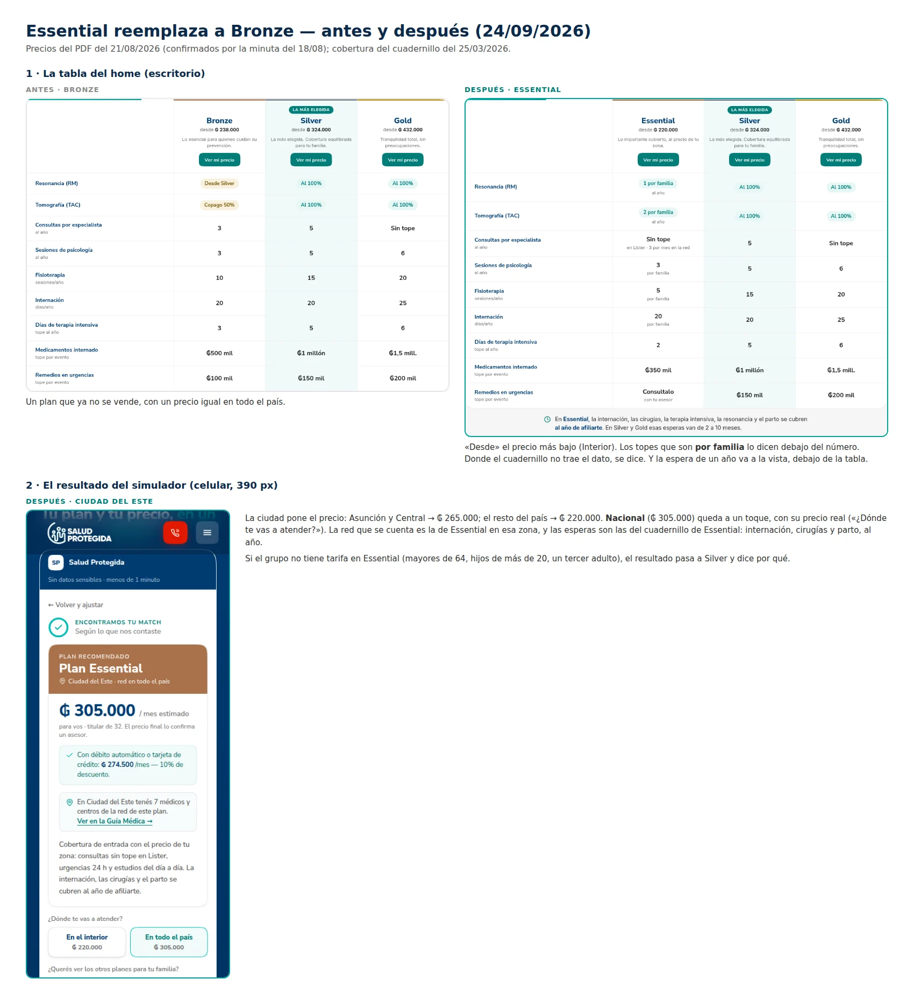

**Qué muestra.** La tabla del home antes (Bronze) y después (Essential), y el
resultado del simulador en celular para alguien de Ciudad del Este, con la
opción de todo el país.

**Qué se decidió.** Arturo eligió que la ciudad ponga el precio y que Nacional
quede a un toque. En la tabla, Essential no tiene los topes de Bronze: varios
son **por familia** y no por persona. Un «5» por familia al lado de un «15» por
persona se lee como una comparación que no es; por eso cada número de Essential
dice debajo qué cuenta. Donde el cuadernillo no trae el dato, la celda lo dice
(«Consultalo con tu asesor») en vez de rellenarla. Y como la tabla muestra topes
y no esperas, la espera de un año de Essential va en una línea propia, a la
vista, debajo de la tabla.

**La lección.** Una tabla compara solo si cada celda mide lo mismo. Cuando un
plan cuenta distinto, la diferencia se escribe junto al número; y lo que la
tabla no puede mostrar (la espera) se dice al lado, no se deja para la letra
chica.

---

## Parte 6 · Portadas del blog: el lenguaje elegido (24/09/2026)

Sigue a la Parte 4. Arturo tachó en rojo, sobre la lámina de la lección 20, todo
lo que no le servía. Quedaron la gente del isotipo (las dos personas que se
explican, la familia entre la casa y el sanatorio), el barrio con paisaje y el
ícono grande en círculo: *«Es casi como un niño que dibuja, pero un niño que
dibuja y se entiende.»*

### 22 · Un chico que dibuja y se entiende

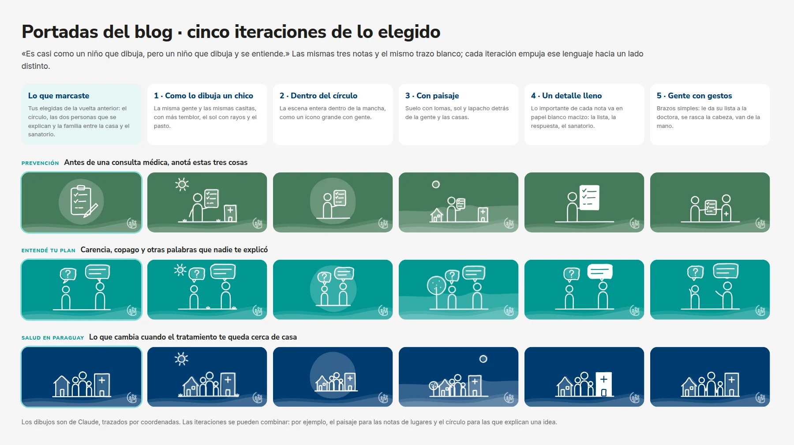

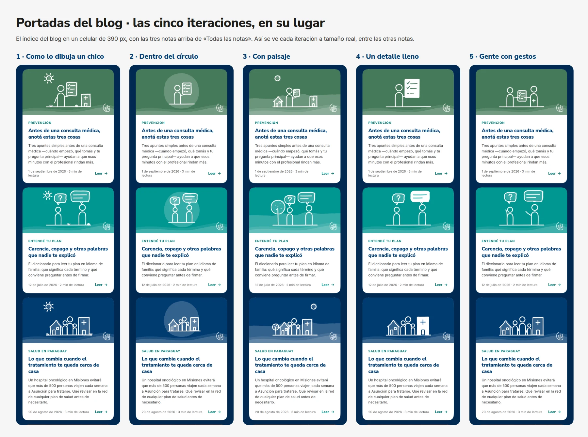

**Qué muestra.** Primero, lo que Arturo marcó. Después, cinco iteraciones del
mismo lenguaje sobre las mismas tres notas: más de chico (temblor, sol con rayos,
pasto), la escena dentro del círculo, con paisaje (lomas, sol, lapacho), un
detalle en papel blanco macizo, y gente con gestos (brazos simples). Abajo, las
cinco en el índice del blog, en celular.

**Lo que se vio.** «Antes de la consulta» no tenía ninguna versión elegida
fuera del círculo. La que mejor lo cuenta con gente es la de gestos: el paciente
le da su lista a la doctora. En el paisaje, las lomas dibujadas con línea
cruzaban a las personas y parecían rayitas sueltas; como papel translúcido
detrás, se leen como campo y no tapan a nadie. Y el detalle lleno es el que más
se ve de lejos, porque es lo único macizo de la portada.

**Estado (24/09/2026):** las cinco sobre la mesa, esperando a Arturo. Se pueden
combinar: él pidió que el conjunto sea diverso.

**Qué se decidió (25/09/2026).** Después de ver a Tranquibara y al muñeco
(lecciones 23 y 24), Arturo volvió a esta lámina: *«vamos a volver atrás con
todo»*. Eligió la **1 · Como lo dibuja un chico** como estilo base, y la **4 · Un
detalle lleno** para usar a veces: en la lista y en el globo sí, en el sanatorio
no (*«excepto la figura que tiene la casa, no me gusta esa»*). La regla que sale
de ahí: se llena un objeto chico que lleva la idea, nunca un edificio. Y sin
rigidez: *«No tenemos que ser muy estrictos, pero el estilo de dibujo creo que
encaja bastante bien aquí.»*

### 23 · Tranquibara también, con la misma mano

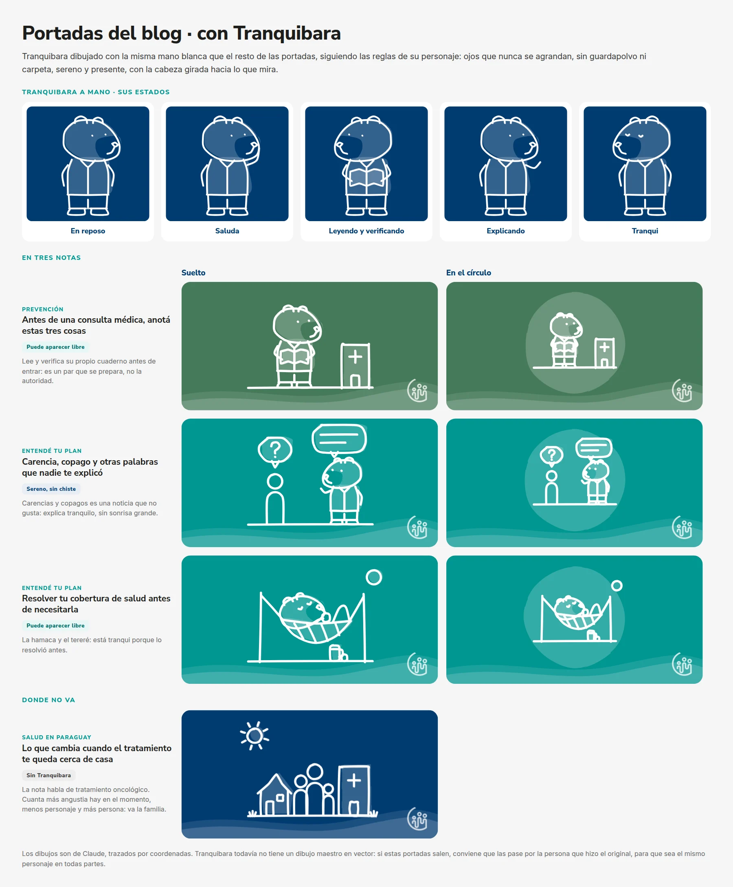

**Qué muestra.** Arriba, Tranquibara dibujado con el mismo trazo blanco, en cinco
estados: en reposo, saluda, leyendo y verificando, explicando y tranqui. Después,
tres portadas, sueltas y en el círculo: lee su cuaderno antes de la consulta,
explica con calma qué es una carencia, y descansa en la hamaca con su tereré
porque resolvió su cobertura antes de necesitarla. Al final, la nota donde no
va.

**Qué se respetó.** Las reglas del personaje: los ojos nunca se agrandan, nada
de guardapolvo ni carpeta, sereno y presente. En carencias y copagos va sereno y
sin chiste. En una nota sobre tratamiento oncológico no aparece: *cuanta más
angustia hay en el momento, menos personaje y más persona*.

**Lo que se vio.** De frente, en línea blanca, parecía un oso. El carpincho está
en el hocico largo, y eso solo se ve de tres cuartos. Girarle la cabeza fue
también cumplir otra regla suya: la cabeza mira hacia lo que atiende.

**Estado (24/09/2026):** esperando a Arturo. Tranquibara no tiene todavía un
dibujo maestro en vector; si estas portadas salen, conviene que las revise quien
hizo el original.

**Después (25/09/2026): descartado.** Arturo: *«Si el dibujo es así es horrible.
Parece como que la IA trató de dibujar usando líneas. No es el estilo de
Claude.»* Un personaje con tantos rasgos delata que el dibujo está construido con
coordenadas; las figuras simples del estilo del chico no, porque ahí la simpleza
es el estilo (BITACORA cap. 106). Si Tranquibara aparece en el blog, va con su
arte oficial.

### 24 · La gente, con otra mano

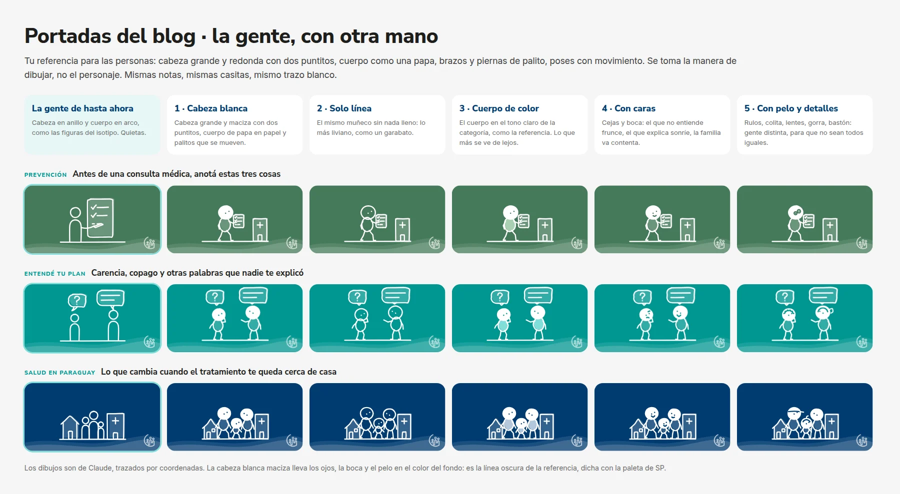

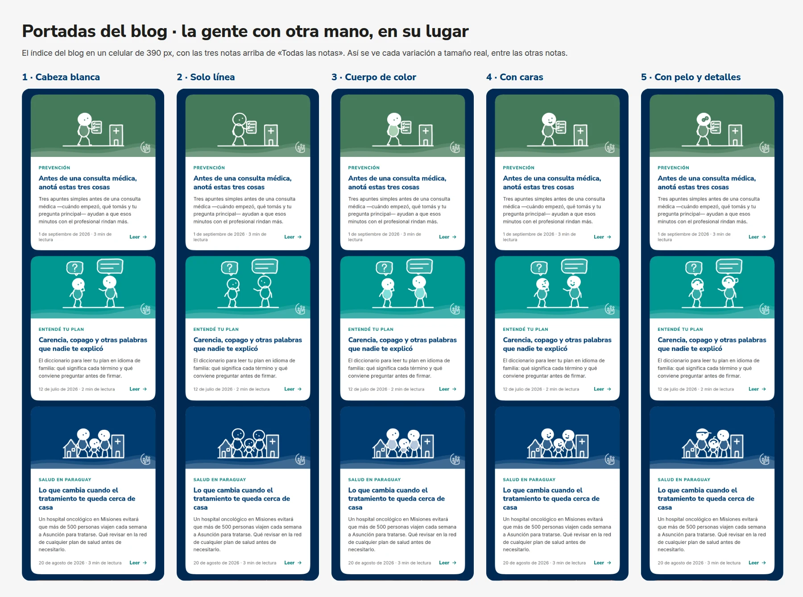

**Qué muestra.** Arturo pasó una referencia para dibujar a las personas: cabeza
grande y redonda con dos puntitos, cuerpo como una papa, brazos y piernas de
palito, poses con movimiento. La referencia no se guarda acá, porque no es
nuestra. Se tomó la manera de dibujar, no el personaje. La lámina muestra la gente
de hasta ahora y cinco variaciones del muñeco sobre las mismas tres notas:
cabeza blanca, solo línea, cuerpo de color, con caras y con pelo y detalles.

**Lo que se vio.** Con cabeza, cuerpo y palitos, la gente se mueve: el que no
entiende se rasca la cabeza, el que explica abre el brazo, la familia camina. El
primer intento de pelo y lentes fue en blanco sobre la cabeza blanca, y no se
veía. Lo que va en la cara va en el color del fondo, que cumple el papel de la
línea oscura de la referencia con la paleta de SP.

**Estado (24/09/2026):** esperando a Arturo.

**Después (25/09/2026): descartado** junto con Tranquibara: *«vamos a volver
atrás con todo»*. La gente sigue siendo la del isotipo (lección 22).

---

## Parte 7 · Essential estudio por estudio y un título sin bajada (25/09/2026)

### 25 · «No sé» también es una respuesta de la tabla

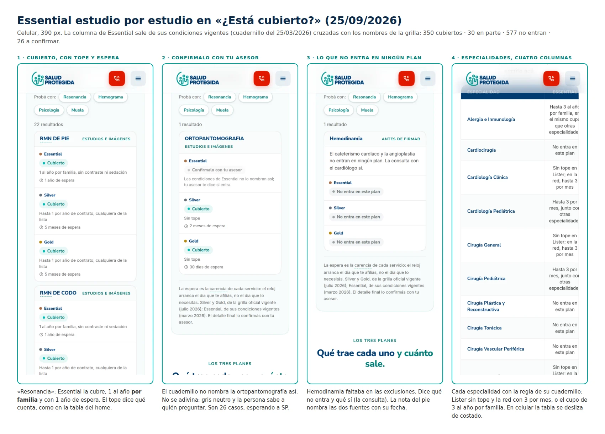

**Qué muestra.** El buscador de `/que-cubre` en celular después de cargar
Essential estudio por estudio: un estudio cubierto con su tope y su espera, uno
que el cuadernillo no nombra igual («Confirmalo con tu asesor»), la exclusión
de hemodinamia que faltaba y la tabla de especialidades con cuatro columnas.

**Qué se decidió.** El cuadernillo de Essential es una lista cerrada, así que
lo que no nombra queda como «No entra en este plan». Cuando un nombre de la
grilla podría ser el mismo estudio con otra palabra, no se adivina: se muestra
en gris neutro, con una línea que dice por qué y a quién preguntar. La nota del
pie nombra las dos fuentes con su fecha, porque Essential y Silver/Gold salen
de documentos distintos.

**La lección.** Un casillero que dice «preguntá» es más honesto que uno
rellenado por parecido, siempre que diga por qué no sabe y a quién preguntar:
sin esa línea, «Confirmalo» se lee como una evasiva. Y cuando dos columnas
salen de dos fuentes, la nota lo dice; si no, la persona cree que todo viene
del mismo papel.

### 26 · La transparencia no implica sobreexplicar

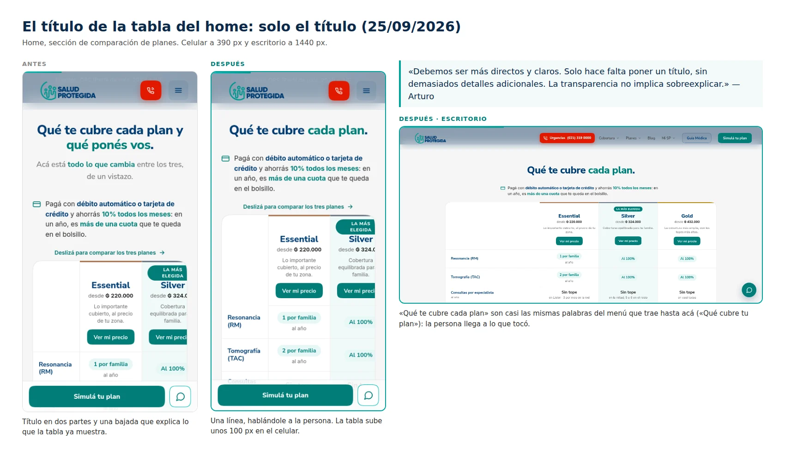

**Qué muestra.** El encabezado de la tabla que compara los planes en el home,
antes y después, en celular y en escritorio.

**Qué se decidió.** Arturo: *«Esta frase no es muy clara y no se dirige
directamente a la persona. Debemos ser más directos y claros. Solo hace falta
poner un título, sin demasiados detalles adicionales. La transparencia no
implica sobreexplicar.»* Quedó «Qué te cubre cada plan.», casi las mismas
palabras del menú que trae hasta ahí, y sin bajada. La tabla sube unos 100 px
en el celular.

**La lección.** Una bajada que anuncia lo que el bloque de abajo ya muestra
(«todo lo que cambia, de un vistazo») no agrega información: agrega lectura. Lo
honesto está en la tabla, no en explicar que la tabla es honesta.

---

## Parte 8 · Portadas del blog: la biblioteca, en tandas (25/09/2026)

Con el estilo elegido (lección 22), Arturo: *«Vamos a cubrir todas en tandas de
10.»* Son 62 notas sin cifra (las 9 con cifra quedan como están), de la más
nueva a la más vieja. Cada tanda se aprueba antes de pasar a la siguiente.

### 27 · Tanda 1: las diez más nuevas

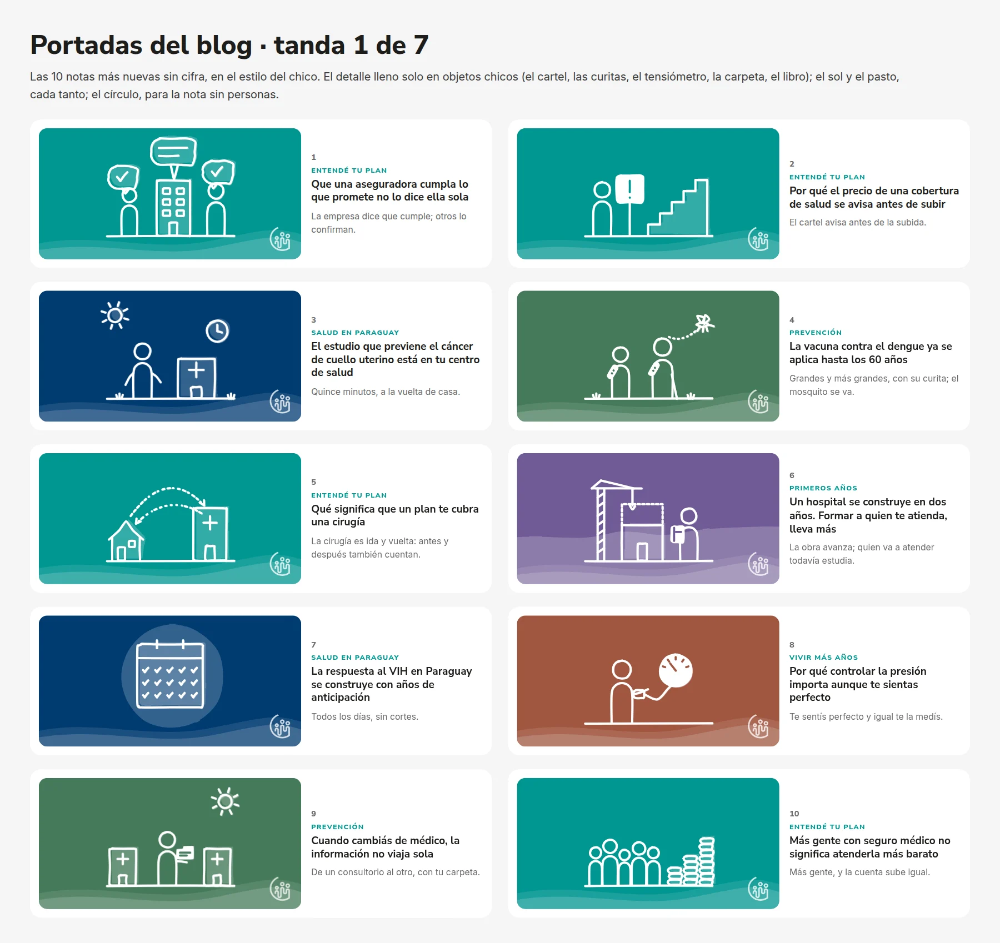

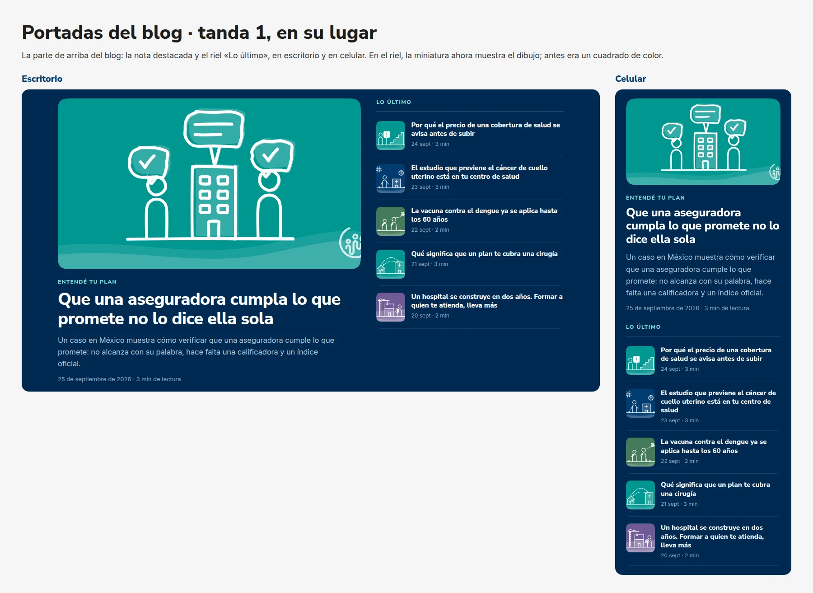

**Qué muestra.** Una metáfora por nota, armada con piezas: la empresa que dice
que cumple y otros que lo confirman; el cartel antes de la escalera; el centro de
salud con su relojito; la curita del joven y del mayor; el ida y vuelta de una
cirugía; la obra y quien estudia; el calendario de todos los días; el
tensiómetro; la carpeta de un consultorio al otro; la gente y las monedas que
suben. Abajo, la parte de arriba del blog con la nota destacada y el riel.

**Lo que se vio.** En el riel «Lo último», la miniatura de 64 px ahora muestra el
dibujo: antes el ícono de la categoría quedaba afuera del recorte y se veía un
cuadrado de color. Las curitas tuvieron que crecer para verse. Y el detalle lleno
quedó en objetos chicos, en cuatro de diez.

**Estado (25/09/2026):** esperando a Arturo.

### 28 · El objeto dice el tema; el gesto dice la idea

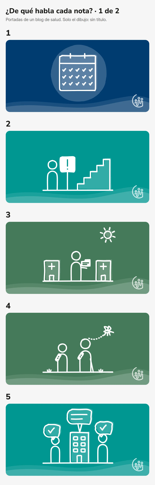

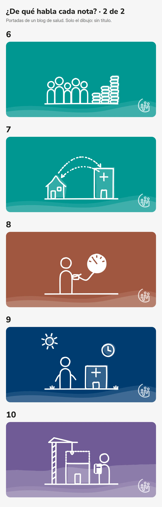

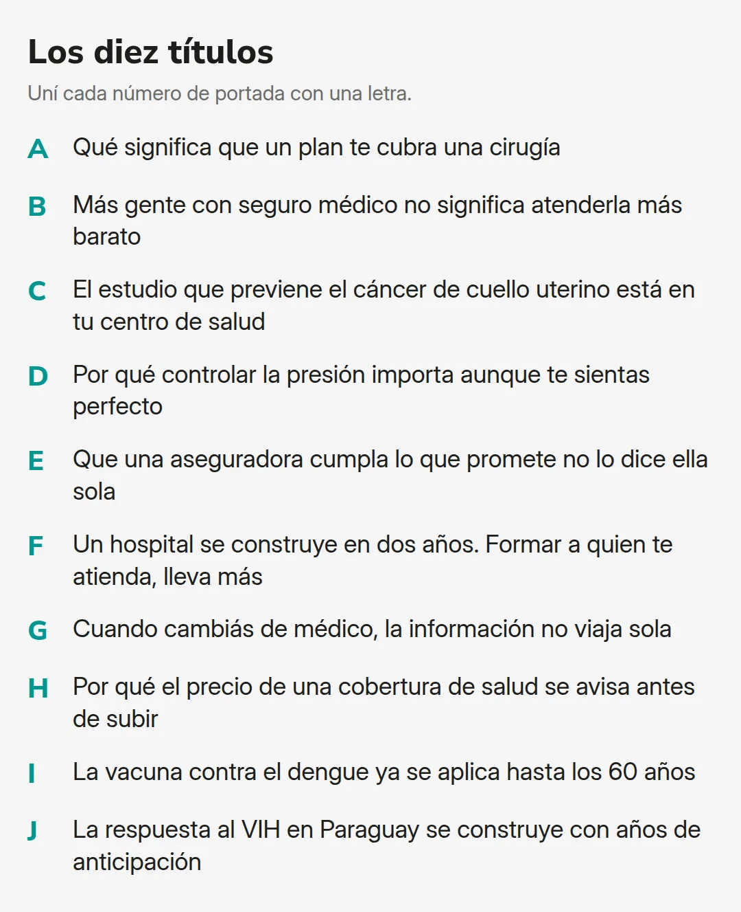

**Qué se pidió.** Arturo volvió a pasar dos juegos de la referencia (seis
portadas de colores apagados y seis íconos crema con un acento terracota) y
pidió *«un prompt para testear si esto se entiende realmente, y si coincide con
la filosofía del estilo de Claude, aunque no sea exactamente lo mismo, pero la
forma en la que el dibujo refleja el mensaje, y la personalidad del estilo»*.
Y después: *«Si miras con excesiva atención las imágenes, ¿qué observas? ¿Qué
otros detalles podrías extraer del estilo y forma?»* Las imágenes de referencia
no se guardan acá: son de otra marca.

**Lo que se ve de cerca.**
- **Emblema, no escena.** Un objeto que todos conocen (corazón, ADN, lamparita,
  escalera, moneda) y un gesto o una línea que le cambia el sentido: el pulso
  que cruza el corazón, la flecha que sube por arriba de la escalera, la mano
  que sostiene la moneda. El objeto dice el tema; el gesto dice la idea.
- **Dos capas que no se calcan.** Una forma plana, llena y sin contorno carga
  la idea; la línea es lo humano y la acción, y cruza la forma sin seguirle el
  borde. En la nuestra el papel también va corrido de la línea, pero al 20 %:
  se lee como sombra, no como idea.
- **Pocos trazos y mucho aire.** Uno a tres elementos en el centro, a media
  altura del cuadro. Sin suelo ni paisaje: las cosas flotan.
- **La gente, en pedazos.** Una mano que sostiene, un perfil que piensa. Nunca
  un cuerpo entero, nunca ojos. La personalidad está en el gesto, no en la cara.
- **Pocos valores.** Fondo, línea y forma. En el juego crema, un solo color de
  acento marca la idea, y un beige apenas más oscuro rellena los detalles.
- **Una picardía.** Un movimiento chico e inesperado: el cursor que hace clic en
  una molécula, la mano que mete un edificio en la ciudad.
- **Misma gramática, otra piel.** Los dos juegos cambian fondo, grosor y color, y
  se reconocen igual. La filosofía viaja; la firma (la mano de dedos en rulo, el
  perfil de una sola línea, las formas facetadas, la pincelada negra) no se toma.

**Lo que eso dice de la tanda 1** (contado sobre la lámina de la lección 27).
Nueve de diez tienen suelo; ocho de diez, gente de cuerpo entero; el sol o el
pasto aparecen en tres. La forma llena, que en la referencia es la idea, en la
nuestra es un detalle chico. Las nuestras cuentan una escena; las de la
referencia condensan una idea.

**La prueba** (`prueba-de-portadas.md`). La hoja a ciegas mezcla el orden y saca
títulos y categorías; la de títulos los trae con letra, en otro orden. Primera
medición, 25/09/2026: una IA sin contexto adivinó el tema de cada portada solo
con el dibujo. Es un lector, no cinco personas: vale como señal.
- **Acertó (2):** dengue (seguridad alta) y presión (baja).
- **Se acercó (3):** cambiar de médico (*«usar tu carnet en distintas
  clínicas»*), más gente (*«cuánto cuesta cubrir a toda la familia»*) y cirugía
  (*«ir y volver del hospital»*).
- **No acertó (5):** VIH (*«cumplir un plazo de días»*), el precio que se avisa
  (*«No sé»*), la aseguradora que cumple (*«a la gente le aprueban algo»*), el
  cuello uterino y el hospital con quien estudia (*«No sé»*).

El cuello uterino es la lección chica: el reloj quería decir «quince minutos» y
se leyó *«cuánto esperás para que te atiendan»*. En salud, un reloj se lee como
espera.

**Los errores que la referencia evita** (Arturo: *«¿Qué errores pensás que evita
cometer?»*). Entre paréntesis, la tanda 1:
1. **Dibujar la oración entera** en lugar de un objeto y un gesto (la comete: la
   aseguradora lleva edificio, globo, dos personas y dos tildes).
2. **La escena genérica de salud**: ni un hospital, ni un guardapolvo, ni un
   estetoscopio en doce dibujos (la comete: cuatro llevan sanatorio o hospital, y
   las dos de «persona + sanatorio» se leyeron como «clínicas» y «horarios»).
3. **Las caras**, que traen edad, género y emoción, y dejan a alguien afuera (la
   evita: la cabeza en anillo no tiene cara).
4. **El adorno** (la comete: suelo en nueve, sol o pasto en tres).
5. **Que todo pese igual** (la comete: todo con el mismo contorno, el papel como
   sombra).
6. **Los símbolos con dos lecturas** (la comete: el reloj y el cartel «!»).
7. **El dibujo quieto** (la comete: casi todo parado sobre una horizontal; la
   excepción, el mosquito que se va, fue de las dos que se acertaron).

Tres preguntas antes de dibujar cada portada: ¿cuál es el objeto?, ¿cuál es el
gesto?, ¿qué sobra?

**Segunda ronda: con los títulos y la referencia** (el mismo evaluador, con el
mensaje 2 en su variante con contrapeso).
- **Aprobadas: 2 de 10.** La presión y, después del contrapeso, el dengue (*«a
  ciegas leí dengue, vacuna y mayores»*). Las otras ocho, a rehacer, cada una con
  su causa visible: el sol que llevó a «vacaciones», el reloj que dice «horario»,
  el globo de la empresa que se ve antes que las tildes de la gente, la persona
  que queda al costado de la grúa.
- **Filosofía 4/10:** *«Nueve de diez son escenas con gente de cuerpo entero
  parada sobre una línea de suelo, no emblemas que flotan.»*
- **Personalidad 5/10:** *«La mano se reconoce […] Pero los objetos son los
  pictogramas de siempre (clínica con cruz, casa, calendario con tildes, edificio
  de ventanitas), así que el carácter está en el trazo y no en la idea.»*
- **Familia: no.** Composiciones repetidas: persona de pie a un lado y objeto al
  otro (cuatro portadas); tres elementos en espejo (dos); persona, clínica y sol
  (dos).
- **Lo que más le falta:** el emblema que flota, la gente en pedazos y la
  picardía.

**Dos cosas que enseñó la prueba sobre la prueba.**
- **El evaluador corrigió una observación nuestra, y con razón.** En el juego
  crema, la moneda y la estrella tienen el relleno adentro de la línea, y hay dos
  rellenos (terracota y beige), no uno. La regla «forma llena sin contorno» vale
  para el acento, no para todo. La guarda que le pedía decirlo funcionó.
- **Tres de sus nueve arreglos traían una mano** («una mano pasa la carpeta»,
  «una mano suma gente a la fila»). Es la firma de la referencia que Arturo
  descartó (lección 20). Quien aprende de una referencia tiende a proponerla: el
  prompt ahora prohíbe las manos como arreglo. En esta marca el gesto lo hacen la
  gente del logo, el objeto que se mueve o una flecha, como la moneda que sube la
  escalera, otro de sus arreglos.

**Segunda ronda a ciegas: la corrida de Arturo** (el mensaje 1, en otra ventana).
Un segundo lector que nunca vio al primero. Por número de la hoja:

| N° | Nota | Arturo | Claude | Juntas |
|---|---|---|---|---|
| 1 | VIH | *«Controles médicos regulares o agendamiento de turnos»* (alta) | *«Cumplir un plazo de días»* | ✗ ✗ |
| 2 | Precio que se avisa | *«Prevención de accidentes en el edificio»* | *«No sé»* | ✗ ✗ |
| 3 | Cambiar de médico | *«Traslados de pacientes o red de sanatorios»* | *«Usar tu carnet en distintas clínicas»* | cerca · cerca |
| 4 | Dengue | *«Prevención contra el dengue o chikungunya»* (alta) | dengue (alta) | ✓ ✓ |
| 5 | Aseguradora que cumple | *«No sé»* | *«A la gente le aprueban algo»* | ✗ ✗ |
| 6 | Más gente | *«Costos de planes médicos familiares»* (alta) | *«Cuánto cuesta cubrir a toda la familia»* | cerca · cerca |
| 7 | Cirugía | *«Atención médica a domicilio o traslados»* (alta) | *«Ir y volver del hospital»* | cerca · cerca |
| 8 | Presión | *«Tiempos de espera en las consultas»* | presión | ✗ ✓ |
| 9 | Cuello uterino | *«Horarios de atención durante el día»* | *«Horarios de atención»* | ✗ ✗ |
| 10 | Hospital y quien estudia | *«Construcción de nuevas clínicas o sucursales»* (alta) | *«No sé»* | cerca · ✗ |

**Lo que suma el segundo lector.**
- **Solo el dengue lo aciertan los dos.** La presión se parte: para Arturo, el
  tensiómetro era *«un reloj grande»*.
- **Cuando dos lectores que no se vieron coinciden en la lectura equivocada, no
  es ruido: el dibujo dice otra cosa.** El cuello uterino dio *«horarios de
  atención»* las dos veces; la fila con chicos, *«plan familiar»* las dos; la
  cirugía, *«traslados»* las dos.
- **Un cuadrante con aguja se lee como hora, y en salud la hora es espera.** De
  cuatro lecturas de los dos relojes (el del cuello uterino y el tensiómetro), tres
  fueron tiempo: *«horarios»*, *«horarios»*, *«tiempos de espera»*. Es la queja de
  la categoría puesta en la portada.
- **El «!» se lee como peligro** (*«prevención de accidentes»*), no como aviso
  previo.
- **Equivocarse con seguridad es peor que un «No sé».** Cuatro lecturas que no
  eran la nota vinieron marcadas «alta»: quien las lee se va convencido de otra
  cosa.

**Estado (25/09/2026):** la tanda 1 sigue esperando a Arturo. Propuesta de
Claude, sin decidir: quedarse con el dengue, rehacer las otras nueve como emblema
(sin manos, sin relojes ni cuadrantes, sin «!», sin una fila de gente que se lea
como familia) y gastar la prueba de pasillo en la versión nueva, no en esta, que
dos lectores ya marcaron.

### 29 · Dos evaluadores, un diagnóstico, y la prueba se calibra

**Qué pasó.** Arturo corrió el mensaje 2 en su ventana, sobre su propia ronda a
ciegas. Aprobó 3 (cambiar de médico, dengue y más gente, las tres en el
contrapeso) y mandó a rehacer 7. Filosofía 4/10, personalidad 6/10, familia no.

**Lo que dicen los dos evaluadores, sin haberse visto.**
- **El mismo diagnóstico.** Filosofía 4/10 en las dos corridas, familia «no» en
  las dos, y en las dos falta lo mismo: el emblema y la picardía. *«La mayoría
  recurre a escenas literales en lugar de crear emblemas conceptuales
  aislados.»* Solo el dengue lo aprueban los dos.
- **El mosquito dice lo contrario.** Queríamos que se fuera. Los dos lo leyeron
  llegando: *«un mosquito volando hacia dos personas»* y *«el recorrido del
  mosquito hacia las figuras explica bien el contagio»*. Una línea punteada no
  dice hacia dónde va.
- **El precio es una moneda que sube.** Para el aviso de precio, los dos
  propusieron lo mismo: *«una moneda sube la escalera»* y *«una flecha subiendo
  sobre una moneda»*.
- **Lo repetido parece de máquina.** Las quince tildes iguales, las monedas
  apiladas, los escalones: *«parece el ícono de calendario de una app»*, y
  *«vectores geométricos y proporciones rígidas»* en la 1, la 2, la 6 y la 7. La
  mano del chico se pierde cuando el mismo trazo se copia.
- **El tensiómetro volvió a ser reloj**: uno de los arreglos pedía *«reemplazar
  reloj por tensiómetro»*, y era un tensiómetro.

**Cómo se calibró la prueba** (detalle en `prueba-de-portadas.md`). El
contrapeso cambió cinco veredictos en las dos corridas y cuatro fueron para
aprobar: ahora lo que falla a ciegas no se aprueba en el contrapeso. «A ciegas»
pasó a ser una pregunta que se puede tildar: *¿alguien que lea solo la
adivinanza elegiría este título entre los diez?* Y el rojo y el logo entraron en
lo que no se propone, porque un arreglo pedía un lazo rojo tocando el logo.

**Ideas para la versión nueva** (de los dos evaluadores, pasadas por nuestras
reglas: sin manos, sin relojes ni cuadrantes, sin «!», sin rojo). Sin decidir:
1. VIH: un lazo blanco, lleno, sobre una pila de almanaques, uno por año.
2. Precio: la moneda que sube la escalera, con el aviso (un sobre) un escalón
   antes.
3. Cambiar de médico: la carpeta llena viaja con la persona entre dos
   consultorios, sin sol ni suelo.
4. Dengue: el mosquito que se va sin duda, hacia afuera del cuadro; la curita
   más grande; sin pasto.
5. Aseguradora: un globo grande con tilde (los de afuera) frente a uno chico (la
   empresa), sin edificio.
6. Más gente: una fila de adultos que crece y la pila de monedas que no baja,
   cada moneda a mano.
7. Cirugía: la lámpara del quirófano en el medio del ida y vuelta.
8. Presión: el corazón con el brazalete del tensiómetro puesto, sin cuadrante.
9. Cuello uterino: el microscopio, grande, en la puerta del centro de salud; sin
   reloj ni sol.
10. Hospital y quien estudia: la pila de libros más alta que el hospital
    terminado.

**Estado (25/09/2026):** esperando el OK de Arturo para rehacer las nueve y
probarlas igual, con la prueba de pasillo para la versión nueva.

### 30 · La tanda rehecha como emblema, y lo que le falta: contraste y gesto

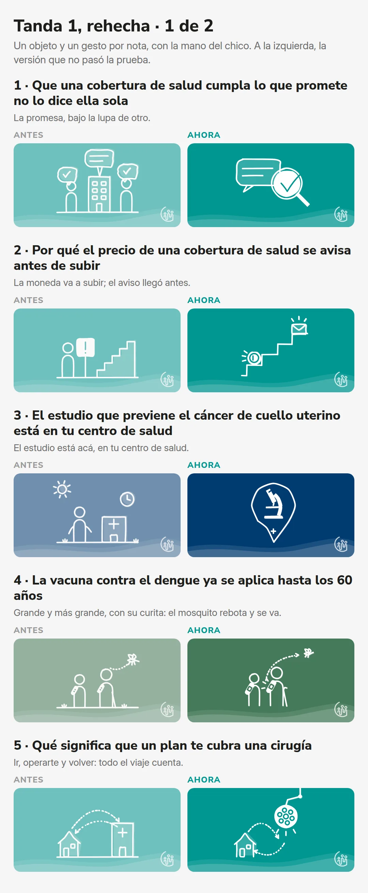

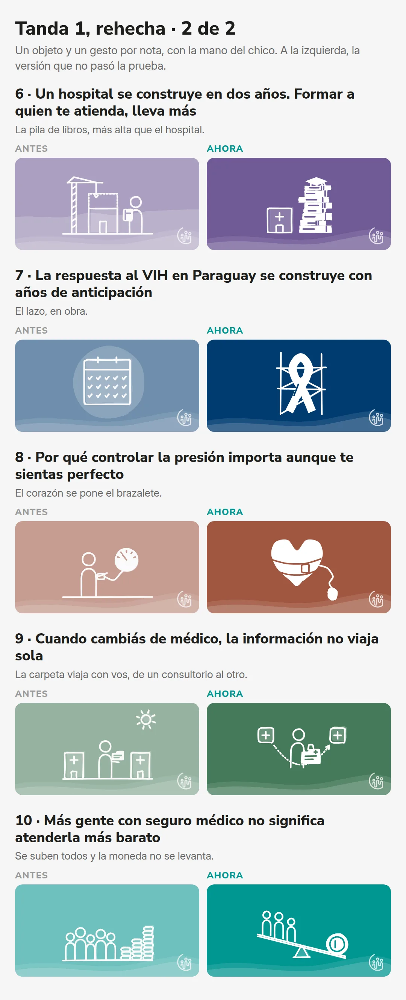

**Qué se hizo.** Con el OK de Arturo, las diez se rehicieron como emblema: un
objeto y un gesto, con la mano del chico, sin suelo, sin sol, sin manos, sin
relojes, sin «!» y sin rojo (dibujos en
`fuentes/2026-09-25-portadas-tanda-1-v2.mjs`). La lámina muestra cada una al lado
de la versión que no pasó.

**La prueba, con un evaluador nuevo y el prompt calibrado.** A ciegas acertó 6 de
10, contra 2 y 1 de las corridas anteriores: el médico (*«cambiarse de […] una
clínica a otra»*), el dengue (*«vacunas para adultos mayores contra el
dengue»*), la cirugía (*«ir a operarse y volver a casa»*), la presión, el cuello
uterino (*«dónde hacerte análisis de laboratorio cerca de tu casa»*) y la
formación de los médicos. Con los títulos aprobó 5, y subieron la filosofía (de 4
a 5) y la personalidad (de 5-6 a 7). Hojas: `…-tanda-1-v2-ciega-*.webp`.

**Lo que sigue fallando, según el evaluador.**
- **El lazo sin rojo se lee como cáncer.** Un lazo blanco es de cualquier campaña.
- **El sobre al final de la escalera se lee «después», no «antes».**
- **La lupa con tilde y el pin del mapa parecen íconos de sistema.**
- **La gente del logo en grupo es una familia.** Tres figuras de alturas
  distintas dieron *«plan familiar»* en las tres corridas: el isotipo mismo es una
  familia. Para decir «más gente» hace falta una multitud pareja.
- **Falta el gesto sobre el objeto** (el lazo, el corazón, el pin y los libros
  están quietos) **y sobran recorridos punteados** (el médico, el dengue y la
  cirugía se explican con una flecha de A a B: *«se parecen más a un diagrama que
  a una picardía»*).
- **La línea repasa el borde del lleno en vez de cruzarlo**: la moneda, los
  libros, el microscopio.

**Lo que dijo Arturo, viendo la tanda.** Sobre el color: *«Usted está poniendo
todo de blanco y puede ver también que el modelo de Claude usa diferentes colores
para tener ese contraste que uno necesita en las imágenes, porque en algunas de
las imágenes que me está mostrando no se siente ese contraste.»* Y sobre el
precio: *«el concepto de moneda y el concepto de aviso, como una casilla de
correo, un correo o un tipo de sobre de correo, no encajan muy bien en la idea
[…] Mira bien los conceptos, observa bien para que te puedas agarrar mejor con lo
que quieres comunicar.»* Las dos cosas coinciden con el evaluador: sin un segundo
color, la línea y el lleno pesan igual y las dos capas no se separan.

**El color: cuatro tratamientos** (tratamientos en
`fuentes/2026-09-25-portadas-color.mjs`, todos con la paleta oficial).

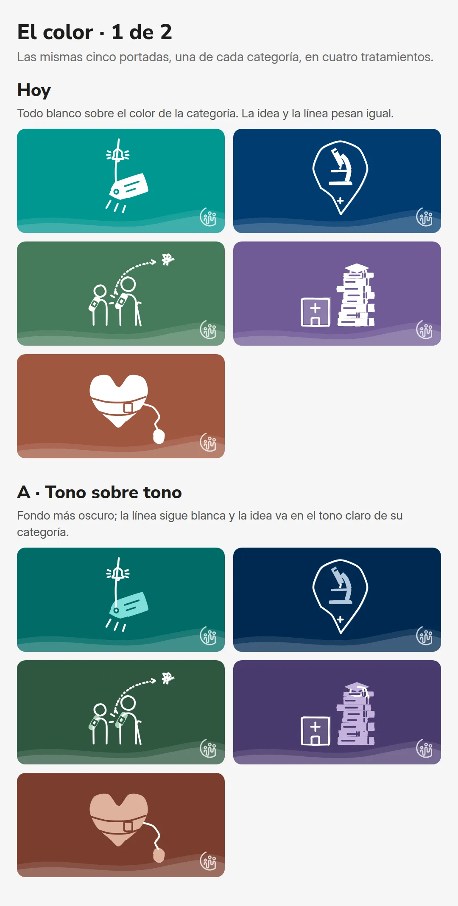

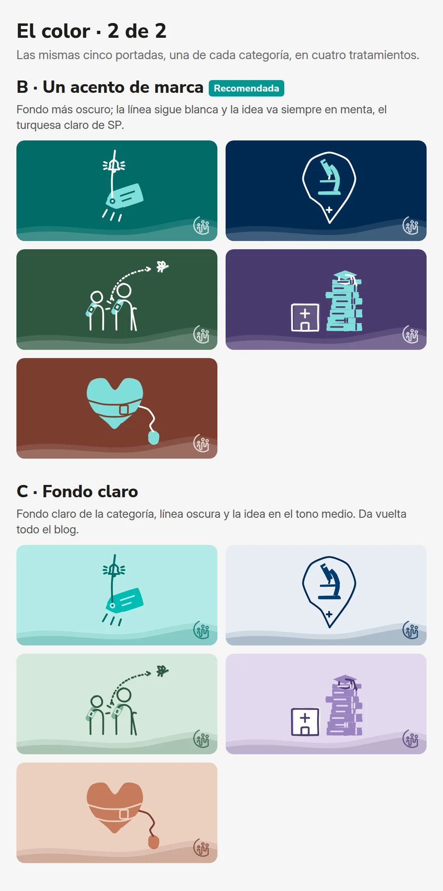

- **Hoy:** todo blanco sobre el color de la categoría.
- **A · Tono sobre tono:** fondo más oscuro (g1), línea blanca, la idea en el tono
  claro de su categoría.
- **B · Un acento de marca:** fondo más oscuro, línea blanca, la idea siempre en
  menta (`--sp-mint`). Es la recomendación de Claude: el contraste más fuerte sin
  dejar el trazo blanco, y un solo acento que une todo el blog, como el terracota
  une los íconos de la referencia, pero con un color de SP.
- **C · Fondo claro:** fondo claro, línea oscura, la idea en el tono medio. Es la
  que más se lee, pero es la receta de la referencia (fondo claro, línea oscura,
  un acento) y da vuelta el aspecto de todo el blog (lección 18).

**El precio: tres conceptos** en lugar de la moneda y el sobre.

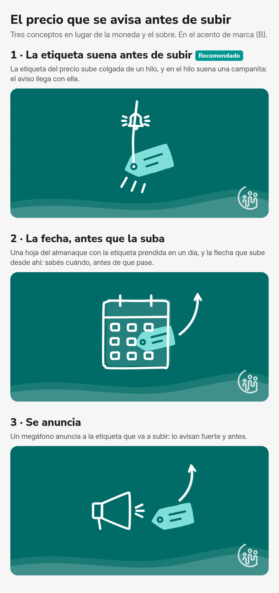

1. **La etiqueta suena antes de subir** (recomendado): la etiqueta del precio
   sube colgada de un hilo y en el hilo suena una campanita, el aviso de todos los
   días en el celular. El aviso va arriba, antes que el precio.
2. **La fecha, antes que la suba:** la etiqueta prendida en un día del almanaque y
   la flecha que sube desde ahí.
3. **Se anuncia:** un megáfono le avisa a la etiqueta que sube.

La escalera se va por otra razón: la referencia tiene un ícono de escalera con
flecha, y la nuestra se le acercaba.

**Estado (25/09/2026):** esperando a Arturo: el color, el concepto del precio y
qué hacer con el lazo del VIH. Después, una pasada más a las diez con el gesto
sobre el objeto, menos flechas punteadas, la línea que cruza el lleno y una
multitud pareja en «más gente»; y de nuevo la prueba.

---

## Parte 9 · El header se siente botón (25/09/2026)

### 30 · Lo que se toca tiene que avisar que se tocó

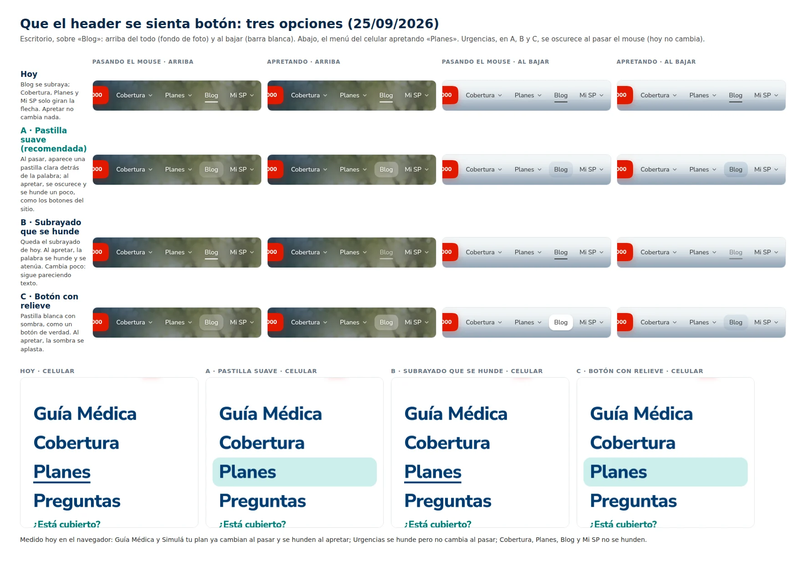

**Qué muestra.** El header tal como estaba y tres opciones, en cuatro estados:
el mouse encima y el botón apretado, arriba de todo (sobre la foto) y al bajar
(barra clara). Abajo, el menú del celular con el dedo sobre «Planes».

**Qué se decidió.** Arturo: *«que se sienta también como botón cada vez que
hacemos clic en eso»*. Medido en el navegador antes de proponer: Guía Médica y
Simulá ya respondían; Urgencias se hundía pero no cambiaba al pasar; Cobertura,
Planes, Blog y Mi SP no se hundían nunca. Eligió la **A, pastilla suave**: una
pastilla clara aparece detrás de la palabra al pasar, se oscurece y se hunde al
apretar; en el celular, el renglón del menú se pinta de menta. La B dejaba el
subrayado y seguía pareciendo texto; la C, con sombra, competía con los tres
botones de verdad del header.

**La lección.** Un subrayado dice «esto es un link»; una pastilla que se hunde
dice «te escuché». En un header donde conviven botones y links, los links que
no responden al toque se leen como texto muerto. Y la pastilla se agrandó con
padding y margen negativo: en reposo, el header quedó idéntico píxel por píxel.

---

## Parte 10 · La tira de prestadores del home (25/09/2026)

### 31 · Un nombre real vale más que una categoría

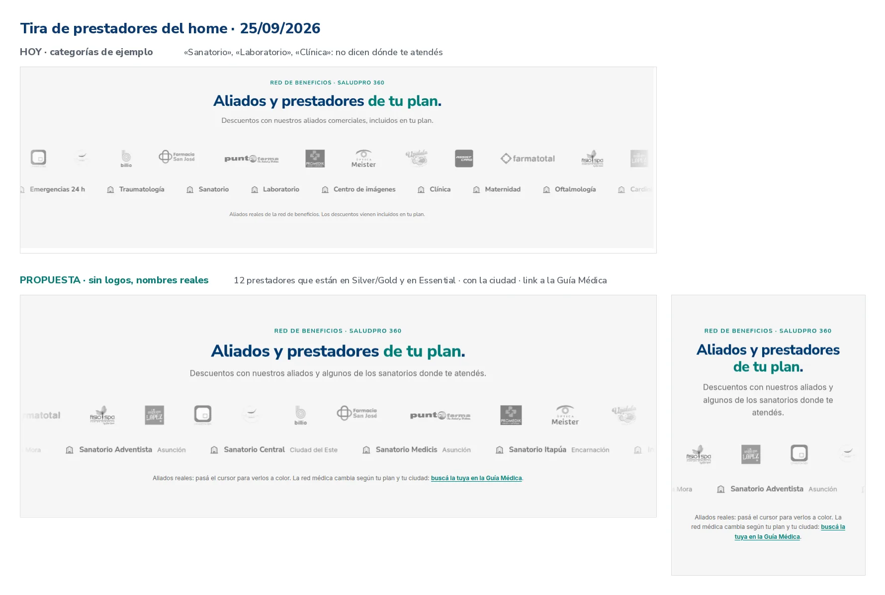

**Qué muestra.** Arriba, la sección tal como estaba: la segunda tira decía
«Sanatorio», «Laboratorio», «Clínica». Abajo, la propuesta sin logos: 12
prestadores reales de la planilla, cada uno con su ciudad, y una nota al pie
con link a la Guía Médica. A la derecha, a 390 px.

**Qué se decidió.** Quedó atrás: la tira se reemplazó por «Dónde te atendés»
(n.º 33 a 35). En su momento: Arturo pidió los logos; no se pudieron bajar
(BITACORA cap. 114) y propuso comparar una versión con logos y otra sin. Esta
es la sin logos. La elección de los nombres no es estética: solo entran los
que están en Silver/Gold **y** en Essential, porque el título dice «de tu
plan».

**La lección.** Una categoría («Sanatorio») no le dice a nadie si su sanatorio
está. Un nombre sí, y por eso también puede prometer de más: se elige con la
planilla al lado, no con la fama.

### 32 · Con logos o sin logos

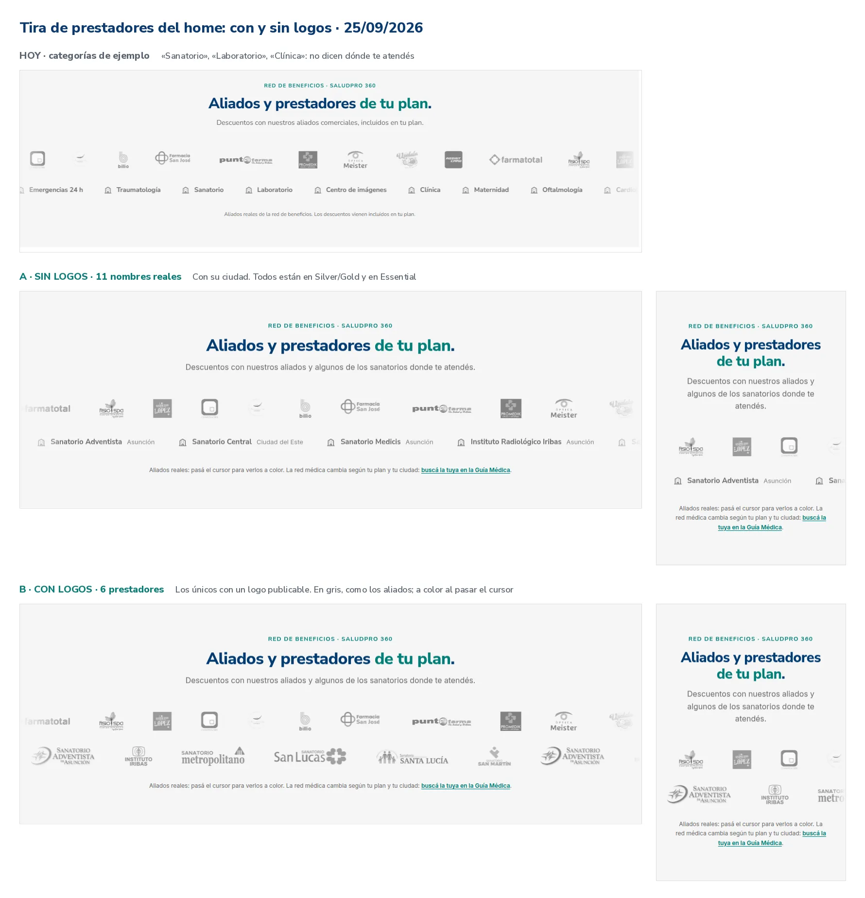

**Qué muestra.** Tres estados de la misma sección. Hoy: categorías de ejemplo.
A: 11 prestadores reales en texto, con su ciudad. B: los 6 que tienen un logo
publicable, en gris como los aliados.

**Qué se decidió.** Ni una ni otra: la tira entera se reemplazó por «Dónde te
atendés» (n.º 33 a 35). Arturo había pedido comparar (*«Igual podemos probar
una versión con y una versión sin logos»*). La recomendación fue A: B deja afuera a
Encarnación y Luque, de Ciudad del Este queda solo Santa Lucía, y pegada a la
tira de aliados no se distingue un sanatorio de una farmacia con descuento.

**La lección.** Dos tiras de logos en gris, una arriba de la otra, se leen
como una sola. Si la segunda dice otra cosa, tiene que verse distinta.

### 33 · Cinco maneras de mostrar la red, sin tira

Arturo, después de ver la tira con y sin logos: *«¿Qué pasa si, en vez de que
sea una tira dinámica, algo que se ve muchísimo, no es algo más original?»*.
Y que funcionara igual con o sin logos. Las cinco usan datos reales de la
planilla (615 médicos y centros de Silver/Gold, 79 ciudades, 17
departamentos) y cierran en la Guía Médica.

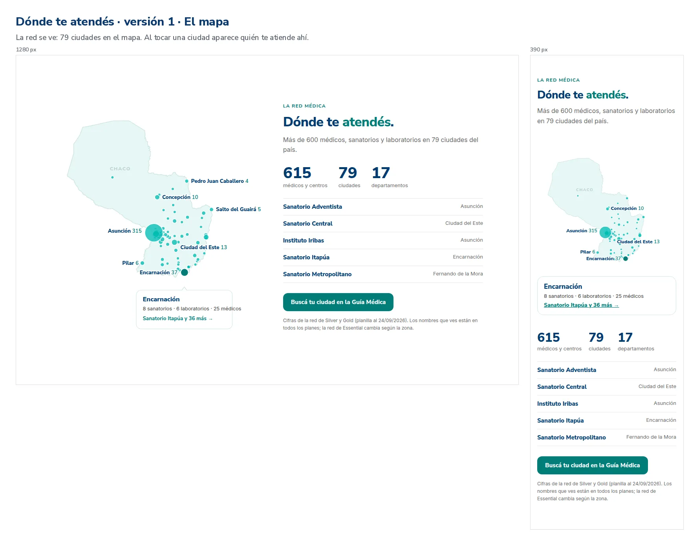

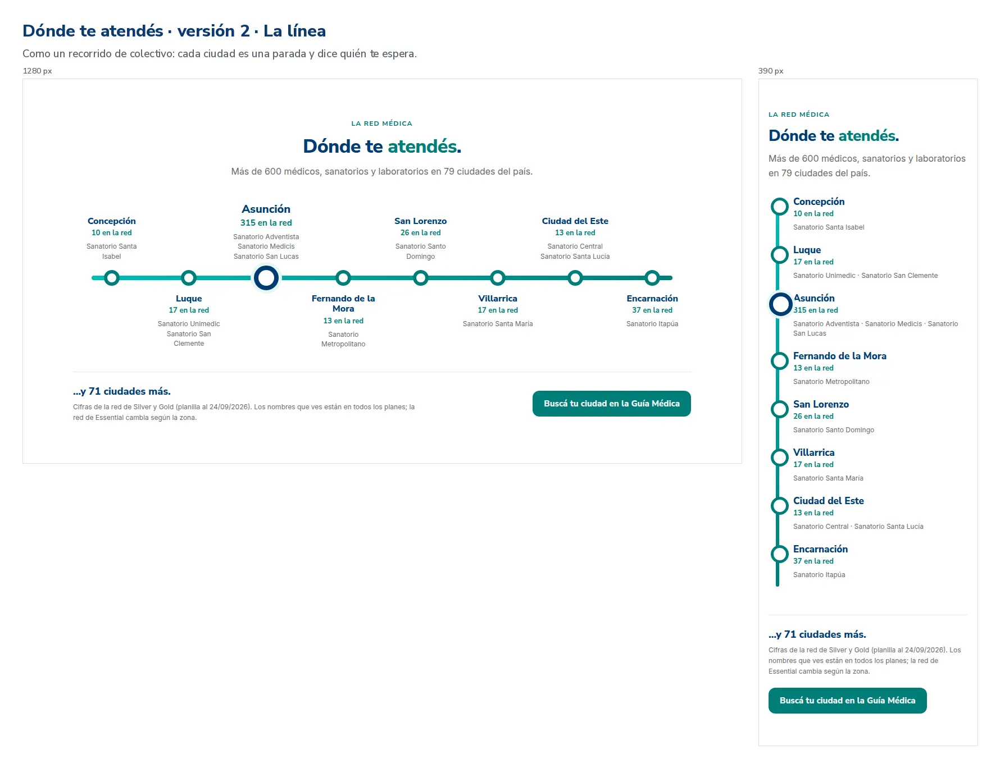

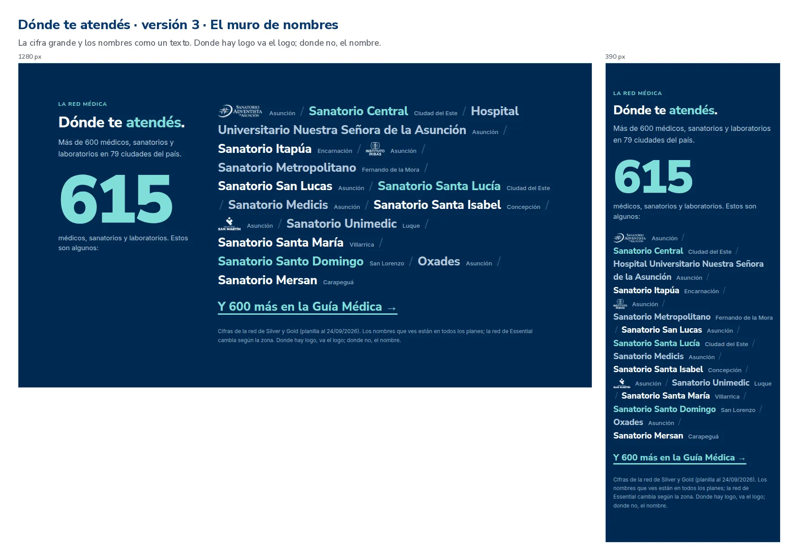

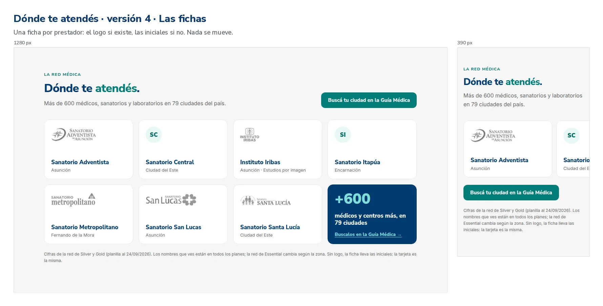

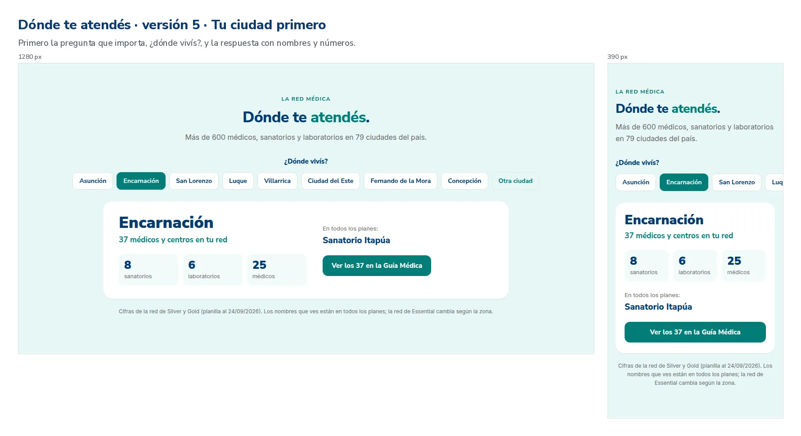

**Qué muestra.** 1, el mapa: un punto por ciudad, del tamaño de su red; al
tocarlo, quién te atiende ahí. 2, la línea: las ciudades como paradas de un
recorrido. 3, el muro: la cifra grande y los nombres como un texto. 4, las
fichas: una tarjeta por prestador, con logo o con iniciales. 5, tu ciudad
primero: «¿Dónde vivís?» y la respuesta con números y nombres.

**Qué se decidió.** Arturo se quedó con tres —el muro, el mapa y «tu ciudad
primero»— y las combinó (n.º 34 y 35). La recomendación había sido la 5, con el mapa
de la 1 como compañía en escritorio: es la única que contesta la pregunta que
trae la persona (*¿tengo algo cerca?*) en lugar de repetir la puerta a la Guía
Médica, que es por lo que se sacó la franja «Lister + más de 50 prestadores»
el 6 de agosto.

**La lección.** Una tira que se mueve dice «tenemos convenios». Un mapa o una
ciudad dicen «acá te atendés». El formato también es parte del mensaje, y el
logo pasa a ser un detalle: la ficha, el muro y el mapa funcionan igual sin él.

### 34 · El muro de fondo, el desglose y el mapa en la Guía

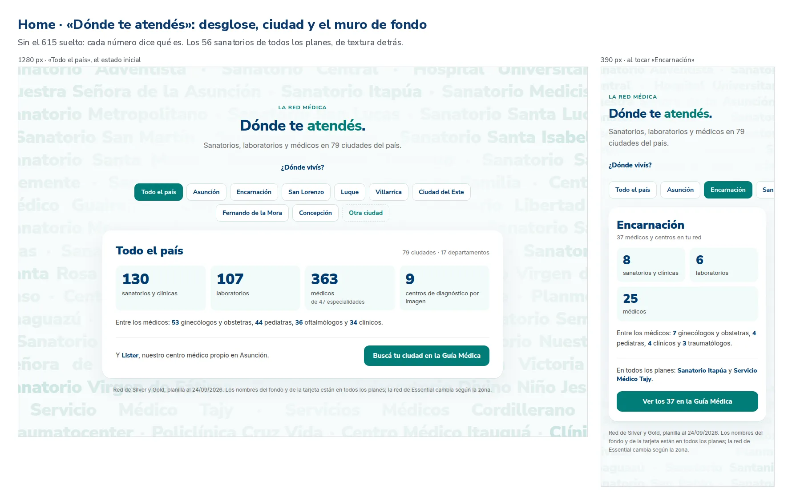

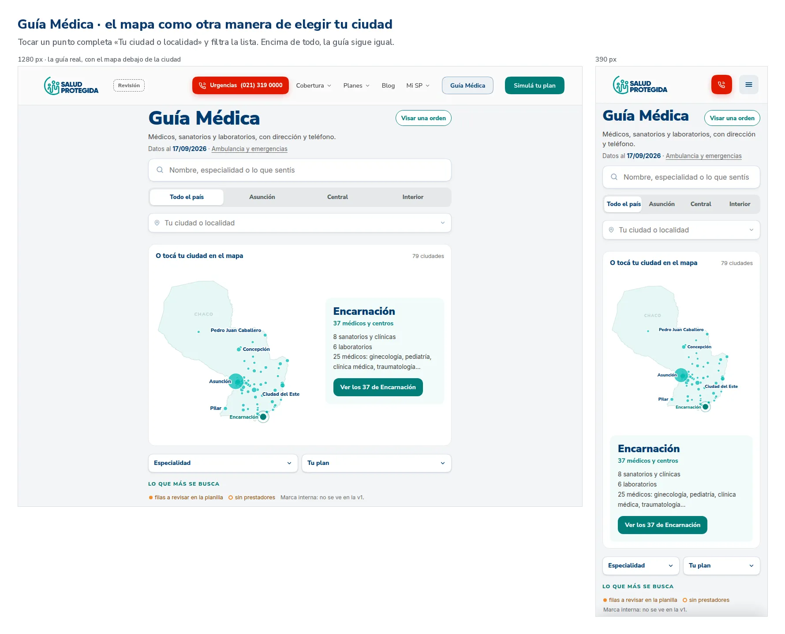

**Qué muestra.** Arriba, la sección del home que junta tres ideas: el muro (sin
logos) pasa a ser el **fondo**, una textura con los 56 sanatorios y clínicas
que están en todos los planes; adelante, el **desglose** de la red y el
«¿Dónde vivís?». Abajo, el **mapa** dentro de la Guía Médica real, como otra
manera de elegir la ciudad.

**Qué se decidió.** Arturo eligió tres de las cinco: *«Me gusta muchísimo el
muro… El mapa está genial y también está muy bueno la versión 5»*. Y pidió
desglosar el número: *«ese número grande, 615, a veces se puede comparar con
otras prepagas que son la competencia y tienen un número mayor»*. Por eso el
615 ya no aparece solo: 130 sanatorios y clínicas, 107 laboratorios, 363
médicos de 47 especialidades, 9 centros de imágenes. El muro va de fondo, como
propuso él; el mapa, donde es útil (la Guía, que ya filtra por ciudad).
Construido después de la n.º 35.

**La lección.** Un número total invita a comparar con el total de otro; un
número con nombre («44 pediatras») se compara con lo que la persona necesita.
Y un fondo de texto funciona si es textura: casi del color del fondo, con un
velo claro donde está lo que se lee, y oculto para los lectores de pantalla.

### 35 · Muro gris, y dos opciones más para el home y para el mapa

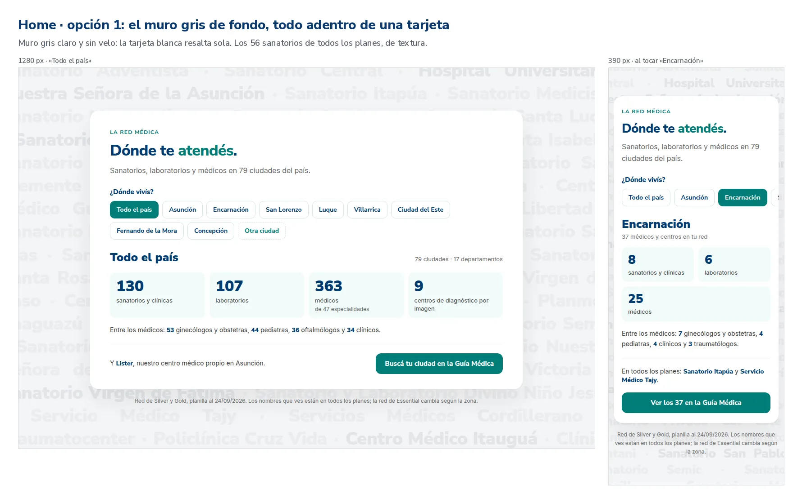

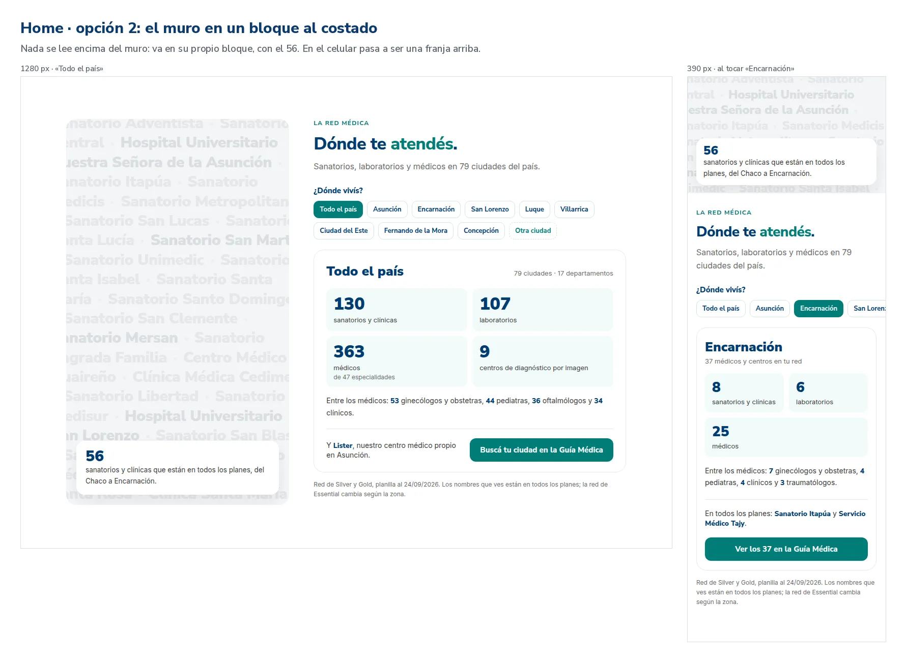

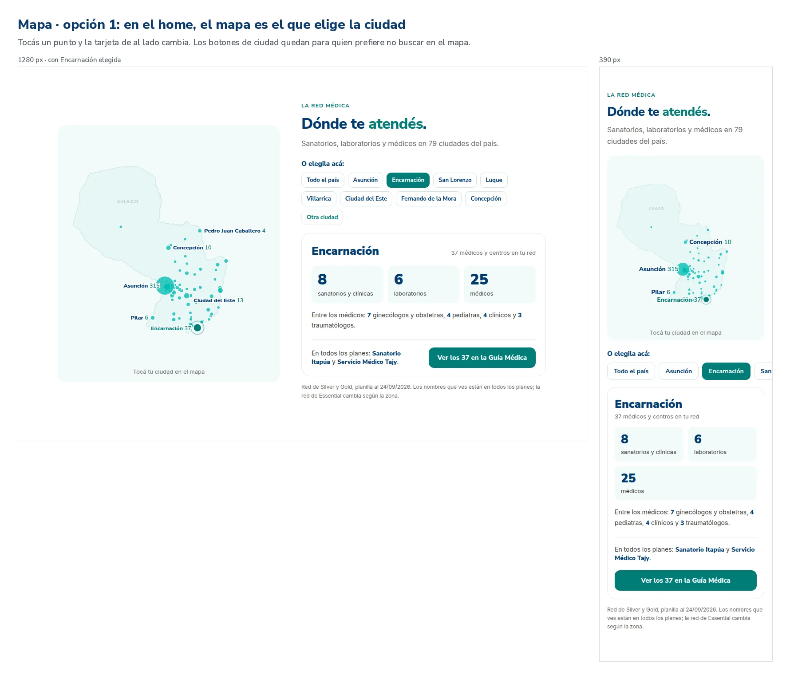

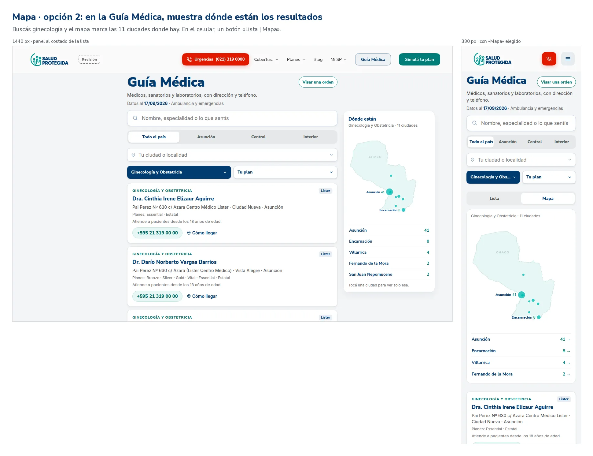

**Qué muestra.** Arturo sobre la n.º 34: el muro *«puede ser de color gris.
Puede ser más claro»*, sin el velo blanco de atrás, para que lo de adelante
tenga contraste propio. Con ese muro, dos maneras de ponerlo en el home: **1**,
de fondo a sangre con todo adentro de una tarjeta blanca; **2**, en su propio
bloque al costado, donde nada se lee encima. Y dos lugares más para el mapa:
**1**, en el home como selector de ciudad; **2**, en la Guía Médica como panel
que muestra dónde están los resultados de lo que buscaste (ginecología: 11
ciudades), con un «Lista | Mapa» en el celular.

**Qué se decidió.** Arturo: *«Dale, construí home opción 1 y mapa opción
2»*. Construido el mismo día: la sección del home con el muro gris a sangre y
todo en la tarjeta, y el mapa en la guía, al costado desde 1400 px y con
«Lista | Mapa» en el resto. En la guía, el mapa va **sin números**: la guía no
muestra totales de prestadores desde el 23/09 (la lámina los tenía).

**La lección.** Un fondo de texto no necesita velo si es suficientemente
claro: el velo es un parche para un fondo que grita. Y un mapa sirve más donde
responde a lo que la persona ya hizo (buscó una especialidad) que donde solo
muestra la red.

---

## Parte 11 · El muro como tapiz de la Guía Médica (25/09/2026)

### 36 · Tres maneras de poner el muro detrás de la guía

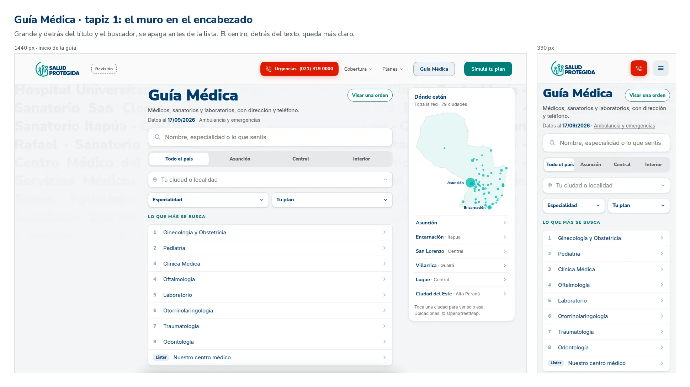

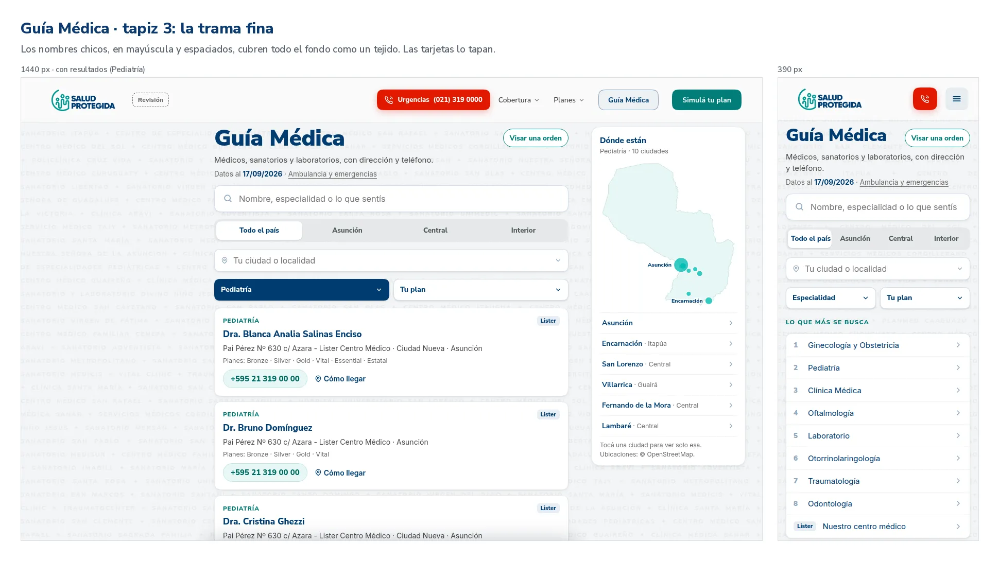

**Qué muestra.** Arturo, con «Dónde te atendés» publicado: el muro *«también
puede estar detrás de la guía médica… más sutil, más fade… como un lindo tapiz
de atrás»*. Tres maneras, sobre la guía real: **1**, en el encabezado, que se
apaga antes de la lista (con el centro más claro detrás del texto); **2**, en
los márgenes, fijo y visible solo a los costados de la columna; **3**, la
trama fina: nombres chicos en mayúscula, como un tejido, en todo el fondo.

**Qué se decidió.** Arturo eligió el **2**, y pidió verlo sin el degradé que
lo apagaba al acercarse a la columna (n.º 38).

**La lección.** La guía es una herramienta: se leen direcciones y teléfonos.
El tapiz tiene que vivir donde no se lee. En el celular no hay márgenes, así
que el 2 se vuelve el 1: la misma idea necesita otro lugar en otra pantalla.

---

## Parte 12 · El tramo de abajo del comparador (25/09/2026)

### 37 · Siete piezas apiladas, compactadas en dos maneras

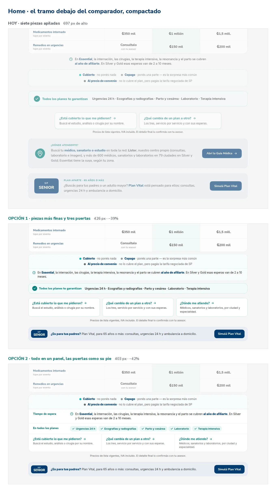

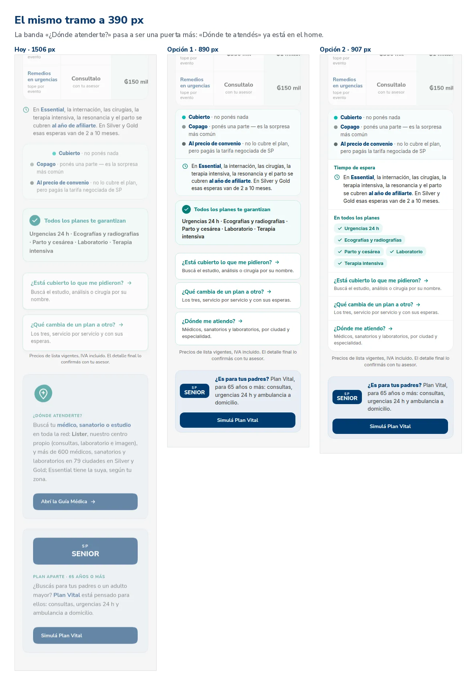

**Qué muestra.** Arturo: *«esta parte de aquí no me gusta tanto cómo está
diseñada… podemos cram it a little bit more while maintaining very good
aesthetic design»*. Hoy son siete piezas, cada una con su caja: la espera de
Essential, la leyenda, la garantía, dos puertas, la nota de precios, la banda
«¿Dónde atenderte?» y la banda de SP Senior. **Opción 1**: la leyenda y la
espera en una sola caja, la garantía en una línea, tres puertas iguales y SP
Senior en una tira. **Opción 2**: todo en un solo panel —leyenda, espera,
garantía en cápsulas— con las tres puertas como su pie, y SP Senior en una
tira. Las dos bajan el tramo un 40%.

**Qué se decidió.** Ninguna de las dos. Arturo: *«las versiones compactadas
se ven como mucha info, mucho ruido»* (n.º 39). En las dos, la banda «¿Dónde
atenderte?» pasa a ser la tercera puerta («¿Dónde me atiendo?»): desde el
25/09 el home tiene «Dónde te atendés», y la banda repetía lo mismo con más
texto (la misma razón por la que se sacó la franja de Lister el 6/08).

**La lección.** Una pila de cajas iguales no ordena: cada caja pide la misma
atención. Juntar lo que se lee junto (leyenda y espera explican la tabla) y
alinear lo que es del mismo tipo (tres preguntas, tres puertas iguales)
achica sin sacar nada.

### 38 · El tapiz 2 sin degradé: borde neto o sin borde

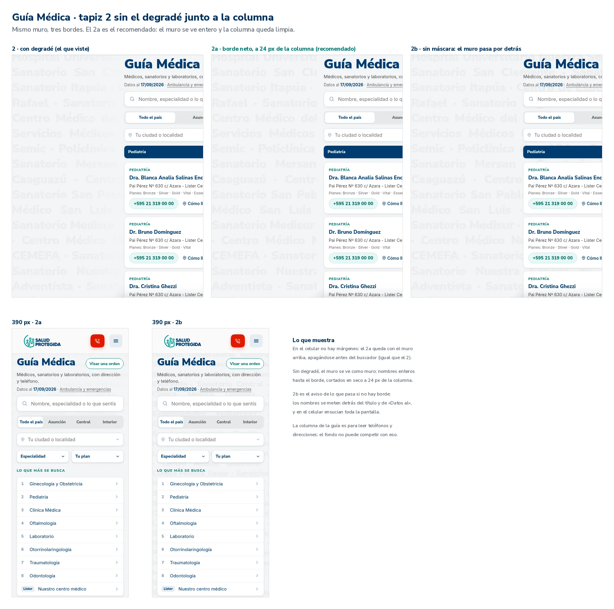

**Qué muestra.** Arturo, del tapiz 2: *«¿podemos probar qué tal se ve sin ese
fade al acercarse al cuadro?»*. El mismo muro con tres bordes: **2**, el de
antes, que se apaga al llegar a la columna; **2a**, entero hasta 24 px antes
de la columna y cortado en seco; **2b**, sin máscara: el muro sigue por
detrás de todo.

**Qué se decidió.** Arturo eligió el **2a** y se construyó el 26/09/2026
(`.gm-tapiz`).

**La lección.** Sin degradé, el muro se lee como muro: nombres enteros, sin
la niebla que los desdibujaba junto a la columna. Pero sin *ningún* borde (2b) los
nombres se meten detrás del título y de «Datos al», y en el celular ensucian
toda la pantalla. El degradé no era lo que protegía la columna: lo que la
protege es el borde. Se puede sacar la niebla y dejar el borde.

---

## Parte 13 · El tramo del comparador, sin ruido (25/09/2026)

### 39 · Compactar no es calmar

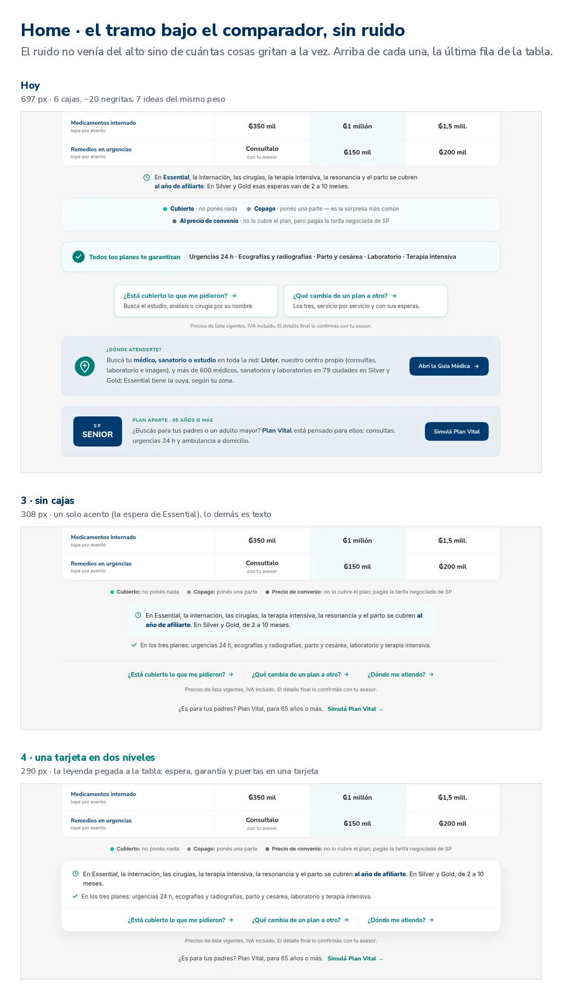

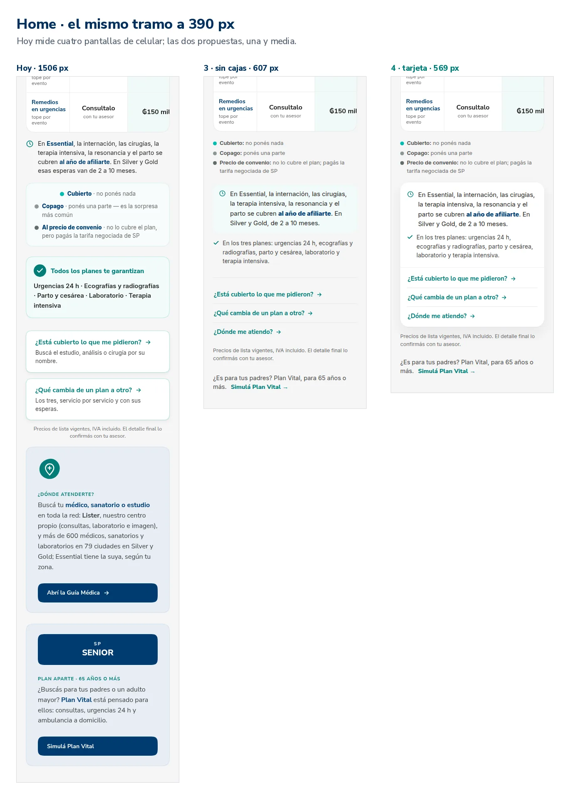

**Qué muestra.** Con las opciones 1 y 2 del n.º 37 delante, Arturo: *«se ven
como mucha info, mucho ruido. ¿Cómo podríamos solucionar esto?»*. El ruido no
venía del alto: hoy son **6 cajas, unas 20 palabras en negrita y 7 ideas con el
mismo peso**, y las opciones 1 y 2 las apretaban sin sacarles volumen. Las dos
nuevas bajan el volumen: **3**, sin cajas: un solo acento (la espera de
Essential, en una franja menta), la leyenda en una línea gris pegada a la
tabla, la garantía en una línea con un tilde, tres preguntas como enlaces sin
subtítulo y SP Senior en una frase. **4**, lo mismo, pero la espera, la
garantía y las tres preguntas viven en **una** tarjeta blanca; afuera quedan
solo la leyenda (arriba, pegada a la tabla) y la nota de precios.

**Qué se decidió.** Arturo eligió la **4** (recomendada: un solo contenedor y
un solo eje de lectura; en la 3 quedan cinco piezas sueltas de anchos
distintos), y al elegirla preguntó: *«esa "essential" (las carencias), ¿no se
podría simplemente poner como una fila más en el comparativo?»*. Sí: es un dato
que cambia por plan, que es lo que la tabla hace. Se construyó el 26/09/2026
con la espera como última fila («Tiempo de espera»): el tramo quedó en 244 px
en escritorio (hoy eran 697) y 474 a 390 px (eran 1506).

**La lección.** Achicar no saca ruido: lo concentra. El ruido lo hacen las
cosas que piden atención a la vez (cajas, negritas, subtítulos, íconos), y
se baja quitando pedidos, no píxeles: una sola cosa destacada por tramo, las
demás en voz baja. Y una segunda, de método: la foto de «hoy» del n.º 37 salió
a mitad de la animación de entrada de la página, lavada. Un «antes» que se ve
peor de lo que es hace ganar a cualquier «después»; en esta lámina está
repetida con la animación terminada.

---

## Parte 14 · El muro detrás de toda la home (26/09/2026)

### 40 · Cuatro maneras de que el muro atraviese la página

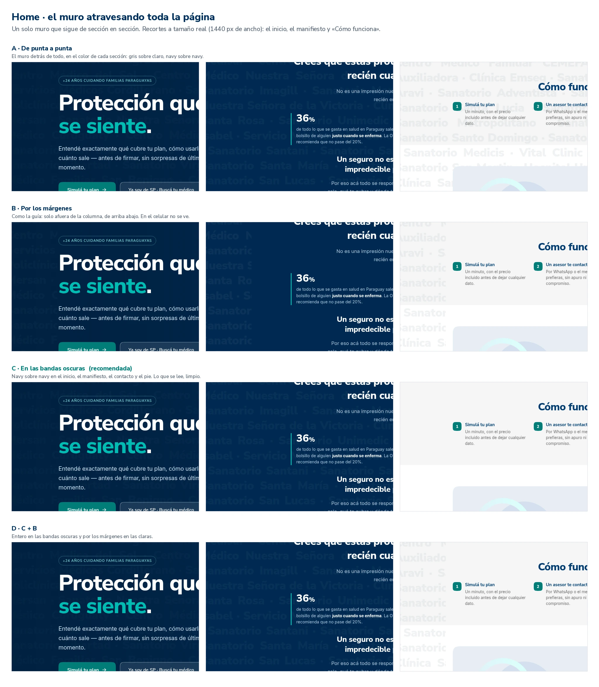

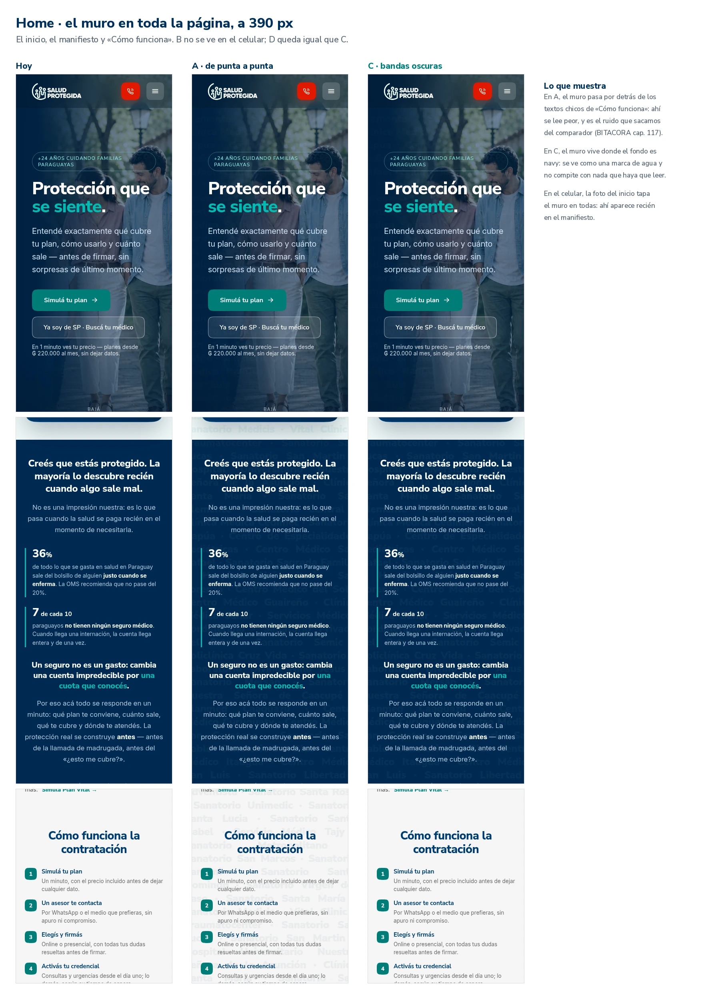

**Qué muestra.** Arturo, con el tapiz de la guía ya elegido: *«el mural se
podría ver muy bien si se puede ver atrás de toda la página, desde el home,
desde la primera sección, que traspase toda la página»*. En las cuatro es
**un solo muro**: las líneas siguen de una sección a la otra y cada sección
muestra su pedazo, en el color de su fondo (gris sobre claro, navy apenas
más claro sobre navy). **A**, de punta a punta, detrás de todo. **B**, por
los márgenes, como la guía (en el celular no existe). **C**, solo en las
bandas oscuras: el inicio, el manifiesto, el contacto y el pie. **D**, C más
los márgenes de las claras. En «Dónde te atendés» el muro queda entero en
todas.

**Qué se decidió.** Arturo tomó la **C** y le agregó una vuelta: las secciones
claras también, pero más transparentes (n.º 41).

**La lección.** El muro no molesta por estar, molesta por dónde está: detrás
de un texto chico (los pasos de «Cómo funciona») es el ruido que se acaba de
sacar del comparador (n.º 39). Sobre navy, en cambio, se lee como una marca
de agua y no compite con nada. La pregunta para un fondo no es «¿se ve
lindo?» sino «¿qué hay que leer encima?». Y una de método: a media escala, el
navy sobre navy desaparece de la lámina; los recortes van a tamaño real, o la
lámina miente por omisión.

### 41 · La C, con las secciones claras más transparentes

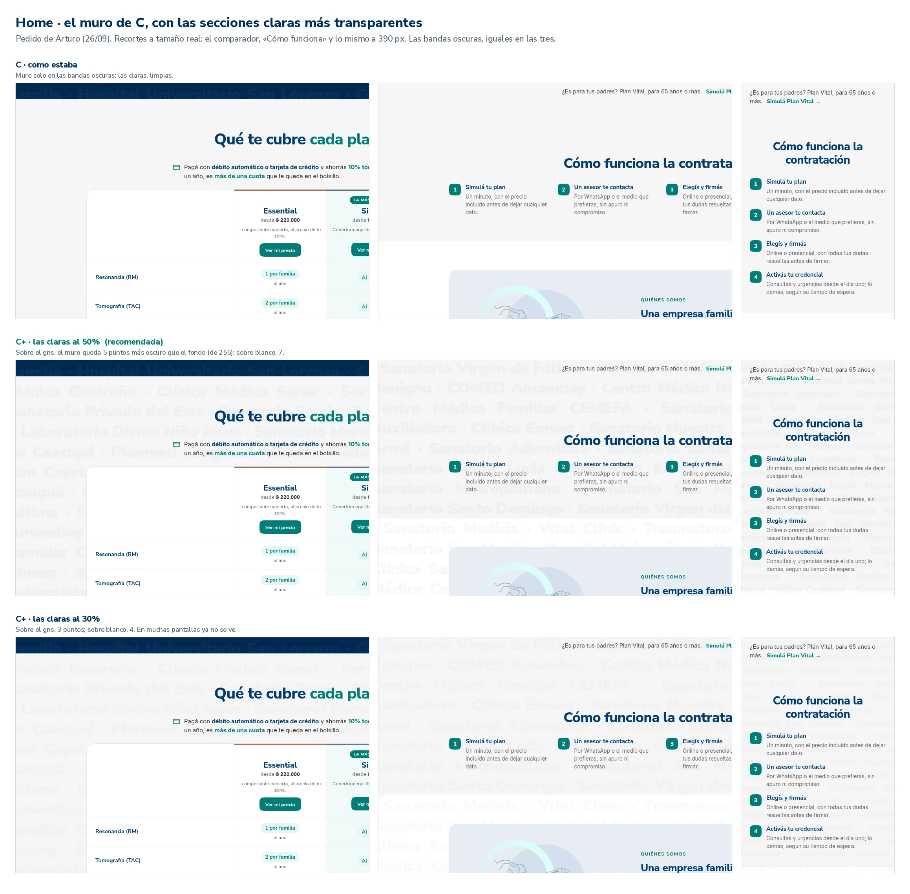

**Qué muestra.** Arturo, sobre el n.º 40: *«¿Y si vamos con C, pero en las
secciones claras, si es un poco más transparente?»*. Las bandas oscuras quedan
como en la C; en las claras vuelve el muro de la A, con menos opacidad.
Medido sobre la captura (de 0 a 255): al 50%, el muro queda 5 puntos más
oscuro que el gris de fondo y 7 más que el blanco; al 30%, 3 y 4. En la A eran
9 y 13. El texto gris de lectura (`#4A4A4A`) pasa de un contraste de 8,1 a 7,8
con el muro al 50% detrás (el mínimo es 4,5).

**Qué se decidió.** Recomendé el 50% (al 30%, en muchas pantallas el muro ya no
se ve). Arturo eligió el punto del medio: *«Y claras al 40%»*. Se construyó el
26/09/2026 (`components/MuroFondo.jsx`): medido en el sitio, el muro queda 4
puntos más oscuro que el fondo, sobre el gris y sobre el blanco. Ya publicado,
lo ajustó: *«en la banda azul vamos un 5% más transparente, y en la blanca un
5% menos»*. El 5% no se podía dibujar (ver BITACORA cap. 119); se movió el paso
más chico que existe, y las claras quedaron a 5 puntos del fondo.

**La lección.** Arturo encontró la variable que faltaba: no era *dónde* va el
muro sino *cuánto* se ve en cada lugar. Con el mismo muro en toda la página y
la intensidad según lo que hay que leer encima, la continuidad que él quería
no cuesta la lectura.

---

## Parte 15 · El muro con letra más chica (26/09/2026)

### 42 · Tres tamaños para que entren más prestadores

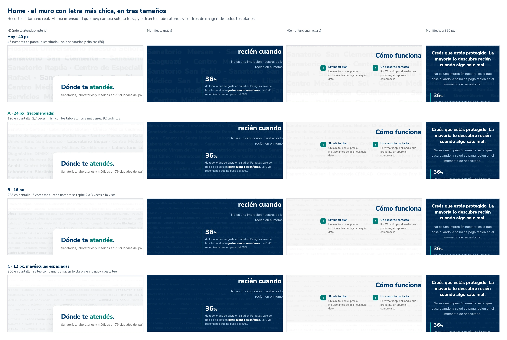

**Qué muestra.** Arturo, con el muro ya publicado: *«quiero que la tipografía
de ese muro… sea más chica para que puedan entrar más prestadores… y todavía
se vea legible, como para entender que son prestadores, son sanatorios, son
laboratorios y sus nombres»*. Tres tamaños con la misma intensidad de hoy:
**A**, 24 px; **B**, 16 px; **C**, 12 px en mayúsculas espaciadas. En las tres
entran, además de los 56 sanatorios y clínicas, los laboratorios y centros de
imagen que están en todos los planes: 92 nombres distintos. Medido en
«Dónde te atendés» a 1440 px: hoy se ven 46 nombres; A, 126; B, 233; C, 206.

**Qué se decidió.** Arturo resolvió el primer techo: rompió la regla de «todos
los planes» para el muro (*«la idea es también que la gente sienta que estos
son realmente todos los prestadores que hay»*). Con la red entera de Silver y
Gold, que son 231 nombres, la **B (16 px)** dejó de repetirse: entra casi la
red completa en una pantalla. Se construyó el 26/09/2026 con los destacados
primero y un paso más de intensidad en las secciones claras, que resuelve el
segundo techo.

**La lección.** Achicar la letra choca con dos techos que no son de diseño.
El primero es la lista: en todos los planes hay 92 nombres, así que a 16 px
cada uno aparece dos o tres veces a la vista, y un muro que se repite deja de
parecer una red. Para llenar sin repetir habría que sumar los de Silver y Gold
solos, y la nota de la sección dice que los nombres están en todos los planes.
El segundo es la intensidad: con la transparencia que eligió Arturo, una letra
de 12 px sobre el claro deja de leerse; se vuelve trama. Legible y chica a la
vez pide un poco más de contraste.

