# Lecciones de diseño de SP, con sus láminas

Acá se guardan las láminas de comparación que se le muestran a Arturo cuando
hay que decidir algo de diseño, cada una con la lección que dejó. Pedido suyo
(24/09/2026): *«Todas las imágenes que me envías son ejemplos que vale la pena
conservar como material de aprendizaje, tanto para una diapositiva como para la
bitácora.»*

Cada lección tiene la misma forma, para que sirva de diapositiva tal cual: **el
principio** (el título), **la lámina**, **qué muestra** y **qué se decidió y por
qué**. El camino completo, con los errores, está en `BITACORA.md`; el estado
vigente, en `HANDOFF.md`.

**Cómo se suma una lámina nueva:** en WebP, en `img/`, con la fecha adelante
(`2026-09-24-tema.webp`), y una entrada acá con su lección. Si solo compara
píxeles y no enseña nada, no entra.

---

## Parte 1 · El lenguaje táctil (24/09/2026)

Arturo: *«me gustaría que todo lo que revisamos, el diseño inspirado en Apple y
las mejoras realizadas, se extienda a toda la web»*. Lo que hace que se sienta
Apple no son los efectos: son las reglas detrás de cada uno.

### 1 · La sombra dice «esto se toca»

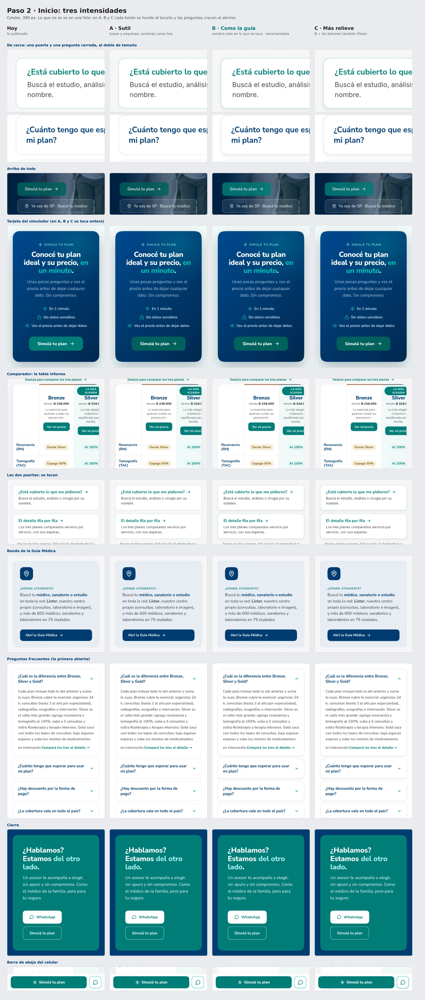

**Qué muestra.** El inicio en celular en cuatro columnas: hoy, A (sutil), B (como
la guía) y C (más relieve).

**Qué se decidió.** La **B**, elegida por Arturo (*«Vamos con la B»*). La sombra
va solo en lo que se toca o se abre; lo que informa (la tabla del comparador) no
lleva, y se distingue con color, borde e ícono. Lo elegido va plano, «apretado».
Los botones principales van planos. La C ponía sombra en casi todo, y cuando
todo flota nada se destaca.

### 2 · Cada movimiento avisa algo verdadero

[Video en cámara lenta (×3): el botón se hunde, la tarjeta se hunde entera, la pregunta crece](img/2026-09-24-toque-camara-lenta.webm)

**Qué muestra.** El toque a un tercio de la velocidad real.

**Qué se decidió.** Un botón se hunde al 97 %; una tarjeta entera, al 98 %,
porque es más grande y lo mismo se vería como un salto. Una fila de lista se
oscurece en vez de achicarse, porque se despegaría de sus bordes. Una palabra del
glosario se atenúa, porque achicarla movería la línea. **Un botón deshabilitado
no se hunde**: hundirse sería decir «te escuché» sin escuchar (BITACORA cap. 91).
Nada dura más de un tercio de segundo y todo se apaga con «reducir movimiento».

### 3 · Sobre azul, la sombra no se ve

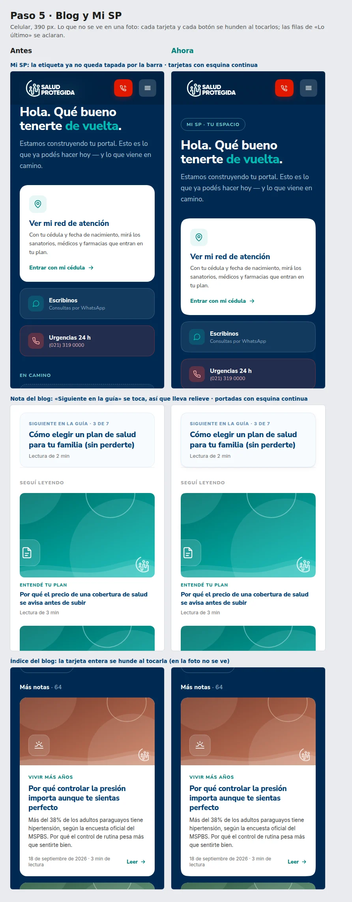

**Qué muestra.** Mi SP, una nota y el índice del blog, antes y después.

**Qué se decidió.** En las páginas de fondo azul no va sombra: una sombra azul
sobre azul no se ve. Ahí lo que se toca se distingue por la superficie más clara
y el borde, y la fila tocada se aclara en vez de oscurecerse. La lámina también
muestra un error que no era del sistema: la etiqueta «Mi SP · tu espacio» estaba
tapada por la barra fija. Lo encontró el ojo, no una prueba (cap. 91).

### 4 · Lo elegido va plano; el relieve va en lo que se toca

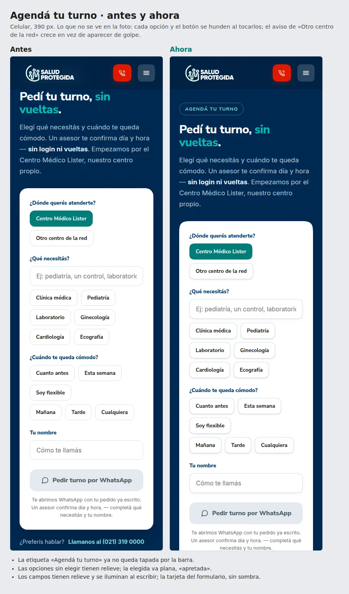

**Qué muestra.** El formulario de agendar.

**Qué se decidió.** Las opciones sin elegir llevan relieve y la elegida va plana.
Los campos llevan relieve porque se tocan. La tarjeta del formulario pierde su
sombra, porque es superficie y no se toca. Regla afinada: sobre el azul no va
relieve; dentro de una tarjeta blanca apoyada en el azul, sí.

### 5 · Una esquina se elige por lo que es, no por un número

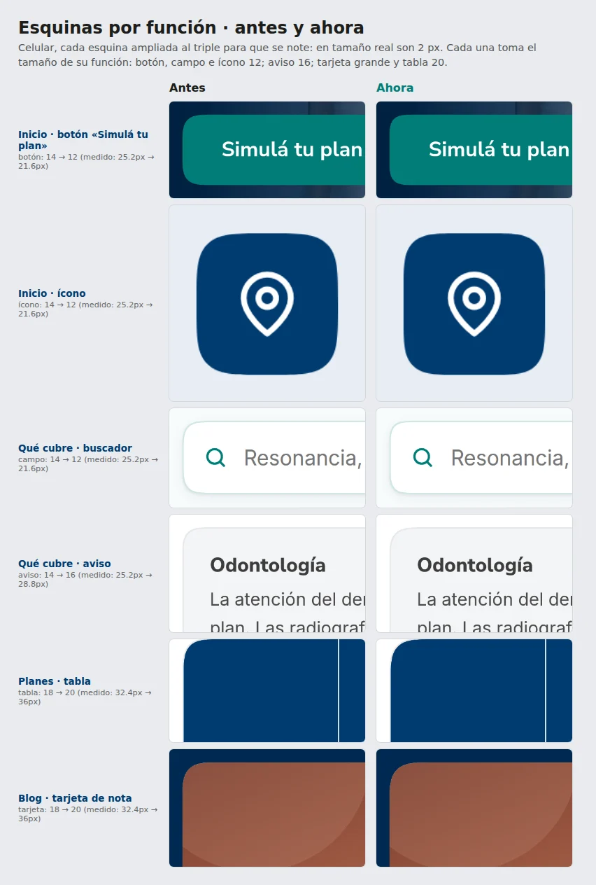

**Qué muestra.** Seis esquinas reales, ampliadas al triple, con el radio medido.

**Qué se decidió.** 14 px quedaba justo entre 12 y 16: no tenía un «más
cercano». Cada esquina fue al tamaño de su función: botón, campo e ícono 12;
aviso 16; tarjeta grande y tabla 20. A la vista son 2 px; en el sistema, cada
tamaño pasó a querer decir algo (cap. 92).

---

## Parte 2 · Íconos propios (24/09/2026)

Arturo, sobre los íconos de hoy: son genéricos, y quiere íconos *«más creativos,
más nuestros»*, como los de Claude.

### 6 · Copiar un estilo no lo hace nuestro

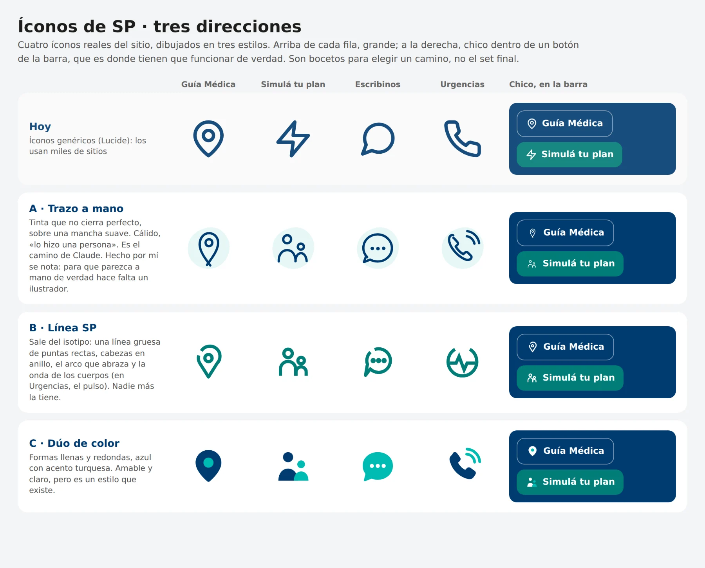

**Qué muestra.** Cuatro íconos del sitio en tres estilos, contra los de hoy, que
son de una librería que usan miles de sitios.

**Qué se decidió.** La **B · Línea SP**, que salía del isotipo, quedó
descartada: *«No se ve como un toque personal.»* A Arturo le gustaron el trazo a
mano (A) y el dúo de color (C). La lección: lo que se aprende de Claude no es su
dibujo, que es suyo, sino que sus íconos tienen mano propia.

### 7 · Un ícono se gana su lugar

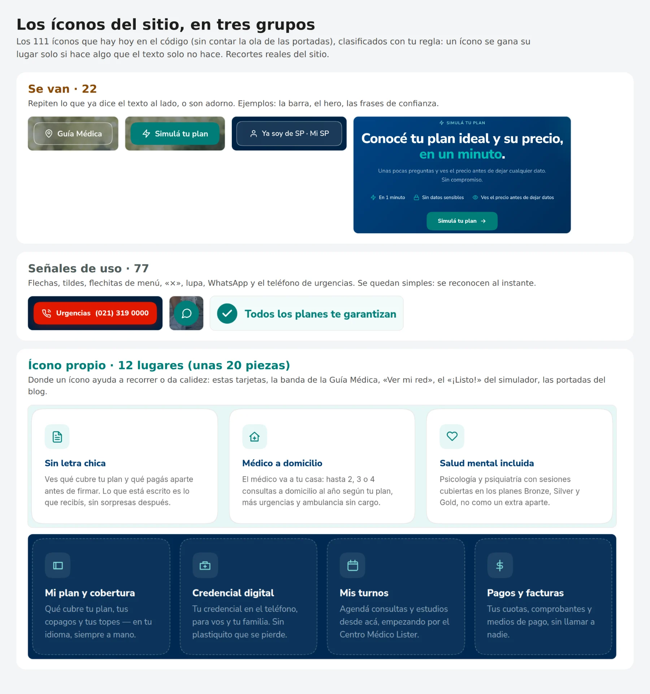

**Qué muestra.** Los 111 íconos que hay hoy en el código, clasificados: 22 se
van, 77 son señales de uso y 12 lugares llevan ícono propio (unas 20 piezas).

**Qué se decidió.** La regla es de Arturo: *«En esos casos no es necesario usar
el ícono, y de todas formas, se ve muy pequeño. La aplicación creo que sería en
otras instancias más prácticas y donde tiene más sentido.»* Un ícono se gana su
lugar solo si hace algo que el texto solo no hace: ayuda a recorrer una lista o
una grilla, dice más rápido algo que el texto tarda en decir, o da calidez en un
momento que la necesita. En un botón que ya dice «Guía Médica», el ícono sobra.
Las flechas, la «×», la lupa, WhatsApp y el teléfono de urgencias se quedan
simples: se reconocen al instante.

### 8 · Ocho estilos, tres familias

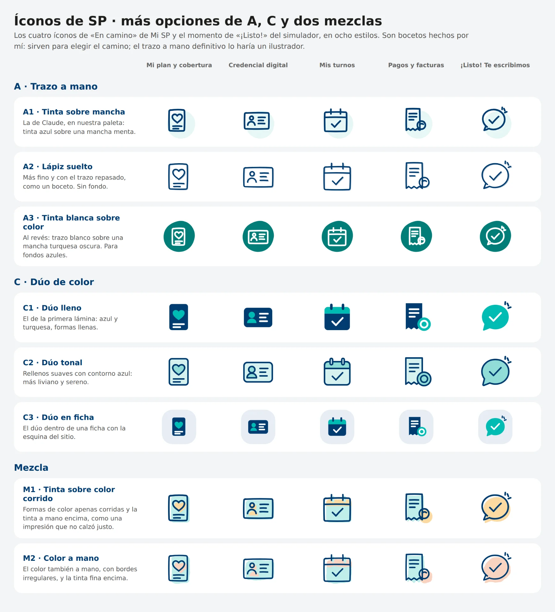

**Qué muestra.** Los cuatro íconos de «En camino» de Mi SP y el «¡Listo!» del
simulador, en tres variantes de trazo a mano, tres de dúo de color y dos
mezclas.

**Qué se dijo.** Arturo: *«Lo que realmente me atrae es el estilo de trazo a
mano. La combinación de colores depende del fondo; debemos elegir la aplicación
correcta según el color de fondo.»* Una sola mano, y el color según el fondo.

### 9 · Un ícono se juzga en su lugar, no suelto

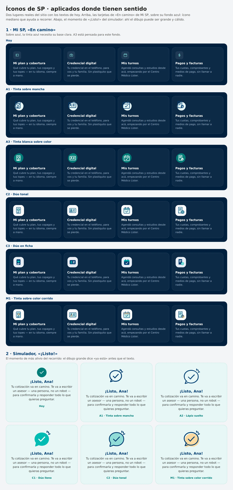

**Qué muestra.** Los estilos en dos lugares reales, con los textos de hoy: las
tarjetas de «En camino» sobre el azul de Mi SP y el «¡Listo!» del simulador.

**La lección.** Un ícono que se ve bien sobre blanco puede desaparecer sobre
azul. Por eso las pruebas siguientes se hicieron en los fondos reales.

### 10 · El color del ícono depende del fondo (medido)

**Qué muestra.** Credencial y turnos en cinco tratamientos sobre los cuatro
fondos del sitio: blanco, gris de la guía, menta y azul. En naranja, lo que falla
medido.

**Lo que se midió.** El trazo blanco sobre su círculo turquesa (A3) es el único
trazo a mano que funciona en los cuatro fondos, porque trae su propia base. La
mancha menta (A1) solo se distingue sobre blanco. El trazo azul sin base (A2)
funciona en los fondos claros y desaparece en el azul (1,3 a 1; un ícono necesita
por lo menos 3 a 1).

### 11 · Lo que limita el tamaño es el detalle, no el estilo

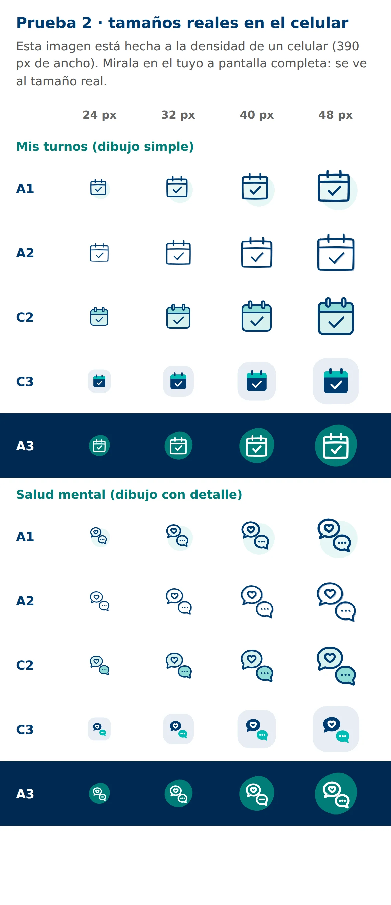

**Qué muestra.** Un dibujo simple (turnos) y uno con detalle (salud mental) a 24,
32, 40 y 48 px, a la densidad de un celular.

**Lo que se vio.** La hipótesis era que el trazo a mano se perdía por debajo de
32 px, y estaba mal. El dibujo simple se lee a 24 px en cualquier estilo; el que
tiene detalle se empasta a 24 px en todos, el dúo incluido. Como los lugares con
ícono propio usan de 40 a 60 px, el tamaño no limita.

### 12 · Una metáfora se puede confundir con otra

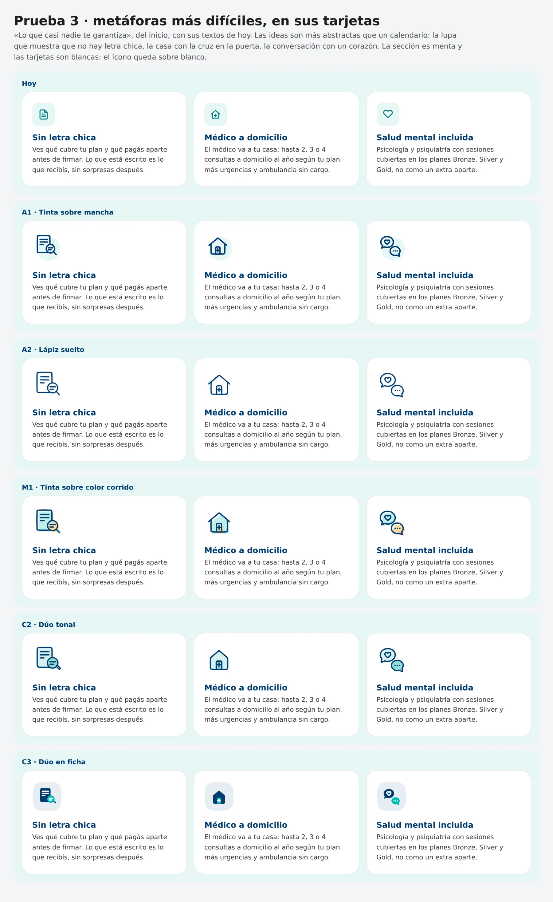

**Qué muestra.** Las tres tarjetas de «Lo que casi nadie te garantiza» del
inicio, con metáforas más abstractas que un calendario.

**Lo que se vio.** La lupa que muestra que no hay letra chica y la casa con la
cruz en la puerta se entienden. Los dos globos con un corazón, para salud
mental, se pueden leer como «Escribinos» por WhatsApp: hace falta otra idea.

**Estado (24/09/2026):** propuesta sobre la mesa, esperando a Arturo: trazo a
mano siempre; en fondos claros, trazo azul sin base (A2); en azul, trazo blanco
sobre el círculo turquesa (A3).

**Después (24/09/2026):** Arturo dio el paso (*«ya podemos ir aplicando los
cambios según lo que hablamos en la página»*) y la propuesta se aplicó al sitio.
Al verla, la corrigió: todo A3 (lección 16). Lecciones 13 a 16.

### 13 · Una sola mano para todo el sitio

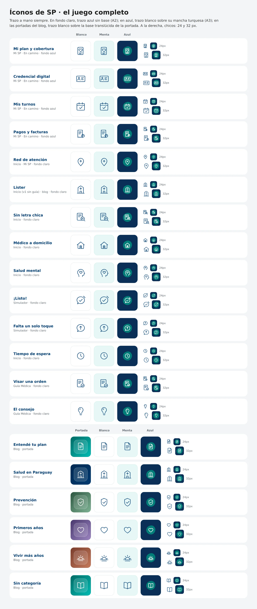

**Qué muestra.** Las 19 piezas que usa el sitio, cada una sobre blanco, menta y
azul, y chicas a 24 y 32 px. Las del blog, además, sobre su portada.

**Qué se decidió.** Todas salen de la misma mano: el trazo que no cierra
perfecto, repasado y apenas corrido, blanco sobre su mancha turquesa. El mismo
ícono sirve en cualquier fondo porque trae su propia base. Las portadas del blog
llevan el mismo trazo sobre la base translúcida de la portada: la mancha
turquesa sobre Sage, Lavender o Terracota mezclaría dos territorios de color que
la marca no deja mezclar. Los dibujos viven en `app/components/iconos-sp.js` y
se ponen con `IconoSP`.

### 14 · El dibujo dice lo que pasa de verdad

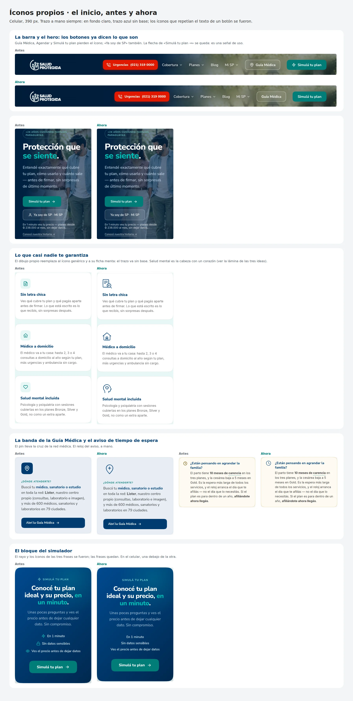

**Qué muestra.** Cada lugar tocado, en celular, antes y ahora: los botones que
perdieron el ícono y los lugares que ganaron el dibujo propio.

**Qué se vio.** El final que ve hoy quien usa el simulador es «¡Listo, Ana!
Falta un solo toque»: todavía no se mandó nada, porque falta que toque el botón
de WhatsApp. El ícono de antes era un tilde, que dice «ya está». Ahora es un
globo con la flecha de enviar. Es la lección 2 aplicada a un dibujo: lo que se
muestra tiene que avisar algo verdadero. Y los botones que ya decían «Guía
Médica» o «Simulá tu plan» quedaron más limpios sin su ícono, como había dicho
Arturo (lección 7).

### 15 · Una metáfora nueva se elige entre varias

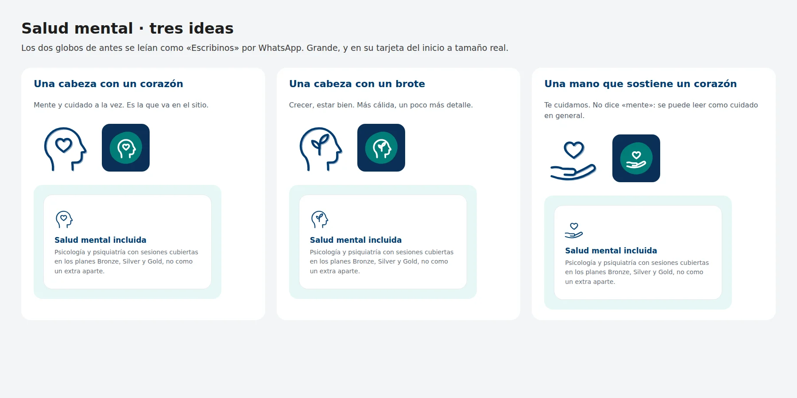

**Qué muestra.** Tres ideas para «Salud mental incluida», grandes y en su
tarjeta del inicio: una cabeza con un corazón, una cabeza con un brote y una
mano que sostiene un corazón.

**Estado (24/09/2026):** en el sitio va la cabeza con el corazón, que dice mente
y cuidado a la vez. La mano no dice «mente» y se puede leer como cuidado en
general. Las tres quedan dibujadas hasta que Arturo elija.

**Qué se decidió.** Arturo: *«Vamos con la cabeza con el corazón»*. Dice mente y
cuidado a la vez, y no se confunde con ningún otro ícono del sitio. Las otras dos
salieron del archivo de dibujos; quedan en esta lámina.

### 16 · La regla más simple, vista en su lugar

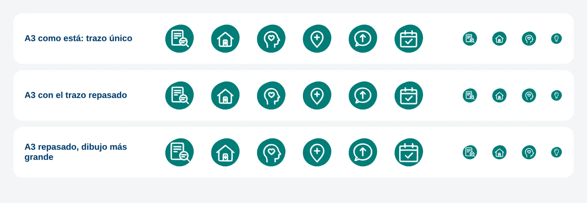

**Qué muestra.** Arriba, siete lugares del sitio con las dos reglas que había
sobre la mesa: trazo azul sin base en los fondos claros y A3 en el azul, o A3 en
todas partes. Abajo, A3 con el trazo único, con el trazo repasado y con el
dibujo más grande.

**Qué se decidió.** A3 en todas partes. Arturo: *«no era que íbamos a
seleccionar todo A3?»*, y del trazo, *«Hay algo humano y auténtico en eso»*. La
propuesta de Claude había sido la de dos reglas, por miedo a que una fila de
círculos turquesa iguales se volviera monótona sobre blanco. En los lugares
reales ese miedo no se sostiene: los círculos quedan en secciones distintas y
nunca forman una fila larga. Para que la mano se siga viendo dentro del círculo,
el trazo va repasado (fila del medio). El dibujo más grande ya toca el borde de
la mancha. La lección: una regla se juzga en su lugar, no en una lámina de íconos
sueltos (como la lección 9), y ante dos reglas que funcionan gana la más simple.

---

## Parte 3 · El comparador del home (24/09/2026)

### 17 · Dos puertas hermanas hablan con la misma gramática

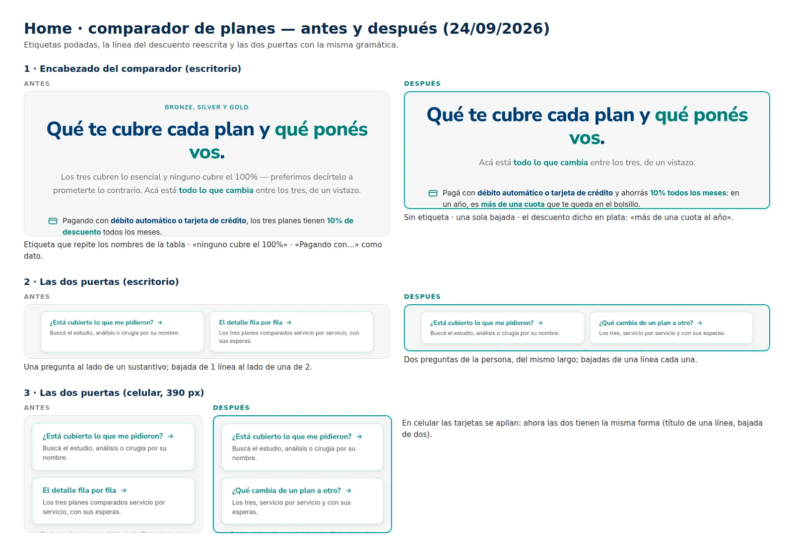

**Qué muestra.** El encabezado del comparador y sus dos puertas de salida, antes
y después, en escritorio y en celular.

**Qué se decidió.** Arturo vio que *«¿Está cubierto lo que me pidieron?»* y *«El
detalle fila por fila»* *«presentan una disonancia gráfica; no son simétricos»*.
Las cajas medían lo mismo; lo que no era simétrico era el texto: una pregunta al
lado de un sustantivo, y una bajada de una línea al lado de una de dos. Ahora las
dos son la pregunta que se hace la persona (*«¿Qué cambia de un plan a otro?»*) y
sus bajadas miden lo mismo. En la misma pasada se fueron las etiquetas que
repetían lo que estaba al lado y la línea del descuento pasó del porcentaje a la
plata: *«en un año, es más de una cuota que te queda en el bolsillo»*.

**La lección.** La simetría no es solo de cajas: dos elementos del mismo rango
se escriben con la misma forma gramatical y el mismo largo. Si no, el ojo los lee
como cosas de distinto peso aunque el borde sea idéntico.

---

## Parte 4 · Portadas del blog: un dibujo por nota (24/09/2026)

Arturo pasó cinco portadas del newsroom de Anthropic (no se guardan acá: son
suyas): *«Son muy creativos, lucen genial y no tienen que ser fotos. Podés
hacerlo e imitarlo, pero llevarlo más al estilo SP?»*. Lo que se aprende de esas
portadas no es el dibujo sino la idea: cada imagen dice lo que dice su nota.

### 18 · Un color distinto no es un estilo distinto

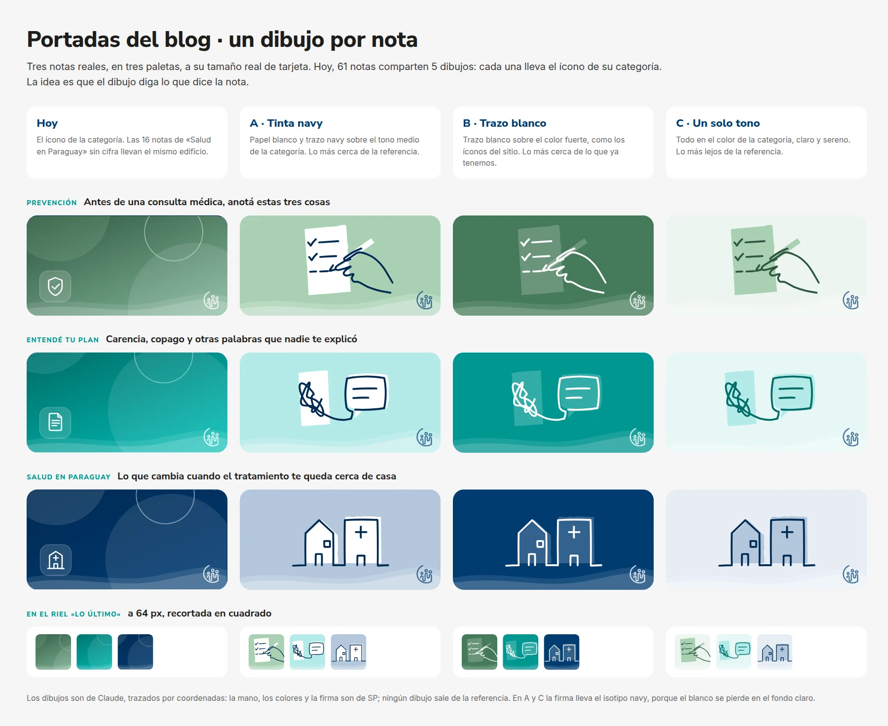

**Qué muestra.** Tres notas reales, de las tres categorías con más notas, a su
tamaño de tarjeta: la portada de hoy y un mismo estilo (papel recortado y trazo
a mano) en tres paletas. Abajo, las mismas portadas a 64 px, como en el riel
«Lo último».

**Qué se midió.** Hoy, 61 de las 70 notas comparten 5 dibujos: cada una lleva el
ícono de su categoría (las otras 9 muestran su cifra). Y en el riel «Lo último»
la miniatura se recorta en cuadrado y el ícono, que vive a la izquierda, queda
afuera: son cuadrados de color. Nadie lo había notado.

**Qué pasó.** La paleta A era la más parecida a la referencia. Antes de verla,
Arturo avisó: *«Acordate de que no tienen que ser muy similares. Podes ver 3 - 5
versiones del estilo»*. Tres paletas de la misma técnica eran tres versiones de
lo mismo: la receta de la referencia (fondo apagado, trazo oscuro, papel blanco)
seguía entera en las tres. Cambiar el color no cambia el estilo.

### 19 · Cinco técnicas, una sola mano

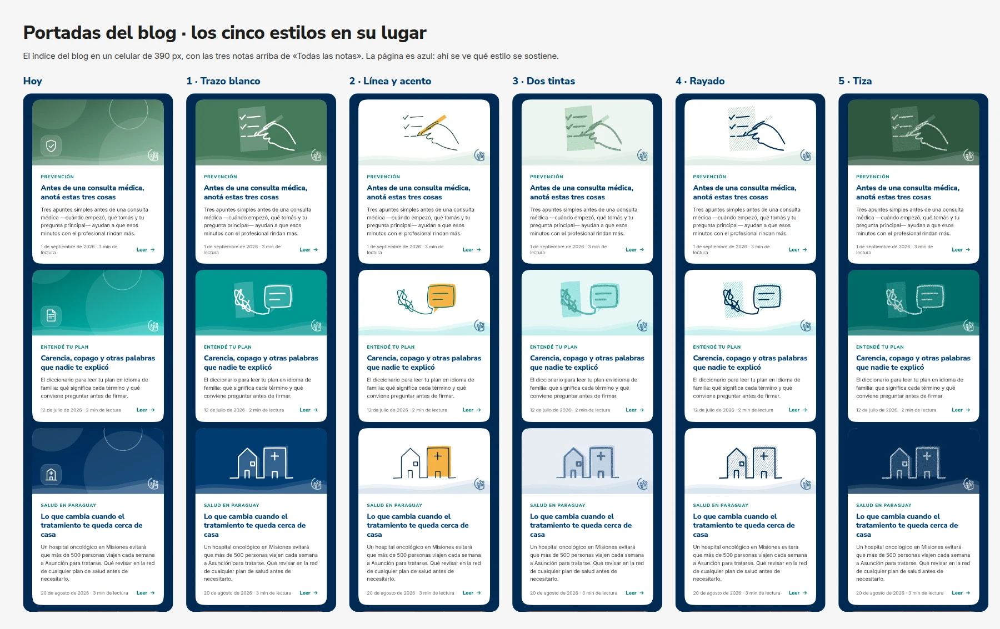

**Qué muestra.** El mismo dibujo con cinco técnicas: trazo blanco (la mano de los
íconos del sitio), línea y acento ámbar, dos tintas con grano, rayado a mano y
tiza. Abajo, los cinco en el índice del blog, en un celular de 390 px.

**Lo que se vio.** En la página azul, las portadas de fondo blanco (línea y
acento, rayado) se funden con la tarjeta blanca y la tarjeta se lee como una
sola pieza, más de revista. La tiza de «Salud en Paraguay» usa el mismo azul que
la página y pierde el borde de arriba. El trazo blanco es el más parecido a la
referencia de los cinco, porque conserva papel y trazo, pero es también el que
ya usa el sitio en sus íconos.

**Estado (24/09/2026):** los cinco sobre la mesa, esperando a Arturo. Los dibujos
y las técnicas están en `fuentes/`, para no redibujar cuando elija.

**Después (24/09/2026):** Arturo: *«Trazo blanco está bien. El problema no era
eso, pero más el estilo de los garabatos o dibujos. Por ejemplo, la mano, que
tiene súper similitud con la mano que se usa para Claude.»* El acabado quedó
elegido; lo que se parecía era el dibujo, y ese no había cambiado en ninguno de
los cinco (lección 20).

### 20 · Lo que se parecía era la mano, no la pintura

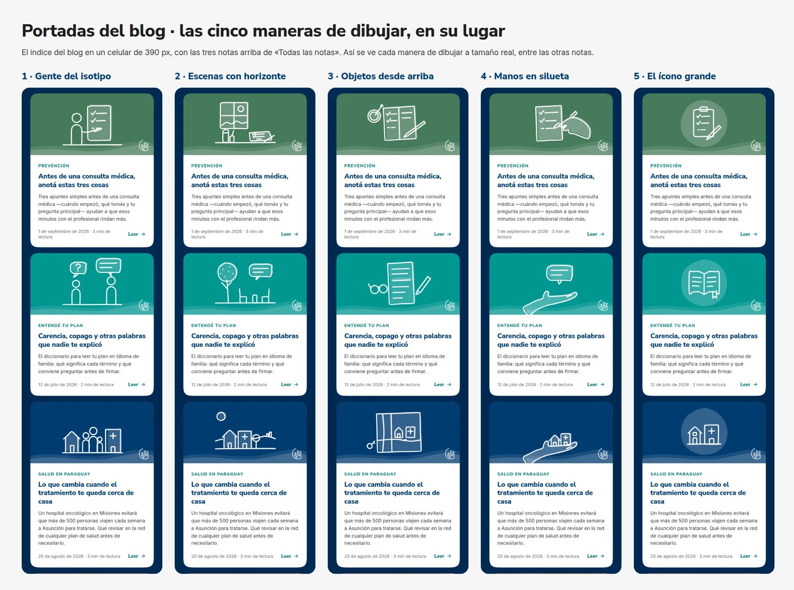

**Qué muestra.** Las mismas tres notas, las mismas ideas y el mismo trazo blanco,
dibujadas de cinco maneras: gente con cabeza en anillo y cuerpo en arco, como las
figuras del isotipo; escenas chicas con suelo y cielo; objetos sobre la mesa
vistos desde arriba; manos macizas con el pulgar a la vista; y la portada como un
ícono grande dentro de su mancha. A la izquierda, apagada, la mano de antes.
Abajo, las cinco en el índice del blog, en un celular de 390 px.

**Lo que se vio.** La gente del isotipo se lee a tamaño de tarjeta y es la única
que pone personas donde la referencia pone manos sueltas. Las manos en silueta se
leen como manos gracias al pulgar; sin él, la palma parecía una hoja. El ícono
grande es el que mejor se lee chico, pero dice el tema más que la historia. En
las escenas, los detalles lejanos (la ciudad en el horizonte) no se ven en la
tarjeta. Y la guampa vista desde arriba se puede confundir con un blanco de tiro.

**Estado (24/09/2026):** las cinco sobre la mesa, esperando a Arturo. Los dibujos
están en `fuentes/2026-09-24-portadas-maneras-de-dibujar.mjs`.
